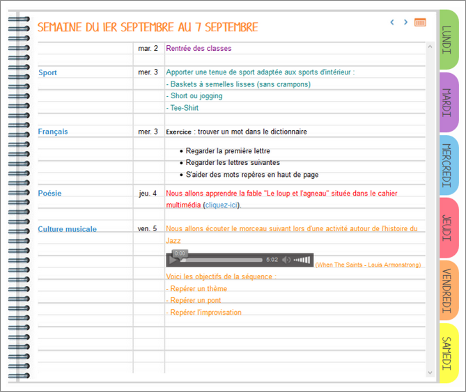
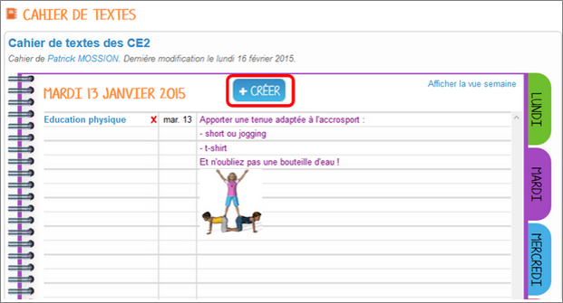
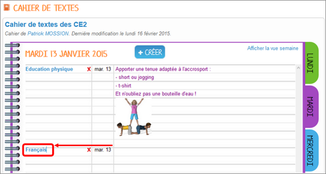
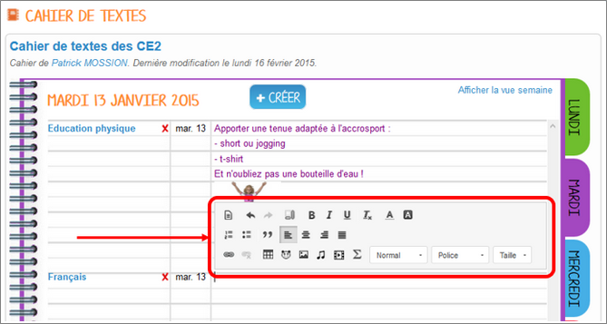
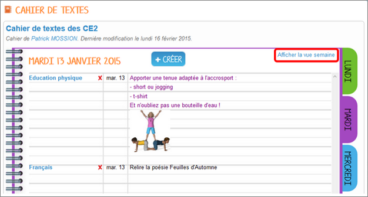
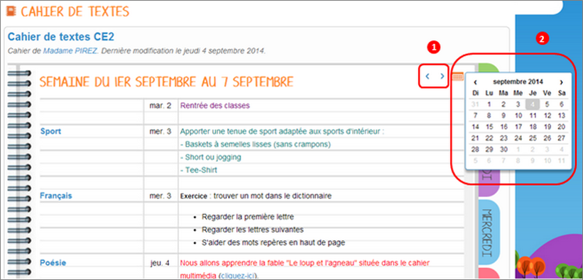

[[cahier-de-textes-1d]]
= Cahier de textes 1D

L’appli Cahier de textes permet de planifier et d’organiser les
activités des élèves en fonction des jours de la semaine.

* link:index.html?iframe=true#presentation[Présentation]
* link:index.html?iframe=true#cas-d-usage-1[Créer un cahier de textes]
* link:index.html?iframe=true#cas-d-usage-2[Partager un cahier de
textes]
* link:index.html?iframe=true#cas-d-usage-3[Créer une activité]
* link:index.html?iframe=true#notes-de-versions[Note de version]

http://creativecommons.org/licenses/by-nc-sa/3.0/fr/[image:../../wp-content/uploads/2015/03/CC-BY-NC-SA-3.0-FR-300x105.png[CC
BY-NC-SA 3.0 FR,width=100,height=35]]

[[presentation]]
== Présentation

Il est facile de publier les devoirs des élèves dans le cahier de
textes. Les élèves y accèdent  jour par jour et disposent également
d’une synthèse de la semaine (vue semaine).

Le cahier peut être partagé avec un utilisateur ou un groupe
d’utilisateurs, selon les souhaits de l’enseignant.

[[cas-d-usage-1]]
== Créer un cahier de textes

Pour accéder à l’appli Cahier de textes, cliquez sur l’icône
correspondante dans la page « Mes applis ».

image:/assets/cahier-de-textes.png[image,width=200] +
image:/assets/Cahier-de-texte-2.png[image,width=400]

Pour créer un nouveau cahier de textes, cliquez sur le bouton « Créer »
en haut de la page.

image:/assets/Cahier-de-texte-3.png[image,width=400]

Votre cahier est désormais créé mais n’est pas encore visible.

[[cas-d-usage-2]]
== Partager un cahier de textes

Pour partager un cahier de textes avec d’autres utilisateurs, cliquez
sur la case à cocher (1) située à côté du cahier puis sur « Partager »
(2).

image:/assets/Cahier-de-texte-4.png[image,width=400]

Dans la fenêtre de partage, vous pouvez donner des droits de  lecture,
de contribution et de gestion à d’autres personnes sur votre cahier.
Pour cela, saisissez les premières lettres du nom de l’utilisateur ou du
groupe d’utilisateurs que vous recherchez (1), sélectionnez le résultat
(2) et cochez les cases correspondant aux droits que vous souhaitez leur
attribuer (3). 

image:/assets/Cahier-de-texte-5.png[image,width=300]

Votre cahier de textes est initialisé, vous pouvez désormais créer les
premières activités ! Les différents droits que vous pouvez attribuer sont les suivants :

* Lecture : l’utilisateur visualise le cahier de textes
* Contribution : l’utilisateur peut créer des activités dans le cahier
de textes
* Gestion : l’utilisateur peut partager, modifier et supprimer le cahier
de textes

[[cas-d-usage-3]]
== Créer une activité

Une fois votre cahier de textes créé, vous pouvez y ajouter des
activités. Pour cela, cliquez sur le titre du cahier dans le dossier
correspondant.

image:/assets/Cahier-de-texte-6.png[image,width=400]

Lorsque le cahier est affiché à l’écran, cliquez sur un jour de la
semaine pour saisir une nouvelle activité.

image:/assets/Cahier-de-texte-7.png[image,width=400]

Une fois le jour sélectionné, cliquez sur le bouton « Créer ».

Vous pouvez ajouter une activité directement dans le cahier. Tout
d’abord, saisissez la matière dans la colonne de
gauche.

Cliquez dans la colonne principale pour afficher l’éditeur de texte.

Comme pour les autres services, vous pouvez intégrer plusieurs types de
contenus dans l’activité : texte, image, lecteur audio, lecteur vidéo,
formule mathématique…

Lorsque vous saisissez des contenus, l’enregistrement des données est
automatique. Il suffit de cliquer dans la zone de saisie pour effectuer
les modifications.

Une fois que vous avez terminé, cliquez sur le bouton « Afficher la vue
semaine » pour revenir à la page d’accueil du
cahier.

La semaine en cours est affichée par défaut. Pour saisir une activité
pour une semaine ultérieure, vous pouvez soit faire défiler les semaines
en cliquant sur les flèches (1) soit sélectionner la date dans le
calendrier (2).

[[notes-de-versions]]
== Note de version

A chaque nouvelle version de l'application, les nouveautés seront
présentées dans cette section.
