[[administration]]
= Administration

L’appli *Administration* donne accès, pour les utilisateurs habilités, à
la console d’administration et à un ensemble de paramètres qui peuvent
être ajustés en fonction des souhaits de l'établissement.

* link:index.html?iframe=true#presentation[Présentation]
* link:index.html?iframe=true#cas-d-usage-1[Accéder à la Console
d’administration]
* link:index.html?iframe=true#cas-d-usage-2[Rechercher un utilisateur]
* link:index.html?iframe=true#cas-d-usage-3[Examiner la fiche d’un
utilisateur]
* link:index.html?iframe=true#cas-d-usage-4[Opérations sur les classes]
* link:index.html?iframe=true#cas-d-usage-5[Opérations sur les groupes]
* link:index.html?iframe=true#cas-d-usage-6[Exporter tous les comptes
d’un établissement]
* link:index.html?iframe=true#cas-d-usage-7[Les règles de communication]
* link:index.html?iframe=true#cas-d-usage-8[Cas d’usage de création d’un
groupe manuel]
* link:index.html?iframe=true#notes-de-versions[Note de version]

http://creativecommons.org/licenses/by-nc-sa/3.0/fr/[image:../../wp-content/uploads/2015/03/CC-BY-NC-SA-3.0-FR-300x105.png[CC
BY-NC-SA 3.0 FR,width=100,height=35]]

[[presentation]]
== Présentation

Les administrateurs accèdent à une appli leur permettant de gérer un
ensemble de paramètres en toute autonomie. Cette appli leur permet
notamment de *créer* *de nouveaux comptes, exporter les identifiants et
codes d’activation des utilisateurs créés, renouveler le mot de passe*
des utilisateurs, **activer de nouveaux services**, etc. +
La console d'administration offre également la possibilité d'ajuster les
règles de communication entre les groupes d'utilisateurs de
l'établissement.

image:../../wp-content/uploads/2015/03/Console-dadmin.png[Console
d'admin,width=594,height=293]

[[cas-d-usage-1]]
== Accéder à la Console d’administration

Seuls les utilisateurs ayant la fonction d’administrateur local peuvent
accéder à la console d’administration. Pour accéder à la console
d’administration, connectez-vous à l’ENT, puis cliquez sur l’appli «
Administration » dans la page « Mes applis ».

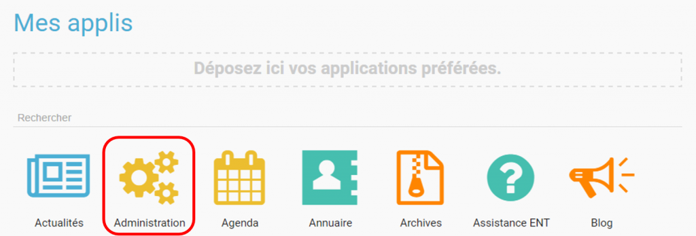

Deux menus sont accessibles dans la console d’administration :

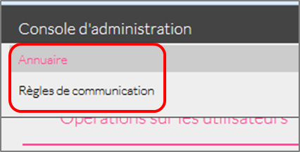

* L’annuaire permettant de gérer les comptes des utilisateurs, les
classes, les groupes et la gestion des doublons.

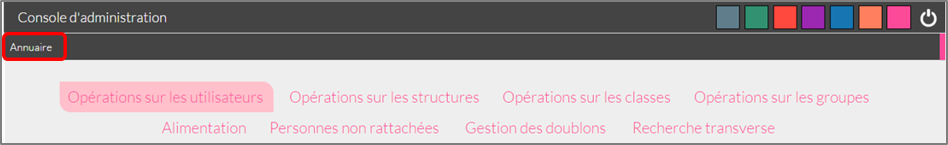

* Les règles de communication permettant de définir à qui un utilisateur
peut envoyer un message, partager des contenus et à quels utilisateurs
il aura accès dans l’annuaire.

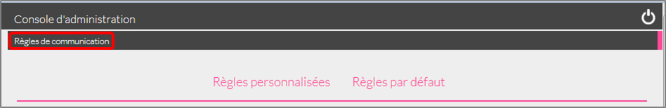 

Pour passer d’un menu à l’autre, glissez la souris sur le bandeau gris
de navigation.

[[cas-d-usage-2]]
== Rechercher un utilisateur

Pour accéder aux comptes des utilisateurs, cliquez sur le menu annuaire
(1) puis sur l’onglet « Opérations sur les utilisateurs » (2)

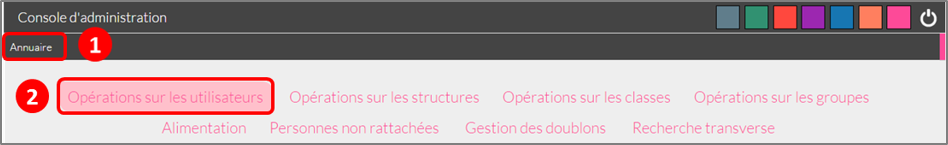

Les structures auxquelles vous êtes rattaché apparaissent sur la partie
de gauche. Cliquez sur une structure pour faire apparaitre les éléments
suivants :

* La liste des utilisateurs rattachés à l’établissement (3)
* Les boutons d’action pour faciliter une recherche (4)

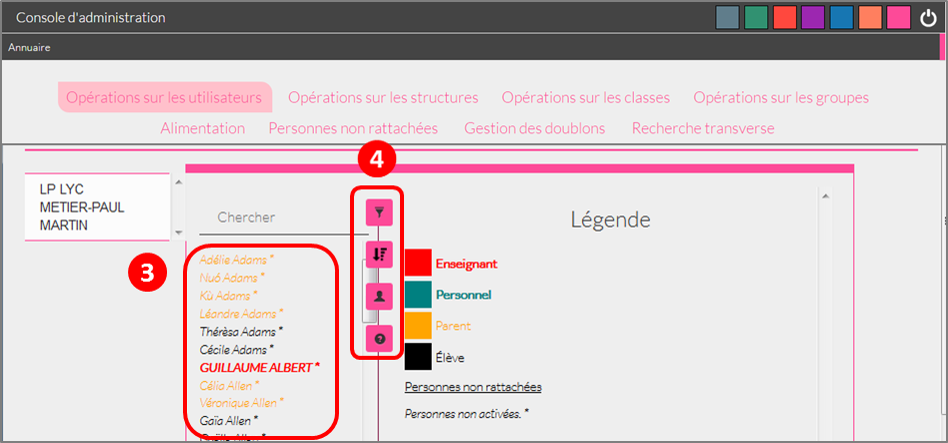

Vous pouvez effectuer les opérations suivantes :

* Afficher/cacher les filtres
 image:../../wp-content/uploads/2015/07/a7.png[a7,width=20,height=20]

* Ordonner par nom/rôle 

* Créer un utilisateur 

* Afficher la légende 

La légende est la suivante : 

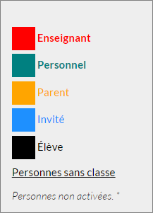

1.  *Effectuer une recherche filtrée*

Pour définir un filtre, cliquez sur l’icône « Afficher/Cacher les
filtres » (1). Plusieurs filtres sont disponibles :

* Par classe
* Par profil
* Par utilisateurs rattachés à la structure
* Par comptes non activés

Pour faciliter votre recherche, vous pouvez cliquer sur les boutons
suivants :

* pour sélectionner tous les champs 

* pour désélectionner tous les champs 

Après avoir choisi les filtres souhaités (2), la liste des résultats
apparaît sur la partie gauche de l’écran (3).

image:../../wp-content/uploads/2015/07/a14.png[a14,width=552,height=578] 

*2. Effectuer une recherche par nom ou par prénom*

Pour chercher un utilisateur en particulier, saisir les premières
lettres de son nom ou de son prénom dans la barre de recherche (1). Les
résultats s’affichent automatiquement (2).

Le critère de recherche se combine avec le filtre éventuellement activé.

image:../../wp-content/uploads/2015/07/a15.png[a15,width=598,height=299]

 

[[cas-d-usage-3]]
== Examiner la fiche d’un utilisateur

Pour faire apparaître la fiche d’un utilisateur, cliquez sur son
identifiant.

Les informations suivantes sont disponibles sur la fiche :

1.  Identifiant de l’utilisateur, profil et code d’activation.
2.  Identité de l’utilisateur et informations administratives (issues de
l’AAF)
3.  La structure de rattachement de l’utilisateur
4.  Les classes de rattachement de l’utilisateur
5.  Sa famille
6.  Des fonctions paramétrables:

* L’attribution de structures et de classes de rattachement
* L’attribution de droits d’administrateur central et local

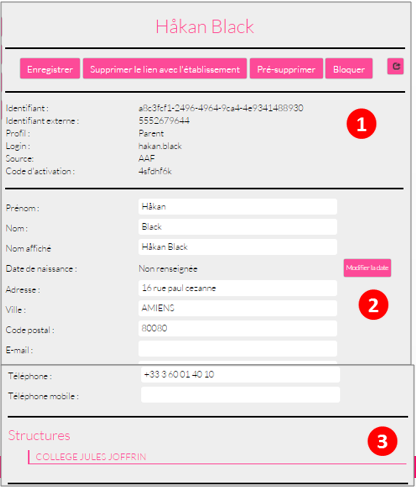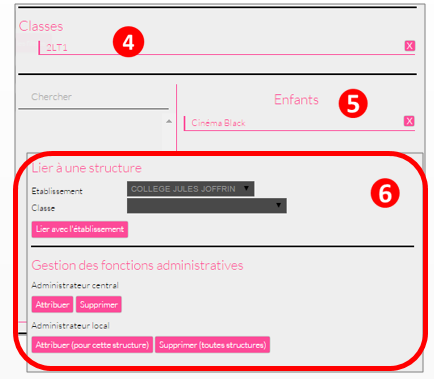

*1.  Changer le mot de passe d'un utilisateur*

Lorsqu’un utilisateur perd son mot de passe, l’administrateur peut
lancer sa réinitialisation. Pour réinitialiser un nouveau mot de passe,
rendez-vous sur la fiche de l’utilisateur concerné, saisissez l’adresse
mail de l’utilisateur dans le champ « Renvoyer un code d’activation »
(1) et cliquez sur « Envoyer » (2).

L’utilisateur reçoit un lien pour choisir un nouveau de mot de passe.

*2. Modifier l’espace de stockage d’un utilisateur*

Les quotas  des utilisateurs sont fixés par la collectivité. Les
administrateurs locaux ont la possibilité de modifier ce quota dans la
limite fixée par la collectivité.

Pour modifier l’espace de stockage disponible d’un utilisateur,
rendez-vous sur sa fiche, choisissez l’unité de mesure du quota (1),
saisissez le nombre souhaité (2) puis cliquez sur « Enregistrer » (3).

Si le quota attribué est trop élevé par rapport à la limite fixée, un
message d’erreur apparaît.

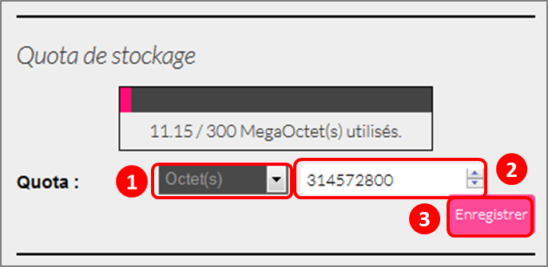 +

*3. Attribuer la fonction d’administrateur local à un utilisateur*

Un administrateur local peut donner la fonction d’administrateur local à
un autre utilisateur.

Pour cela, suivez les étapes ci-dessous :

1.  Cliquez sur « Annuaire » dans la console d’administration
2.  Cliquez sur le bouton « Opérations sur les utilisateurs »
3.  Recherchez le nom de l’utilisateur dans la liste déroulante ou
saisir le début de son prénom dans la barre de recherche
4.  Au bas de la fiche utilisateur, cliquez sur « Attribuer »

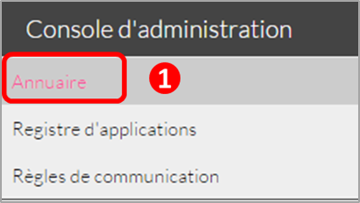 +
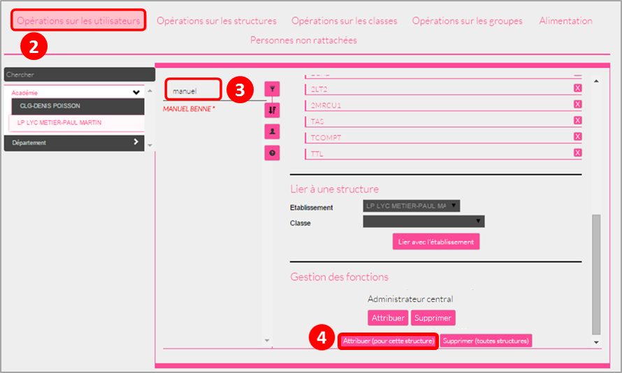

*4. link:../../wp-content/uploads/2015/07/a181.png[ ]Créer manuellement
un nouvel utilisateur*

Pour créer un nouvel utilisateur, dans l’annuaire, cliquez sur l’icône
« Créer un utilisateur » (1) puis saisissez les informations suivantes 
(2):

* Le prénom
* Le nom
* Le profil de l’utilisateur : enseignant, personnel, élève, parent ou
invité
* La date de naissance. (Ce champ est obligatoire que pour les profils
utilisateurs élèves)
* La classe de rattachement à sélectionner dans la liste déroulante.

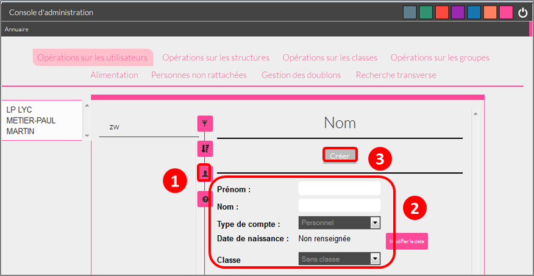

Pour finaliser la création du compte, cliquez sur « Créer » (3). Vous
pouvez vous rendre sur la fiche de ce nouvel utilisateur pour obtenir
son identifiant et son code d’activation.

*5. Bloquer un utilisateur*

L’administrateur local peut bloquer le compte d’un utilisateur (et le
débloquer par la suite).

Pour cela, suivez les étapes ci-dessous :

* Cliquez sur « Annuaire » dans la console d’administration
* Cliquez sur « Opérations sur les utilisateurs »
* Choisissez l’utilisateur à bloquer dans la liste de gauche ou saisir
le début de son prénom pour le trouver plus rapidement
* Cliquez sur « Bloquer »

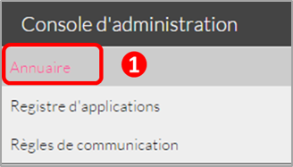 +
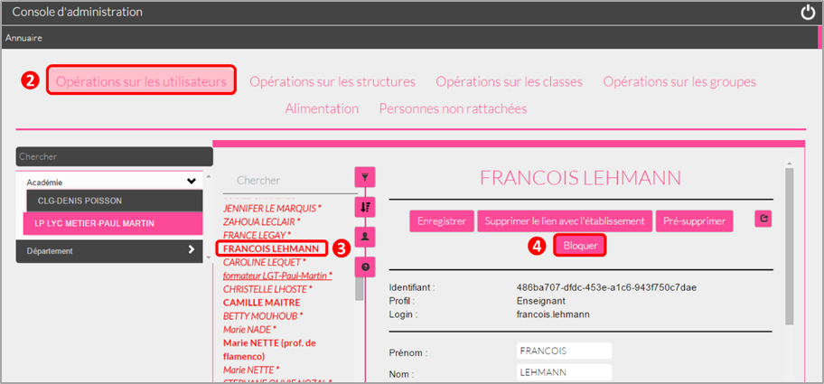

Pour débloquer le compte d’un utilisateur, cliquez sur « débloquer ».
L’utilisateur accédera à nouveau à son compte. (Le bouton « Débloquer »
est situé au même emplacement que le bouton « Bloquer ».)

Lorsqu’un utilisateur est  bloqué, il n’apparait plus dans l’annuaire et
dans les écrans de partage des autres utilisateurs.

[[cas-d-usage-4]]
== Opérations sur les classes

Pour consulter la liste des classes, cliquer sur « Opérations sur les
classes ». La liste des classes s’affiche automatiquement.

En sélectionnant une classe dans la liste des résultats à gauche (1),
vous obtenez les informations relatives à la classe.

Pour consulter tous les utilisateurs d’une classe, cliquez sur le lien
« Voir les personnes rattachées à cette classe » (2), vous êtes redirigé
sur la page « Opérations sur les utilisateurs » où les membres de la
classe apparaissent. 

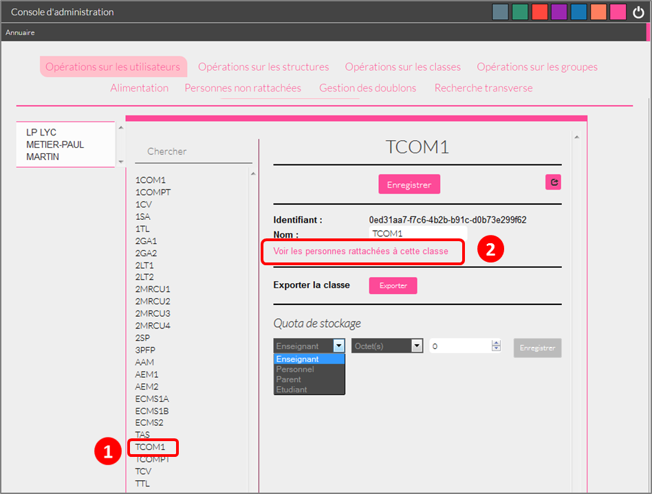 +
*1. Exporter les comptes des utilisateurs d’une classe*

Pour générer un fichier contenant la liste des utilisateurs rattachés à
une classe, cliquez sur « Exporter » (1). Le fichier généré est au
format CSV (Comma Separated Value) et peut être importé dans un logiciel
de type tableur (Microsoft Excel, Open Office Calc, etc…)

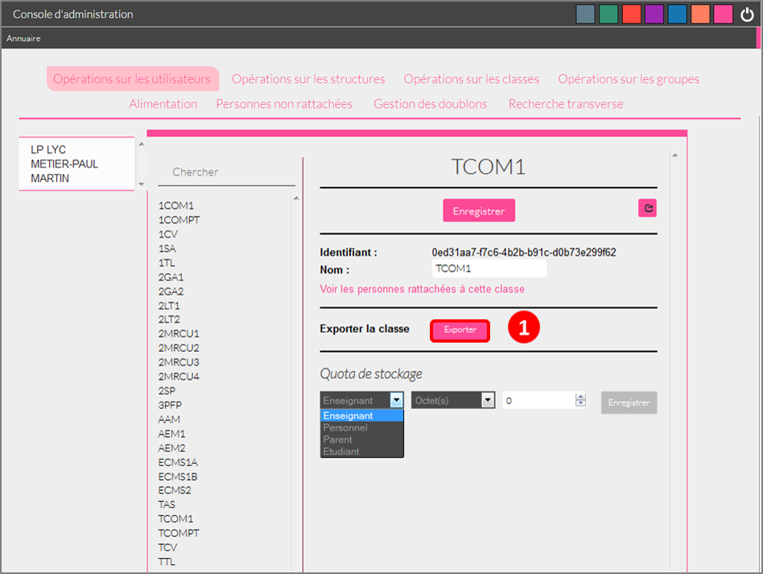

Les informations présentes dans le fichier sont les suivantes :

* L’  « Id » qui correspond au code du compte dans la console
d’administration
* Le « Type » qui correspond au profil de l’utilisateur.
* Le nom
* Le prénom
* Le « Login » qui correspond à l’identifiant de l’utilisateur.
* Le Code d’activation si le compte n’a pas encore été activé. Sinon, la
colonne est vide.

Pour permettre aux utilisateurs de se connecter à l’ENT, il est
nécessaire de leur transmettre leurs identifiants et leurs codes
d’activation.

*2. Modifier le quota documentaire d’une classe*

L’administrateur local peut modifier le quota de tous les utilisateurs
d’un profil donné et d’une classe en une seule action.

Pour cela, dans l’annuaire, cliquez sur « Opérations sur les classes »
(1), sélectionnez un type de profil (2), attribuez l’unité et le nombre
de l’espace de stockage (3) puis cliquez sur « Enregistrer » (4).

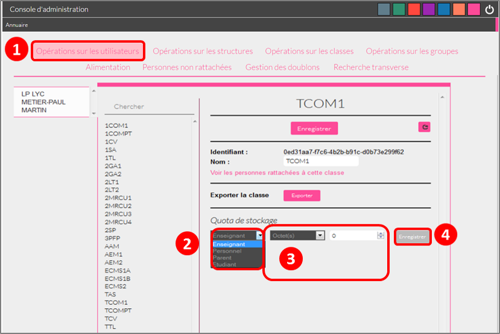

[[cas-d-usage-5]]
== Opérations sur les groupes

*1. Créer un groupe manuel*

Pour créer un groupe manuel, cliquez sur « Annuaire » (1), sur
« Opérations sur les groupes » (2) puis sur l’icône « Créer un groupe »
(3).

Saisissez le nom du groupe (4) et cliquez sur le bouton « Enregistrer »
(5). Le groupe est créé mais aucun utilisateur n’y est encore rattaché.

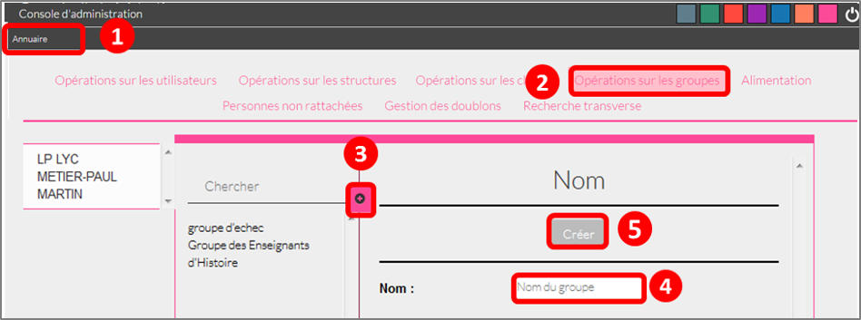 +
*2. Rattacher des utilisateurs à un groupe manuel*

Pour rattacher des utilisateurs à un groupe manuel, suivez les étapes
suivantes :

1.  Cliquez sur « Annuaire »
2.  Cliquez sur « Opérations sur les groupes »
3.  Recherchez le groupe dans lequel vous souhaitez ajouter des
utilisateurs
4.  Sélectionnez les utilisateurs dans la liste en effectuant un tri par
classe si nécessaire
5.  Cliquez sur «Enregistrer »

Les membres du groupe apparaissent dans la section « utilisateurs dans
le groupe ».

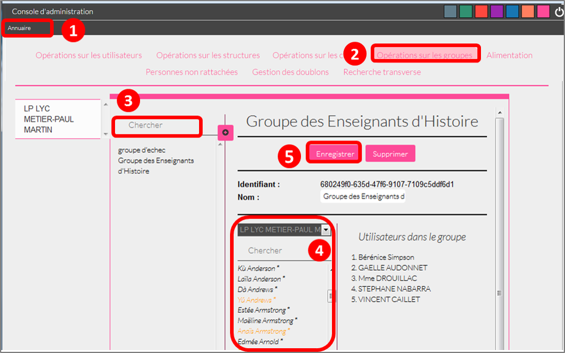

Pour retirer un utilisateur du groupe, cliquez sur son identifiant dans
la section « utilisateurs dans le groupe ».

Par défaut, le groupe manuel crée n’est visible par personne et ne voit
personne dans l’ENT. Pour permettre la communication de ce groupe vers
et par ce groupe, il est nécessaire de paramétrer les règles de
communication pour qu’il puisse communiquer et être vu par d’autres
utilisateurs de l’ENT.

[[cas-d-usage-6]]
== Exporter tous les comptes d’un établissement

L’export des comptes est possible dans deux onglets de la console
d’administration :

* Opération sur les structures
* Annuaire

L’export des comptes par l’onglet « Alimentation » de l’annuaire permet
de filtrer plus précisément la liste des comptes avant de lancer
l’exportation.

Pour exporter l’ensemble des comptes de l’ENT d’un établissement dans un
fichier en passant par l’annuaire, suivez les étapes suivantes :

1.  Cliquez sur « Annuaire »
2.  Cliquez sur « Alimentation »
3.  Sélectionnez les filtres souhaités : structure, classe, profil,
activation de compte
4.  Cliquez sur « Exporter »

Un fichier contenant la liste de tous les utilisateurs rattachés à
l’établissement est généré.

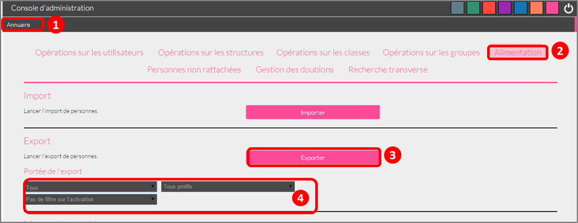

Le fichier est au format CSV (Comma Separated Value) et peut être
*importé* dans un logiciel de type tableur (Microsoft Excel, Open Office
Calc, etc…)

Une fois importé dans un tableur, le fichier contient les informations
suivantes :

* L’« Id » qui correspond au code du compte dans la console
d’administration
* Le « Type » qui correspond au profil de l’utilisateur.
* Le nom
* Le prénom
* Le « Login » qui correspond à l’identifiant de l’utilisateur.
* Le Code d’activation si le compte n’a pas encore été activé. Sinon, la
colonne est vide.

 

[[cas-d-usage-7]]
== Les règles de communication

*1. Accéder aux règles par défaut*

Les règles de communication définissent avec qui un utilisateur peut
**partager des contenus**, *envoyer des messages* et les utilisateurs
qu’il pourra **voir dans l’annuaire**.

Les règles de communication sont définies entre des *groupes* et non
entre des utilisateurs.

Il existe plusieurs sortes de groupes :

1.  Les groupes de profils par établissement (créés automatiquement)
2.  Les groupes de profils par classe (créés automatiquement)
3.  Les groupes d’enseignement (créés automatiquement)
4.  Les groupes d’administrateurs locaux par établissement (créés
automatiquement)
5.  Les groupes manuels créés par les administrateurs locaux.

Lors de l’ouverture de l’ENT dans un établissement, des *règles de
communication par défaut* sont mises en place. Elles définissent la
communication des groupes de classe et d’établissement automatiquement
créés dans l’ENT.

Ces règles peuvent être modifiées par les administrateurs locaux dans
l’onglet **règles personnalisées**.

Pour visualiser les règles par défaut, cliquez sur « Règles de
communication » (1), puis sur « Règles par défaut » (2).

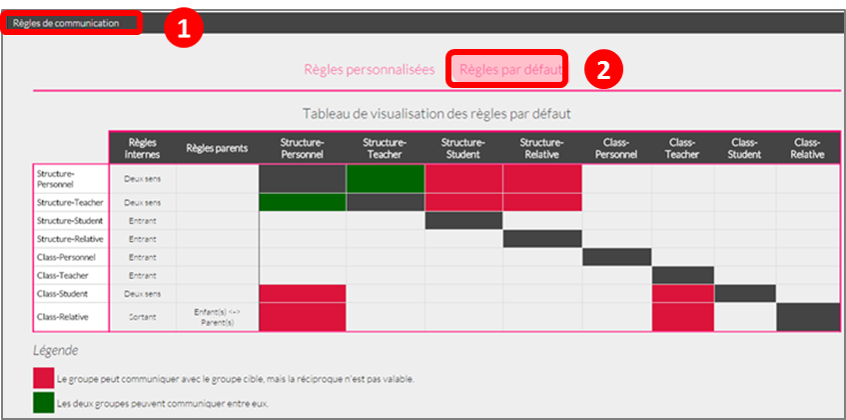

Dans la capture d’écran ci-dessus, les règles de communication par
défaut sont les suivantes :

* Un Personnel peut initier une communication avec tout autre
utilisateur dans l’établissement
* Un Enseignant peut initier une communication avec tout autre
utilisateur dans l’établissement
* Un Elève peut initier une communication avec ses parents, les
enseignants de sa classe, les élèves de sa classe et les personnels de
l’établissement
* Un Parent peut initier une communication avec ses enfants, les
enseignants de la classe de son enfant et les personnels de
l’établissement.

*2. Définir des règles de communication personnalisées*

L’administrateur peut avoir besoin de personnaliser les règles de
communication dans plusieurs cas :

* Les règles par défaut ne conviennent pas
* Pour définir des règles de communication pour les groupes
d’enseignement
* Pour définir des règles de communication pour les groupes manuels

Lors de la configuration des règles personnalisées, trois types de
communication sont possibles :

* *Communication sortante* : les membres du groupe peuvent communiquer
vers un autre groupe
* *Communication entrante* : les membres du groupe peuvent être
contactés par un autre groupe
* *Communication dans les deux sens* : les membres d’un groupe peuvent
contacter et être contactés par les membres d’un autre groupe

Pour définir des règles personnalisées, suivez les étapes suivantes :

1.  Sélectionnez le groupe de référence en le recherchant dans la barre
de recherche
2.  Cliquez sur « Règles de communication personnalisées » dans la liste
déroulante
3.  Cliquez sur le groupe avec lequel vous souhaitez établir une
communication
4.  Cliquez sur « Paramétrage du groupe » dans la liste déroulante
5.  Choisissez le type de communication que vous souhaitez établir :
sortante, entrante ou dans les deux sens.
6.  Cliquez sur « Modifier »

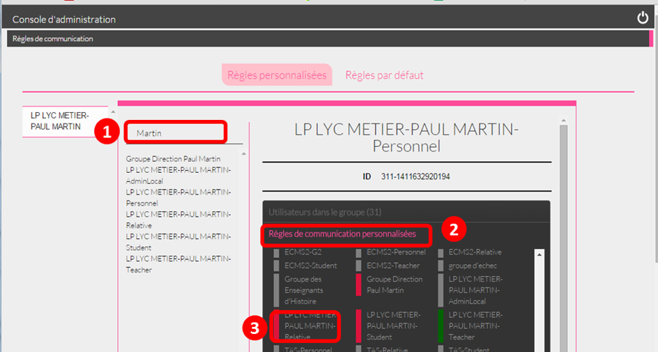

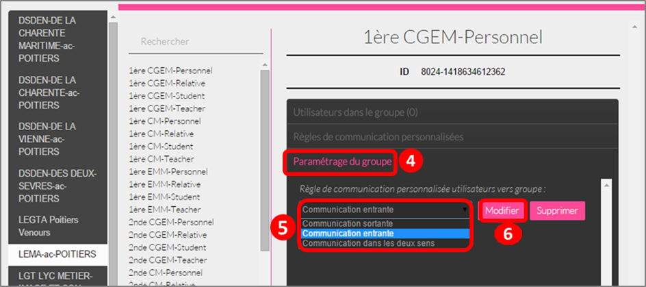

Les règles sont bien établies.

[[cas-d-usage-8]]
== Cas d’usage de création d’un groupe manuel

*1. Créer un groupe*

Pour créer un nouveau groupe, allez dans « Opérations sur les groupes »
(1), cliquez sur le nom du lycée (2) puis sur l'icône suivant (3) +
 +
Saisissez ensuite le nom du groupe puis cliquez sur « Créer ». +
Il est possible de typer le groupe comme un groupe d’enseignement en le
rattachant à une classe. En faisant cela, le groupe suivra le cycle de
transition d’année scolaire et sera supprimé à la fin de l’année.

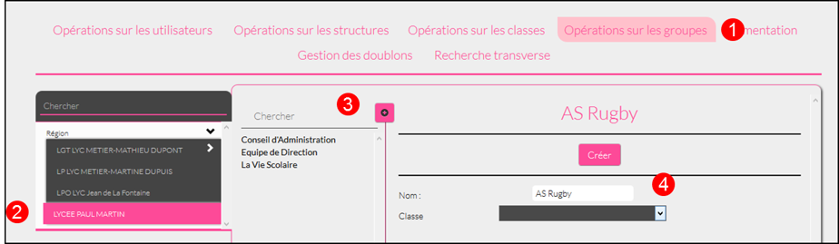 +
Sélectionner ensuite votre groupe (5) puis ajoutez-y des utilisateurs en
cliquant sur leur nom (6).

Il est possible de les retirer du groupe en cliquant sur leur nom dans
la partie de droite (7).

Pour filtrer les utilisateurs, utilisez les listes déroulantes ou la
zone de texte (8), la liste se met à jour automatiquement.

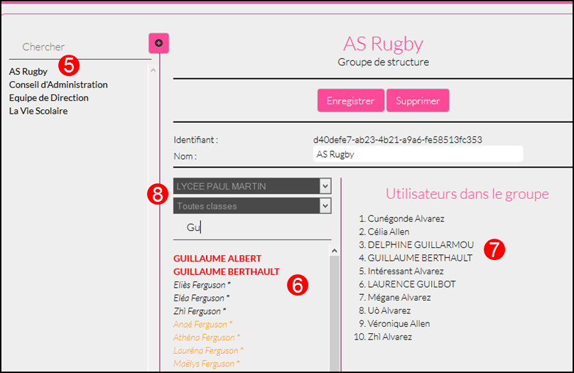 

*2. Rendre le groupe visible*

Pour rendre le groupe visible il faut modifier ses règles de
communication.

Allez dans le menu « Règles de communication » (1) puis dans « Règles
personnalisées » (2).

Saisissez ensuite une partie du nom du groupe (3) pour le retrouver plus
facilement (4).

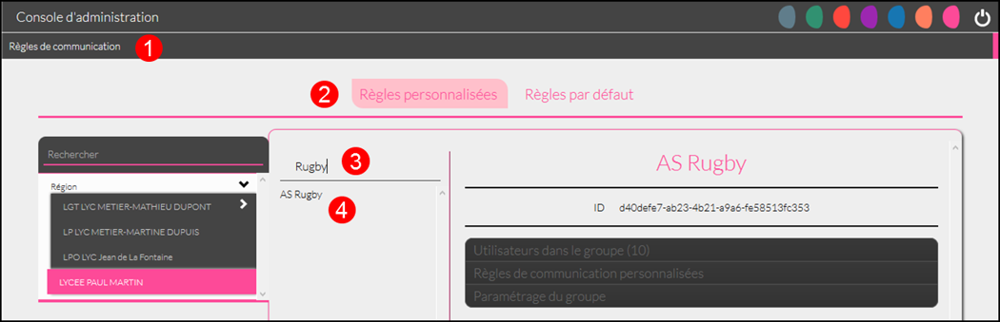 +
Dans un premier temps allez dans « Paramétrage du groupe » (5) pour
ouvrir la communication.

Il faut d’abord choisir si les membres du groupe doivent pouvoir voir le
groupe et se voir entre eux. Si c’est le cas, choisissez « Communication
dans les deux sens » (6) puis cliquez sur « Modifier » (7).

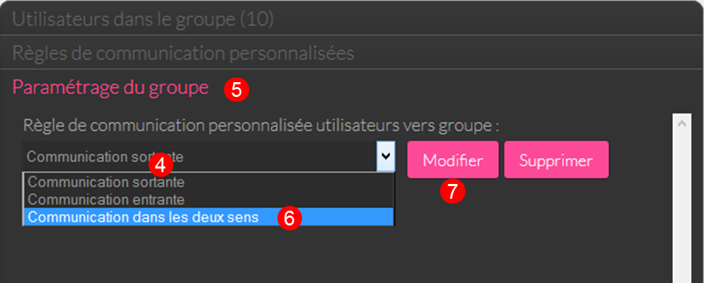

* Si les membres du groupe ne doivent pas se voir, il s’agit soit :
** Du cas d’une liste de diffusion (communication entrante)
** Du cas d’un groupe qui sert à étendre des droits de communication
(communication sortante)

Dans ces deux cas, les membres ne verront pas le groupe. +
link:../../wp-content/uploads/2015/07/a83.png[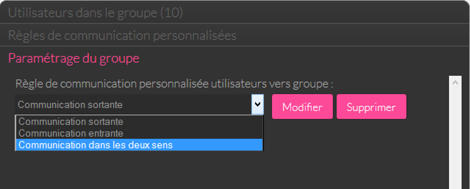]

*3. Ajouter des droits de communication*

Pour donner des droits de communication vers d’autres groupes pour les
membres de votre nouveau groupe, allez dans « Règles de communication
personnalisées » (1), saisissez une partie du nom du groupe pour le
retrouver plus facilement (2) puis cochez le groupe à rendre visible
pour les membres de votre groupe (3).

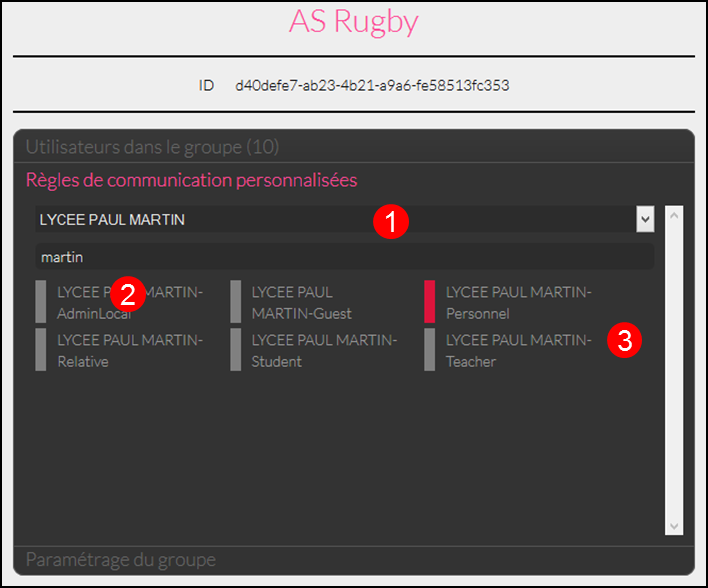 +
*4. Rendre le groupe visible par d’autres personnes*

Pour rendre votre groupe visible par d’autres personnes, sélectionnez le
groupe qui doit le voir dans la partie de gauche (1) puis sélectionnez
le groupe à rendre visible dans la partie droite (2).

link:../../wp-content/uploads/2015/07/a83.png[ +
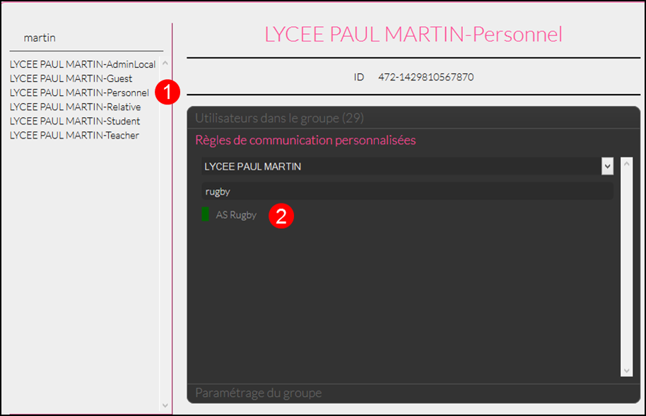 +
]

[[notes-de-versions]]
== Note de version

Nouveautés de la version 1.13.1

*Import CSV*

La console d’administration permet d’importer des utilisateurs en lot à
partir de fichiers au format CSV. Cette fonctionnalité est présente dans
l’onglet « Opérations sur les structures » de la rubrique
« Annuaire ». +
image:../../wp-content/uploads/2015/05/NDV-17.png[NDV
17,width=382,height=76]

Pour chaque profil, les fichiers CSV doivent contenir un certain nombre
de champs :

* Enseignants, personnels, invités :
** id ou externalid (facultatif),
** prénom (obligatoire),
** nom (obligatoire),
** classe (facultatif) : une colonne par classe.
* Élèves :
** id ou externalid (facultatif),
** prénom (obligatoire),
** nom (obligatoire),
** classe (obligatoire),
** date de naissance (obligatoire).
* Parents :
** id ou externalId (facultatif),
** prénom (obligatoire),
** nom (obligatoire),

Pour lier un parent à un enfant, il faut soit son prénom, son nom et sa
date de naissance :

* prénom enfant (facultatif),
* nom enfant (facultatif),
* classe enfant (facultatif).

Soir connaitre son identifiant :

* childId ou childexternalid (facultatif).

Il existe une correspondance des libellés qui permet d’accepter
plusieurs valeurs différentes pour un même champ. Pour le moment, les
champs sont tolérés avec ou sans accents, espaces ou majuscules. Il est
possible d’ajouter d’autres correspondances. 

*Gestion des doublons*

La console d’administration permet de gérer les doublons de comptes. Si
un compte issu des imports AAF (ou autre source) était déjà présent en
tant que compte créé manuellement il est identifié comme doublon.

_N.B. : l’ENT permet un certain degré de tolérance sur la reconnaissance
du nom, il peut donc reconnaitre des doublons même si les noms et
prénoms ne sont pas strictement identiques.

image:../../wp-content/uploads/2015/05/NDV-18.png[NDV
18,width=534,height=82]

Quand un nouveau compte est identifié, il n’est pas possible de
l’activer. Un administrateur (local ou central) devra alors indiquer si
le compte est bien un doublon ou s’il peut être activé. +
Si l’administrateur choisit de dissocier les comptes, le deuxième pourra
être utilisé indépendamment du premier. +
Si l’administrateur choisit de fusionner les deux comptes, un seul
compte sera alors visible, les données de l’utilisateur existant seront
mises à jour avec celles du référentiel AAF. Les données saisies ou
partagées dans les applications par le compte existant sont conservées.

*Recherche transverse d’utilisateur*

Un nouvel onglet permet de faire une recherche d’utilisateur de manière
transverse. Les administrateurs intervenant sur plusieurs établissements
peuvent donc retrouver un utilisateur sans savoir à quel établissement
il appartient.

*Modification des champs des exports* +
Les champs suivants sont maintenant présents dans les exports de comptes
utilisateurs :

* Id : identifiant ;
* Type : profil de l’utilisateur ;
* Nom ;
* Prénom ;
* Login : identifiant de connexion ;
* Code d'activation ;
* Fonction(s) ou matière(s) : fonction pour les personnels non
enseignants et matière pour les enseignants ;
* Structure(s) : établissement(s) de rattachement ;
* Classe(s) : classe(s) d’appartenance ;
* Enfant(s) : pour les parents, les enfants rattachés au compte ;
* Parent(s) : pour les enfants, les parents rattachés au compte.

*Pouvoir rattacher des élèves à un parent après modification*

Il est désormais possible de rattacher des comptes enfants à un parent
après la création de ce dernier.

*Profil invité*

Un nouveau profil d’utilisateurs a été ajouté, le profil invité. Ce
profil peut être utilisé pour ajouter des intervenants extérieurs par
exemple

*Choix du thème de la console d’administration*

Il est désormais possible de choisir la couleur de la console
d’administration.

*Restaurer un compte supprimé*

Les comptes en pré-suppression sont visibles dans le menu « Personnes
non rattachées » par les administrateurs centraux. +
Il est désormais possible de restaurer un compte en pré-suppression. Ce
dernier retrouve alors tous ses groupes et classes de rattachement.

*Différencier les utilisateurs issus des référentiels des utilisateurs
créés manuellement*

Sur la fiche profil des utilisateurs, un champ permet maintenant de
distinguer l’origine de création des comptes : manuellement, par import
AAF ou par import CSV.

*Ouverture de la gestion des structures aux administrateurs locaux*

Les fonctionnalités suivantes sont maintenant disponibles aux
administrateurs locaux dans l’onglet de gestion des structures :

* Changer le nom de l'établissement ;
* Changer le quota des utilisateurs d’une structure par profil.

'''''

Nouveautés de la version 1.12.0

*Possibilité de rattacher un élève à des parents après création du
compte*

Le rattachement d’un élève à un parent n’était possible qu’à la création
du compte. Il est désormais possible de rattacher des élèves à un parent
après sa création.

*Affichage des parents rattachés à un élève*

Les parents rattachés à un élève sont maintenant affichés sur la fiche
de l’élève dans la console d’administration.

image:../../wp-content/uploads/2015/04/NDV-15.png[NDV
15,width=150]

*Rattacher un groupe manuel à une classe*

Les groupes manuels peuvent désormais être rattachés à des classes. Cela
permet de gérer ces groupes comme des classes lors de la transition
d’année scolaire, c’est-à-dire de les supprimer. Cela peut s’avérer
utile si le groupe n’a pas vocation à perdurer au-delà de l’année
scolaire.

*Création de structures inter-établissements*

Les établissements scolaires peuvent être regroupés dans des structures.
Cela permet notamment de matérialiser les académies, les collectivités
ou encore les cités scolaires dans la plateforme.

image:../../wp-content/uploads/2015/04/NDV-16.png[NDV16,width=200]

Un premier cas d’utilisation est la gestion des comptes des
collectivités et des services académiques. Ces comptes peuvent
maintenant être rattachés à des structures à part (hors établissements
scolaires) et des règles de communications spécifiques peuvent être
définies.

Il est également possible de nommer des administrateurs de structures,
ils seront automatiquement administrateurs locaux de toutes les
structures et établissements sous-jacents.

*Gestion des profils administrateurs*

Plusieurs évolutions ont été apportées au niveau de la gestion des
profils administrateurs :

* Les fonctions d’administration (administrateur central ou
administrateur local) sont désormais affichées sur la fiche d’un
utilisateur.
* Un administrateur local (ADML) peut désormais attribuer la fonction
(ADML) à un autre utilisateur.
* Un administrateur central (ADMC) peut désormais attribuer la fonction
(ADMC) à un autre utilisateur.

image:../../wp-content/uploads/2015/04/NDV-17.png[NDV
17,width=427,height=98]

**Blocage d’un compte**

Un ADML peut bloquer le compte d’un utilisateur de son établissement.

Un compte bloqué ne peut plus se connecter à l’ENT et les autres
utilisateurs ne le voient plus dans les destinataires possibles d'un
message ni dans les écrans de partage des autres services.

image:../../wp-content/uploads/2015/04/NDV-18.png[NDV
18,width=60]

**Export des comptes**

La fonctionnalité d’export des comptes est plus conviviale. Le choix des
établissements ou des classes à exporter se fait maintenant à l’aide de
listes déroulantes.

image:../../wp-content/uploads/2015/04/NDV-19.png[NDV
19,width=400]
