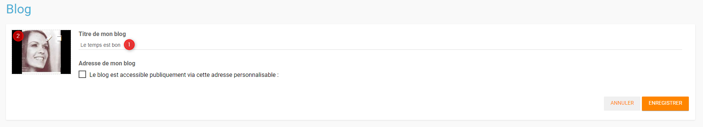
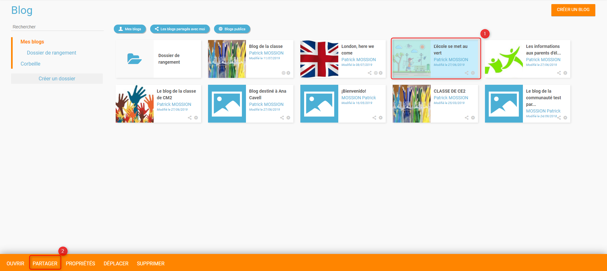
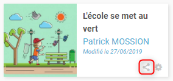
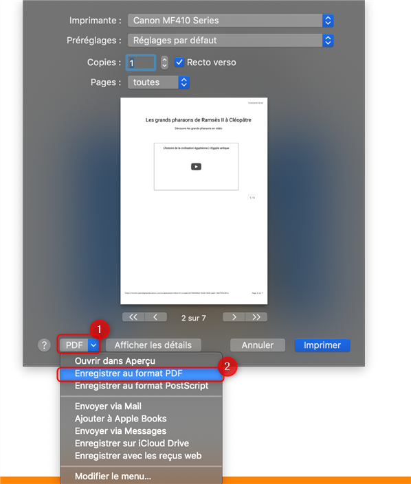

# Blog

Endossez la casquette du petit reporter en créant un **Blog** ! Publiez et partagez facilement vos informations, en y intégrant différents types de contenus : texte, images, vidéos, etc. Permettez à vos collègues ou vos élèves de contribuer ou de commenter vos billets facilement.

## Présentation

L’appli **Blog** permet de publier facilement des informations, en y intégrant **différents types de contenus** : texte, images, fichiers audio, vidéos, liens externes, etc. Les articles ou « billets » de blog sont datés, identifiés par leur auteur et sont affichés par ordre chronologique inversé \(visualisation des derniers contenus publiés en haut de page\).

En cas de contribution de la part d’autres utilisateurs, le gestionnaire du blog choisit le **circuit de publication** souhaité : soit il relit les billets soumis par les autres utilisateurs avant de les publier, soit les billets sont publiés immédiatement quel qu’en soit l’auteur.

## Créer un blog privé

Cliquez sur la page « Mes applis » puis sur l’icône « Blog ».

Dans le service Blog, cliquez sur le bouton « Créer un blog » présent en haut à droite de la page.

Vous accédez à l’interface de création du blog.

1. Indiquez le titre de votre blog.
2. Ajoutez une vignette d’illustration du blog \(si vous ne modifiez pas l’image, c’est la vignette par défaut qui s’affichera\).

Cliquez sur « Enregistrer » pour valider la création du blog.

## Partager un blog

Le blog a été créé mais n’est pas encore visible par les autres utilisateurs. Pour partager un blog avec d’autres utilisateurs, suivez les étapes suivantes :

1. Cliquez sur le blog à partager \(1\)
2. Cliquez sur le bouton « Partager » \(2\)

Pour le partager, suivez les étapes suivantes :

1. Saisissez les premières lettres du nom de l’utilisateur ou du groupe d’utilisateurs que vous recherchez.
2. Sélectionnez le résultat.
3. Cochez les cases correspondant aux droits que vous souhaitez leur attribuer.

Pour valider, cliquez sur le bouton "Partager".

Les différents droits que vous pouvez attribuer aux autres utilisateurs sont les suivants :

* **Consulter** : l’utilisateur peut lire le contenu du blog
* **Contribuer** : l’utilisateur peut rédiger un nouveau billet
* **Gérer** : l’utilisateur peut gérer le blog, c’est-à-dire le modifier, le partager ou le supprimer
* **Commenter** : l’utilisateur peut commenter les billets

Sur les vignettes de blog, des icônes vous permettent facilement de connaitre vos droit sur les contenus :

*  : Consulter
*  : Contribuer
*  : Gérer

De plus, concernant les blogs sur lesquels vous êtes propriétaire, l'icone suivante vous permet de savoir si le contenu a déjà été partagé : 

## Créer un blog public

Pour créer un blog accessible à des personnes extérieures à l'ENT, il vous faut retourner sur la page de création de blog.

La page des propriétés du blog s'ouvre et vous pouvez y trouver une rubrique nommée "Adresse de mon blog".

Cochez la case précédant la phrase "Le blog est accessible publiquement via cette adresse personnalisable :" \(1\)

Une URL apparaît, c'est l'adresse qui permettra d'accéder au blog sans être connecté à l'ENT. Vous pouvez personnaliser l'URL du blog \(2\). Si l'adresse existe déjà, un message d'erreur apparaît.

Pour communiquer facilement cette URL, vous pouvez cliquer sur le bouton "Copier l'adresse" \(3\).

Note : Si l'on rend public un blog, les documents chargés sur le blog \(par vous ou par un autre utilisateur\) seront eux aussi publics.

Sur la vignette du blog, le symbole suivant vous informe que le contenu est public : 

L'URL du blog public est visible sous l'image du blog. L'adresse apparaît tronquée. Par un clic-droit, vous pouvez récupérer l'URL en choisissant l'option "Copier l'adresse du lien".

## Organiser ses blogs

1. Vous disposez de 3 filtres pour afficher vos blogs : 
   * **Mes blogs**, pour afficher/masquer les blogs dont vous êtes le propriétaire
   * **Les blogs partagés avec moi**, pour afficher/masquer les blogs qui vous ont été partagés
   * **Blogs publics**, pour afficher/masquer les blogs accessibles publiquement
2. Une barre de recherche vous permet de trouver rapidement un blog en saisissant son nom.
3. Afin d'organiser vos blogs, vous disposez de l'arborescence suivante : 
   * **Mes blogs**, qui est le dossier principal, dans lequel vous pourrez créer tous vos sous-dossiers \(grâce au bouton **Créer un dossier\)**
   * **Corbeille** où vous retrouverez les blogs que vous aurez supprimé, pour éviter toute suppression définitive involontaire

Après avoir créer vos différents dossiers, sélectionnez \(1\) le ou les blogs que vous voulez mettre dans vos dossiers, puis cliquez sur le bouton "Déplacer" \(2\).

Une fenêtre s'ouvrira, vous permettant de déplacer le blog sélectionné dans un dossier existant ou d'en créer un nouveau. Il vous est également possible de déplacer des dossiers.

## Gérer le circuit de publication

Pour gérer le circuit de publication de votre blog, ouvrez la fenêtre de partage. Vous pouvez choisir entre deux options :

* **Publication immédiate** : lorsque des utilisateurs contributeurs créent un billet, celui-ci est directement publié dans le blog.
* **Billet à soumettre** : lorsque des utilisateurs contributeurs créent un billet, le billet passe au statut « Soumis » et c’est le gestionnaire du blog qui effectue l’action de publication du billet.

## Publier un billet

Une fois votre blog créé, vous pouvez publier un billet. Pour cela, cliquez sur le bouton « Créer un billet » présent en haut de l’écran.

L’outil de création du billet s’affiche dans la page :

1. Saisissez le titre
2. Rédigez le contenu du billet.

Une fois la saisie terminée, vous avez différents boutons d'action \(3\) :

* **Enregistrer le billet** : il passe alors au format brouillon et n’est pas visible des autres utilisateurs ayant accès au blog
* **Publier le billet** : le billet est alors visible par les utilisateurs ayant accès au blog
* **Annuler** la création du billet


Pour les utilisateurs pouvant contribuer à un blog dans lequel le circuit de publication a été activé, un bouton « Envoyer » s’affiche à la place de "Publier" : il leur permet de soumettre leur billet au gestionnaire du blog qui se chargera de la publication ou non du billet.


## Valider un billet

Si vous avez activé un circuit de publication \(billets à soumettre pour les contributeurs\), les billets en attente de validation se trouvent dans la catégorie « Soumis ».

Cliquez la case à cocher des billets soumis pour afficher les billets rédigés par les contributeurs du blog.

Vous pouvez réaliser les actions suivantes en cliquant sur « Publier » ou sur l’icône  :

* **Publier** le billet sans mise à jour : le billet est alors visible par tous les utilisateurs ayant accès au blog
* **Modifier** le billet avant publication : vous accédez à l’éditeur de texte pour apporter vos modifications
* **Supprimer** le billet

## Imprimer un blog

Lorsque vous naviguez sur votre blog, vous avez la possibilité de l'imprimer, en cliquant sur le bouton "Imprimer le blog" :

Une option vous permettra de choisir si vous souhaitez imprimer le blog avec les commentaires ou non :

## Exporter un blog en PDF

Si vous souhaitez exporter votre blog sous la forme d'un fichier PDF, il vous faut suivre les mêmes démarches que pour imprimer. Ensuite selon le navigateur utilisé :

* Pour Chrome :

Dans le champ "Destination", choisissez l'option Enregistrer au format PDF

* Pour Internet Explorer, Microsoft Edge et Mozilla Firefox :

Dans le champ "Nom", choisissez l'option "Microsoft Print to PDF"

* Pour Safari :

Cliquez sur la flèche vers le bas situé à coté du PDF puis choisissez l'option "Enregistrer au format PDF"

