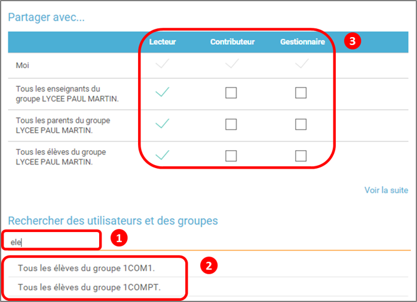

= Mur Collaboratif

Le*Mur Collaboratif* permet de créer un mur sur lequel les
*contributeurs* peuvent chacun *ajouter des notes*, à la façon d’un
tableau sur lequel on ajoute des post-it*.*

* link:index.html?iframe=true#presentation[Présentation]
* link:index.html?iframe=true#cas-d-usage-1[Créer et partager un mur
collaboratif]
* link:index.html?iframe=true#cas-d-usage-2[Ajouter une note au mur
collaboratif]
* link:index.html?iframe=true#notes-de-versions[Note de version]

== Présentation

Différents types de contenus (*son, image, texte, vidéo…*) peuvent être
intégrés dans les notes. Par ailleurs, chaque*note* est accompagnée du
*nom de son auteur* et de *sa date et heure de publication*. Une
*couleur de note* est automatiquement attribuée pour chaque participant
au mur.

 

image:../../wp-content/uploads/2015/06/m112.png[m1]

== Créer et partager un mur collaboratif

Pour accéder à l’appli Mur collaboratif, cliquez sur l’icône
correspondante dans la page « Mes applis ».

image:../../wp-content/uploads/2016/08/mur-1.png[image]

image:../../wp-content/uploads/2015/06/m11.png[m1]

Dans le service Mur Collaboratif, cliquez sur « Créer un mur ».

image:../../wp-content/uploads/2015/07/c11.png[c1]

Une nouvelle page apparaît.

1.  Saisissez le nom de votre mur
2.  Choisissez une vignette d'illustration
3.  Saisissez une description
4.  Choisissez une image de fond
5.  Cliquez sur « Sauvegarder »

image:../../wp-content/uploads/2016/08/mur-2-1024x474.png[image]Pour
partager le mur, cliquez sur le + (1) correspondant au mur puis sur
« Partager » (2).

image:../../wp-content/uploads/2016/08/mur-3-1024x501.png[image]

Dans la fenêtre de partage, vous pouvez donner des droits de  lecture,
de contribution et de gestion à d’autres personnes sur votre mur. Pour
cela, saisissez les premières lettres du nom de l’utilisateur ou du
groupe d’utilisateurs que vous recherchez (1), sélectionnez le résultat
(2) et cochez les cases correspondant aux droits que vous souhaitez leur
attribuer (3).

Les différents droits que vous pouvez attribuer sont les suivants :

* Lecture : l’utilisateur peut visualiser le mur
* Contribution : l’utilisateur peut ajouter des notes sur le mur
* Gestion : l’utilisateur peut modifier, supprimer et partager le mur

== Ajouter une note au mur collaboratif

Pour créer une note sur un mur, cliquez sur le mur souhaité.

[line-through]**image:../../wp-content/uploads/2016/08/mur-4-1024x229.png[image] +
 Puis cliquez sur « Nouvelle note ».

image:../../wp-content/uploads/2015/07/c4.png[c4]

Un post-it apparaît, présentant différentes fonctionnalités disponibles
sur la partie supérieure droite. +
 image:../../wp-content/uploads/2015/06/m9.png[m9]

* Pour modifier  la couleur de la note, cliquez
sur:image:../../wp-content/uploads/2015/06/m10.png[m10]

Une palette de couleurs apparait sur la partie supérieure de la page.
Cliquez sur la couleur désirée.

image:../../wp-content/uploads/2015/06/m111.png[m11]

* Pour afficher l'auteur de la note, cliquez
sur:image:../../wp-content/uploads/2015/06/m12.png[m12]

image:../../wp-content/uploads/2015/06/m13.png[m13]

* Pour ajouter du contenu à la note, cliquez
sur:image:../../wp-content/uploads/2015/06/m14.png[m14]

image:../../wp-content/uploads/2016/01/éditeur-texte_mur_collabora-1024x288.png[image]

* Pour supprimer la note, cliquez
sur:image:../../wp-content/uploads/2015/06/m16.png[m16]

== Note de version

A chaque nouvelle version de l'application, les nouveautés seront
présentées dans cette section.
