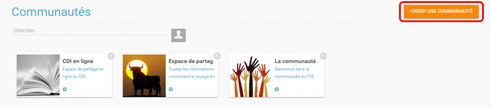
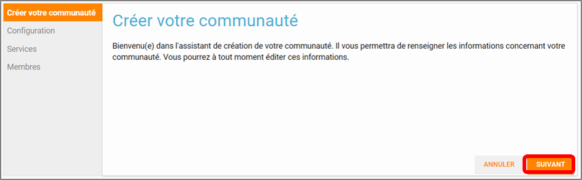
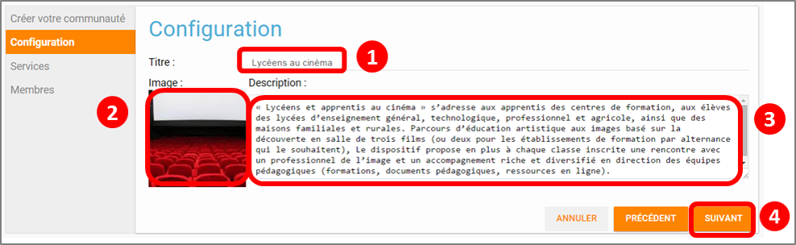
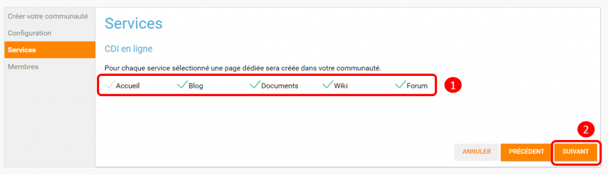
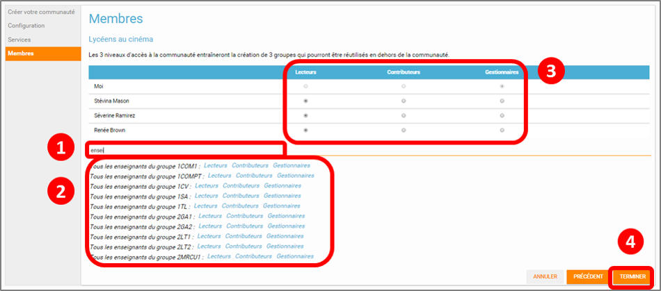

[[communautes]]
= Communautés

L’appli *Communautés* permet de *rassembler* un *groupe d’utilisateurs*
autour d’un *intérêt commun* pour **communiquer**, *partager* ou
*collaborer* en utilisant différentes applis *(Blog, Forum, Wiki,
Documents...).*

* link:index.html?iframe=true#presentation[Présentation]
* link:index.html?iframe=true#cas-d-usage-1[Créer et partager une
communauté]
* link:index.html?iframe=true#notes-de-versions[Note de version]

http://creativecommons.org/licenses/by-nc-sa/3.0/fr/[image:../../wp-content/uploads/2015/03/CC-BY-NC-SA-3.0-FR-300x105.png[CC
BY-NC-SA 3.0 FR,width=100,height=35]]

[[presentation]]
== Présentation

Plutôt que de proposer un usage centré sur un outil (le blog ou le wiki
par exemple), l'appli communautés permet de rassembler un groupe
d'utilisateurs autour d'un *projet collaboratif.* Pour chaque communauté
créée (Espace CDI, parcours artistique, communauté de l'association
sportive, ...), il est possible de définir précisément les droits de
chaque utilisateur et les applis mises à disposition (blog, wiki,
documents, forum, pages...).

image:../../wp-content/uploads/2016/04/Communaut_Pres-ConvertImage.png[Communaut_Pres-ConvertImage,width=600,height=266]

[[cas-d-usage-1]]
== Créer et partager une communauté

Pour accéder à l’appli Communautés, cliquez sur l’icône correspondante
dans la page « Mes applis ».

image:../../wp-content/uploads/2016/04/Mes_Applis_3-1024x231.png[Mes_Applis_3,width=600,height=135]

Cliquez sur « Créer une communauté ».

Un assistant de création apparait pour vous guider dans les étapes à
suivre.

Cliquez sur « Suivant ».

L’onglet Configuration de l’assistant s’affiche.

1.  Saisissez un titre de communauté
2.  Chargez une image d’illustration si vous le souhaitez
3.  Renseignez une description
4.  Cliquez sur « Suivant »

L’onglet Services de l’assistant s’affiche.

1.  Choisissez les services que vous souhaitez utiliser dans votre
Communauté.
2.  Cliquez sur « Suivant »

L’onglet Membres de l’assistant s’affiche.

Dans cet onglet, vous décidez avec qui vous souhaitez partager votre
communauté.

1.  Saisissez les premières lettres du nom d’un utilisateur ou d’un
groupe.
2.  Cliquez sur les utilisateurs ou groupes d’utilisateurs avec lesquels
vous souhaitez partager la communauté.
3.  Définissez les droits accordés pour chaque membre de la communauté.

Lorsque vous ajoutez un groupe d’utilisateurs, chaque membre du groupe
est affiché pour que vous puissiez définir les droits de partage au cas
par cas.

Les différents droits que vous pouvez attribuer aux autres utilisateurs
sont les suivants :

* Lecture : l’utilisateur peut visualiser les contenus créés dans la
communauté
* Contribution : l’utilisateur peut créer du contenu dans les services
de la communauté
* Gestion : l’utilisateur peut partager, modifier et supprimer la
communauté

 4. Cliquez sur « Suivant ».

La communauté est maintenant créée et partagée. Chaque appli de la
communauté est accessible de manière différenciée. Par exemple, le wiki
 de la communauté est accessible depuis l'appli communauté et depuis
l'appli wiki.

'''''

Des listes de diffusion des utilisateurs de la communauté sont
automatiquement créées: lecteurs de la communauté, contributeurs de la
communauté et gestionnaires de la communauté. Ces listes de diffusion
peuvent être utilisées dans tous les services de l'ENT.

'''''

 

Pour savoir comment créer du contenu dans les différents services de
votre communauté,  reportez-vous aux cas d’usages de chacun de ces
services.

[[notes-de-versions]]
== Note de version

A chaque nouvelle version de l'application, les nouveautés seront
présentées dans cette section.
