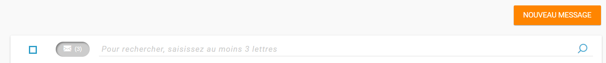
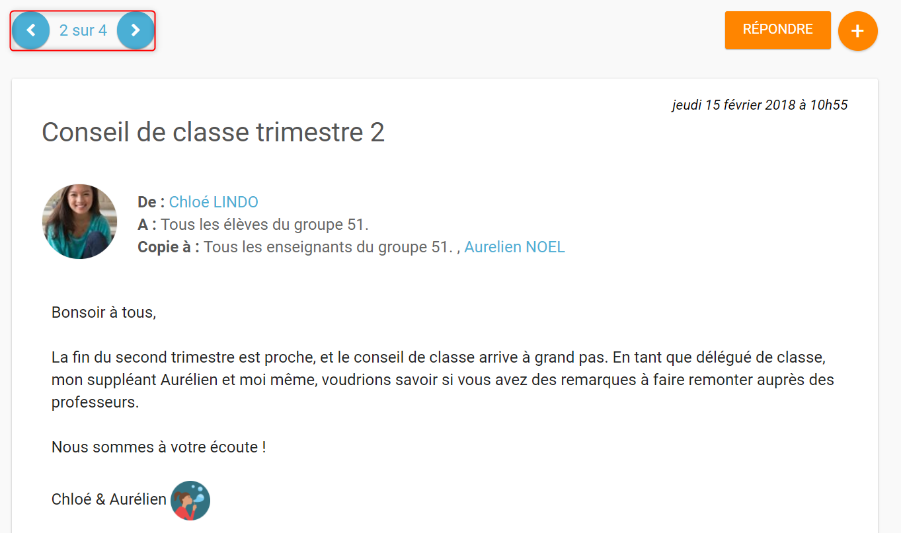

# Messagerie

Communiquez dans un cadre sécurisé ! Envoyez et recevez tous vos e-mails via l’application **Messagerie**. Intégrez des liens vers vos productions, des images, des vidéos ou des sons, c’est vous le patron !

## Présentation

L’appli Messagerie permet d’envoyer simplement un message à **un utilisateur** ou à un **groupe d’utilisateurs** \(les élèves d’une classe, le personnel de l'établissement, etc.\) ayant un accès à l’ENT.

La réception d’un nouveau message est visible dès la page d’accueil. Elle est indiquée par une **notification** dans le bandeau de navigation et dans le fil de nouveautés. Le nombre de messages non lus est indiqué devant chaque dossier.

## Envoyer un message

Dans le service Messagerie, cliquez sur le bouton « Nouveau message » présent en haut de la page.

Vous accédez à la fenêtre de création d’un message.

\(1\) Indiquez le\(s\) destinataire\(s\) de votre message dans le champ « A » en saisissant les trois premières lettres de son nom ou en appuyant sur entrée. Ce champ doit être obligatoirement remplis pour pouvoir envoyer le message. Vous pouvez adresser un message à vous-même, à un utilisateur en particulier \(par exemple un élève\), ou à un groupe d’utilisateurs \(par exemple les parents d’élèves de Terminale\).

\(2\) Ajoutez des personnes ou des groupes dans le champ « Copie » si vous souhaitez leur adresser une copie du message.

\(3\) Ajoutez des personnes ou des groupes dans le champ « Copie Cachée ». Les utilisateurs et/ou groupes ajoutés dans ce champ ne seront pas visibles des autres destinataires et ne pourront répondre qu'à l'expéditeur et au\(x\) destinataire\(s\).

\(4\) Indiquez le sujet de votre message dans le champ « Objet ».

Pour sélectionner les destinataires de votre message :

1. Effectuez votre recherche
2. Les résultats s’affichent dans la liste déroulante

Dans la fenêtre de saisie de contenu, rédigez votre message \(1\). Cliquez sur "Ajouter une pièce jointe" \(2\) pour joindre un document à votre message.

Choisissez le document depuis votre poste de travail.

En cochant « Ajouter une signature », vous pouvez maintenant paramétrer l’ajout d’une signature \(1\) pour ce message et pour les suivants.

L’option pourra être à tout moment décochée et le texte modifié : en cliquant sur la flèche vous faites apparaître le bloc de texte dédié à la signature.

Lorsque vous commencez la rédaction de votre message, un brouillon est automatiquement créé dans la rubrique « brouillon » de votre messagerie.

Toutes les modifications effectuées sont automatiquement enregistrées. Vous pouvez donc interrompre à tout moment la création de votre message et la reprendre plus tard en vous rendant dans l’onglet « brouillon ».

Une fois que votre message est prêt, vous pouvez l’envoyer.

## Visualiser mes messages reçus

Lorsque vous recevez un nouveau message, la notification est indiquée dans le bandeau de navigation supérieur.

Une fois dans l’appli messagerie, les nouveaux messages sont visibles dans la notification indiquée dans le dossier « boîte de réception ». Le nombre de messages non lus est indiqué dans la bulle à droite de la mention « Boîte de réception ».

Sur l’écran central, les messages non lus apparaissent en bleu dans la liste et sont indiqués par une enveloppe fermée.

\(1\) Une flèche indique que le message a été traité et qu’une réponse a été envoyée.

\(2\) Le trombone indique que le message comporte une pièce jointe

\(1\) Le filtre « messages non lus » vous permet de ne faire apparaître que les messages qui n’ont pas encore été lus.

\(2\) La barre de recherche vous permet de rechercher un message dans le dossier en cours de consultation grâce au nom d’un utilisateur, un mot clé présent dans l’objet ou le contenu.

Cliquez sur le titre d’un message pour en lire le contenu.

Les flèches présentes en haut à gauche du message permettent de passer d’un message à un autre au sein de la catégorie ou la sélection.

En revenant à la liste de vos messages dans la rubrique « Boîte de réception » de votre messagerie, vous pouvez :

\(1\) sélectionner plusieurs messages

\(2\) les déplacer dans un dossier \(pour cela vous pouvez également utiliser le "drag & drop"\)

\(3\) les marquer comme lu

\(4\) les marquer comme non lu

## Répondre, transférer, classer et supprimer un message

Lorsque vous avez cliquez sur le titre d’un message, vous accédez à son contenu. Le bouton « répondre » en haut à droite vous permet de répondre à l’émetteur du message.

La fenêtre de création d’un message s’ouvre. L’émetteur du message reçu est automatiquement ajouté en tant que destinataire.

Si vous avez reçu un message groupé vous pouvez cliquez sur le bouton « + » \(1\) présent en haut à droite pour faire apparaître les options secondaires :

\(2\) Répondre à tous : tous les destinataires du messages reçus sont automatiquement ajoutés dans les champs « à » et « en copie » selon la répartition du message d’origine.

\(3\) Transférer : la fenêtre de création de contenus s’ouvre, le champ destinataire est vide et la pièce jointe est reprise si le message transféré en possédait une.

\(4\) Imprimer

\(5\) Supprimer : Le message sera déplacé dans votre corbeille. Vous pourrez le supprimer définitivement ou le restaurer en le sélectionnant dans le dossier « Corbeille ».

