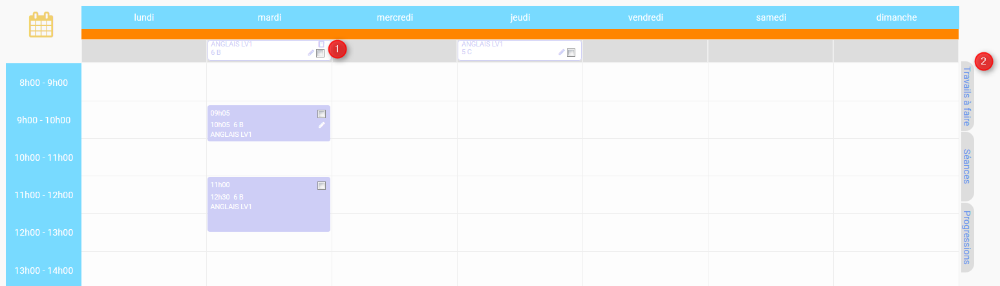
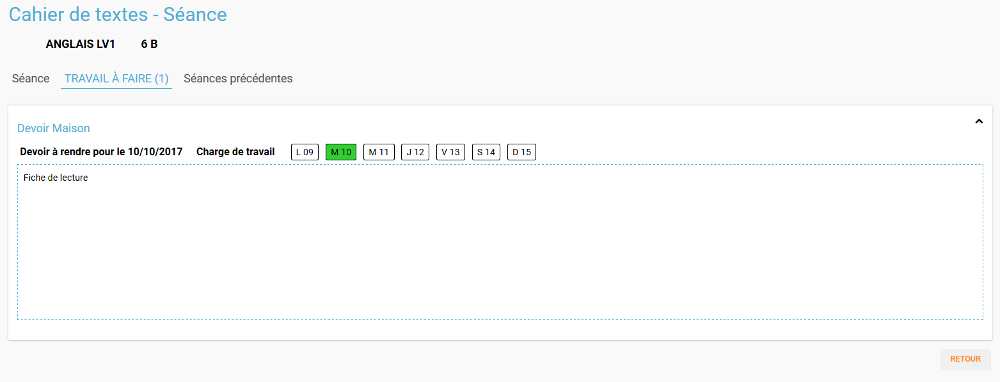

# Cahier de textes

Devenez un maître de l’organisation avec l’appli **Cahier de Texte** ! Créez et organisez vos cours comme vous le souhaitez !

Découvrez des fonctionnalités différentes adaptées au profil de l’utilisateur.

## Profil enseignant

Les enseignants peuvent créer et organiser une séance. Il leur est ensuite possible d’intervenir sur les séances afin d’y ajouter des travails à faire, ainsi que de suivre la progression.

### Calendrier

C’est l'écran d’accueil du cahier de texte. Il s’ouvre sur la semaine courante.

#### Créer une séance

Une séance correspond à un cours, à une date donnée et à une heure donnée. Cliquer sur "Créer une séance".

Une nouvelle page s’ouvre. La séance sera à l'état de brouillon tant qu’elle n’aura pas été publiée. On peut sélectionner la matière \(1\), ainsi que le groupe concerné \(2\).

3 onglets sont disponibles :

* Séance : c’est la description du cours.
* Travail à faire : permet d’ajouter un travail à faire
* Séances précédentes.

#### Créer un travail

On peut créer un travail

* soit à partir de la page calendrier :

* soit à partir du détail d’une séance, via l’onglet "Travail à faire".

On indique la date pour laquelle le travail doit être rendu \(1\) et le type de devoir \(2 : Devoir maison / Exercices / Autres\).

La charge de travail \(3\) des élèves pour la semaine courante est affichée, afin d'éviter de surcharger les élèves.

Si le travail à faire a été créé pour une séance, il apparaît dans la barre en haut de l’agenda \(1\). Si l’on crée un travail à faire indépendamment d’une séance, il apparaît dans l’onglet à droite de l’agenda "Travails à faire" \(2\).

#### Glisser déposer un travail

Cliquer sur l’onglet "Travails à faire". La liste apparaît.

Cliquer sur le travail que vous voulez planifier, et glissez-le dans la barre des devoirs \(1\).

#### Glisser une séance

Cliquer sur l’onglet "Séances". La liste apparaît. Cliquer sur la séance à planifier, et glissez-la dans l’agenda à la date souhaitée.

#### Publication

Après la création d’une séance, celle-ci est d’abord à l'état de brouillon. Pour la "valider" et la rendre visible par les autres utilisateurs, on doit la "publier".

* Cocher la séance que l’on souhaite publier \(1\)
* Cliquer sur "Publier" dans le menu qui apparaît au bas de la page \(2\), et confirmer.

Il est possible de dépublier une séance via le détail.

#### Partage

Pour déterminer avec qui l’on souhaite partager une séance, sélectionner la séance \(1\), puis cliquer sur "Partager" dans le menu \(2\).

Il est à noter que l’on peut définir la liste de partage avant de publier la séance.

### Liste

Outre la vue Agenda, une vue **liste** des séances est disponible :

La liste peut être filtrée par date \(1\) ou par matière \(2\)

En cliquant sur une date \(1\), on peut accéder au détail de la journée. Une icône indique s’il s’agit d’un cours \(2\) ou d’un travail à faire \(3\). Pour modifier un cours ou un devoir, on peut le sélectionner en le cochant, et accéder au menu.

### Progression

La progression est une suite de séances, qui doivent être effectuées dans un ordre précis. Elle est accessible via la vue Agenda.

On accède à la liste des progressions disponibles. Un filtre est disponible \(1\). On peut avoir une vue détaillée en cliquant sur \(2\).

En choisissant la progression, on peut accéder à la liste des séances et devoirs impliqués dans la progression \(3\).

La vue détaillée :

Sélectionner une progression pour en voir le détail. Il est possible à partir de cet écran de modifier les séances et les devoirs.

Pour créer une nouvelle progression, cliquer sur "Créer une progression" \(1\) et remplir les champs \(2\).

### Contenu

Du contenu peut être rajouté à la progression. Par contenu, on entend "séance", y compris les travails à faire qui peuvent y être liés. Pour ce faire, sélectionner une progression, et "Ajouter du contenu" \(1\).

On se retrouve avec l’interface de création de séance.

De retour vers l'écran détail de la progression, on peut ordonner les séances. Cliquer sur l'élément à déplacer, et faire un glisser - déposer :

Ici, nous avons pris le cours sur les verbes irréguliers pour les placer avant le cours sur le vocabulaire :

Pour rajouter une séance d’un contenu dans l’agenda, on sélectionne d’abord la progression concernée, puis la séance, et on fait un glisser déposer :

### Semaine modèle A et B

Les professeurs peuvent définir des semaines modèles, limitées à 2 \(A et B\). Cela permet de gérer facilement l’alternance de semaines.

**Par exemple**, un professeur donne un cours de latin le lundi de 14h à 15h. Cependant, ce cours est donné **une semaine sur deux** à une classe de 5ème, et une semaine sur deux à une classe de 4ème. Avec les semaines modèles, il pourra facilement définir la semaine de cours à la classe de 5ème comme étant le **modèle A**, et la semaine de cours à la classe de 4ème le **modèle B**.


Chaque semaine sera ainsi reproduite sur toute l’année, mais restera modifiable individuellement. Un raccourci d’inversion des modèles A et B est proposé, afin de faciliter la gestion, par exemple, des vacances qui ne durent qu’une semaine.


### Archive

Pour consulter les archives, cliquer sur "Voir les archives".

On peut à partir de là consulter les archives sur une année scolaire, soit en triant par enseignant soit par classe \(1\). Un filtre est disponible \(2\), et il reste à choisir l’année \(3\) et la classe / l’enseignant \(4\).

## Profil élève \(visualisation\)

L'élève n’a accès qu'à la consultation de l’agenda. Il ne peut pas intervenir sur les séances. Il voit les devoirs à faire \(1\) et les séances \(2\).

En cliquant sur la séance, il peut accéder au détail, avec le travail à faire éventuellement rattaché \(toujours en lecture seule\).

## Profil parent \(visualisation\) choix enfant

L’affichage est exactement le même que pour un élève.

Cependant, si le parent a plusieurs enfants, il devra sélectionner de quel enfant il souhaite consulter le cahier de texte.

## Profil Directeur d'établissement

Le directeur d'établissement a accès à tous les contenus publiés des professeurs de son périmètre. Sur la vue agenda, un filtre permet de cibler la vue :

* Par établissement \(1\)
* Par enseignant \(2\)
* Par classe \(3\)

Les séances et les devoirs à faire sont en lecture seule. Cependant, la gestion des visas permet de les valider.

### Gestion des visas

Les visas sont délivrés par le directeur d'établissement aux séances et aux devoirs à faire, afin de signaler l’inspection de leur contenu et leur planification. On y accède via le bouton dans l’agenda :

Un filtre permet de sélectionner les élements :

* Par enseignant \(1\)
* Par matière \(2\)
* Par classe \(3\)
* Par statut \(soit "A viser" soit "Visé et à viser"\) \(4\)

Les séances sont regroupées par enseignant / classe / matière, avec la possibilité d’aposer un visa global en sélectionnant plusieurs triplets.

* Si la date de visa est **verte** \(5\), alors les séances ont été validées \( = visées \).
* Si aucune validation n’a encore été apportée, "Non visé" est indiqué \(6\).
* Si elle est **orange** \(7\), les séances ont été validées, mais ont été modifiées depuis la validation.
* On peut accéder au **détail des séances** en cliquant sur \(8\).

#### Appliquer un visa : en verrouillant / sans verrouiller

Lorsque l’on applique le visa, une fenêtre s’ouvre. Il est **obligatoire** de rentrer un commentaire pour valider.

Si l’on **verrouille**, cela signifie que l’enseignant ne pourra plus modifier la séance.

#### Générer PDF

Tous les visas peuvent être édités sous forme de PDF via le menu.

#### Gestion des habilitations Inspecteur

Le directeur d'établissement peut gérer les habilitations des inspecteurs.

Cela permet d’attribuer ou de retirer à l’inspecteur \(2\) le droit de délivrer un visa pour l’enseignant de cet établissement \(1\).

Pour rajouter un enseignant, on saisit son nom dans \(3\). Et pour supprimer l’habilitation, on clique sur \(4\).

## Profil inspecteur

Tout comme le directeur d'établissement, l’inspecteur peut délivrer des visas, mais uniquement aux séances des enseignants pour lesquels il a obtenu une habilitation \(voir la section "Directeur d'établissement" pour plus de détails\).

Un filtre permet de sélectionner l'établissement et l’enseignant.

En cliquant sur "Gérer les visas", l’inspecteur peut valider les séances de la même manière que le directeur d'établissement.

