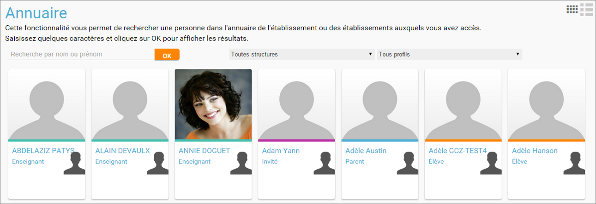

[[annuaire]]
= Annuaire

L’**Annuaire** permet de rechercher un utilisateur de la plateforme avec
lequel l'utilisateur est en contact, à la façon des « Pages Blanches ».

* link:index.html?iframe=true#presentation[Présentation]
* link:index.html?iframe=true#notes-de-versions[Note de version]

http://creativecommons.org/licenses/by-nc-sa/3.0/fr/[image:../../wp-content/uploads/2015/03/CC-BY-NC-SA-3.0-FR-300x105.png[CC
BY-NC-SA 3.0 FR,width=100,height=35]]

[[presentation]]
== Présentation

Pour effectuer une recherche, il suffit de saisir les premières lettres
du nom ou du prénom de l'utilisateur et de filtrer les résultats par
structure ou type de profil.

Le code couleur présent sur chaque vignette permet d'identifier
rapidement le profil des utilisateurs (enseignant, élève, parent, etc.).
En cliquant sur une vignette, il est possible d'accéder aux
*informations personnelles* de l'utilisateur (photo, classe, statut…) et
**d'interagir avec lui en quelques clics** (envoi d’un message par
exemple).

[[notes-de-versions]]
== Note de version

A chaque nouvelle version de l'application, les nouveautés seront
présentées dans cette section.
