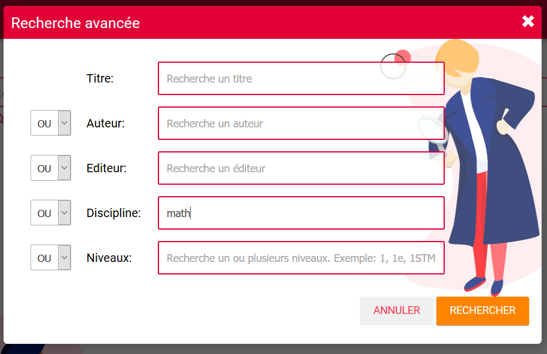

### Documentation Médiacentre

Médiacentre est un **moteur de recherche** qui vous permet de chercher des ressources pédagogiques dans trois espaces différents : **le GAR, Moodle et PMB**.
Seuls les **enseignants et élèves** peuvent voir des ressources GAR dans le Mediacentre.

- Dans le GAR, le médiacentre n’effectue la recherche que sur les **ressources qui vous ont été affectées.**
- Pour Moodle, il s’agit uniquement des **parcours publiés publiquement** par des enseignants (pas encore disponible).
- Pour PMB, le médiacentre permet de chercher dans la **base complète de votre CDI** (pas encore disponible non plus).

Ce moteur de recherche se présente comme tout moteur de recherche en ligne avec la possibilité de **chercher en plein texte** en tapant le mot de votre choix (discipline, niveau, mot clé, éditeur…) :

Ou à l’aide d’une **recherche avancée** afin de préciser votre demande.

Une fois la recherche effectuée, il vous est possible de **trier les résultats** en fonction des champs disponibles. Vous pourrez ainsi trier par **type de ressource, par niveau ou par discipline.** (1) Ces menus déroulants dépendent des résultats de votre recherche. Tous n’apparaîtront pas à chaque fois.

Il vous est aussi possible **d’ajouter une ressource à vos favoris** afin de la retrouver plus rapidement depuis votre tableau de bord, en cliquant simplement sur **Ajouter aux favoris**. Un second clic sur ce bouton enlève la ressource de vos favoris. (2)

Vous pouvez également **copier directement le lien** d’une ressource afin de le partager ailleurs sur l’ENT. (3)

Par ailleurs, afin de faciliter l’accès à vos ressources pédagogiques de travail, vous trouverez directement sur votre tableau de bord :
-	Les **manuels numériques** qui vous ont été attribués
-	Vos **ressources favorites**
- et à terme les **dernières nouveautés** qui vous ont été affectées.

