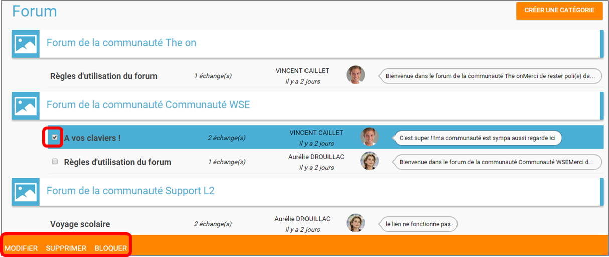

# Forum

L’appli **Forum** est un espace de discussion en ligne, propre à votre réseau éducatif, qui permet à chacun de poser des questions, donner son point de vue, ou tout simplement échanger ses idées !

## Présentation

Le forum est un outil d'échange généralement **animé par une ou plusieurs personnes**. Il permet à différents utilisateurs **de publier des messages affichés les uns à la suite des autres**.

L’appli Forum permet de créer des catégories de forum dans lesquelles il est ensuite possible d’animer des discussions. Chaque message publié dans la discussion s’affiche à la suite du précédent avec la date de publication et l’identifiant de la personne qui a posté le message.

## Créer et partager une catégorie

Pour créer un forum, cliquez sur « Créer une catégorie ».

1. Saisissez un titre
2. Cliquez sur l’image pour modifier la vignette
3. Cliquez sur « Sauvegarder »

La catégorie de forum a été créée mais n’est pas encore visible par les autres utilisateurs. Pour la partager, suivez les étapes suivantes :

1. Saisissez les premières lettres du nom de l’utilisateur ou du groupe d’utilisateurs que vous recherchez
2. Sélectionnez le résultat
3. Cochez les cases correspondant aux droits que vous souhaitez leur attribuer

Pour valider, cliquez sur le bouton "Partager", puis "Terminer".

Les différents droits que vous pouvez attribuer aux autres utilisateurs de l’ENT sur la catégorie de forum sont les suivants :

* **Lecteur** : l’utilisateur peut lire le contenu des discussions
* **Contributeur** : l’utilisateur peut participer aux discussions
* **Modérateur** : l’utilisateur peut modifier ou supprimer un message et/ou une discussion
* **Gestionnaire** : l’utilisateur peut modifier, supprimer et définir les droits de partage du forum

Cliquez sur le bouton « Terminer » pour créer votre discussion.

## Créer une discussion

Pour créer une discussion :

1. Cliquez sur la case à cocher de la catégorie de forum dans laquelle vous souhaitez créer une discussion
2. Cliquez sur « Nouvelle discussion »

Dans la fenêtre qui s’ouvre, renseignez le titre de la discussion \(3\), saisissez le premier message \(2\) et cliquez sur « Envoyer » \(3\).

## Publier un message

Pour poster un message, cliquez sur la discussion concernée.

Rédigez votre message dans la zone de texte en bas de page \(1\) et cliquez sur « Répondre » \(2\).

## Gérer une catégorie

Si vous êtes habilité à créer une catégorie de forum \(présence du bouton « Nouvelle catégorie » en haut de l'écran\), vous disposez également des droits de gestion de la catégorie, c’est-à-dire que vous pouvez :

* Modifier la catégorie
* Supprimer la catégorie
* Définir les droits de partage de la catégorie.

Vous êtes gestionnaire d’une catégorie de discussions lorsque vous l’avez créée ou lorsque le créateur d’une catégorie vous a donné le droit de gestionnaire dans les fonctions de partage.

Pour gérer une catégorie, cliquez sur la case à cocher qui y est associée.

## Gérer une discussion

Si vous êtes gestionnaire d’une discussion \(présence du bouton « Nouvelle discussion » en haut de l'écran\), vous disposez également des droits de gestion de la discussion, c’est-à-dire que vous pouvez :

* Modifier la discussion
* Supprimer la discussion
* Bloquer la discussion.

Vous êtes gestionnaire d’une discussion lorsque vous l’avez créée ou lorsque le créateur d’une discussion vous a donné le droit de gestionnaire dans les fonctions de partage.

Pour gérer une discussion, cliquez sur la case à cocher qui y est associée.

