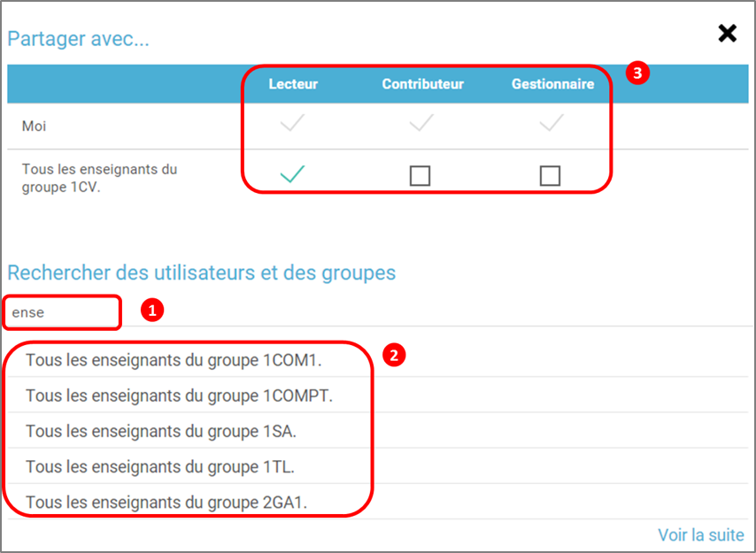

[[carte-mentale]]
= Carte Mentale

1, 2, 3… Brainstormez ! Fatigué de laisser filer vos idées de génie ? L’appli *Carte mentale* permet non seulement de les noter, mais aussi d’y relier toutes les réflexions qui en découlent ! À tester absolument.

[[summary]]
* link:index.html?iframe=true#presentation[Présentation]
* link:index.html?iframe=true#cas-d-usage-1[Créer une Carte Mentale]
* link:index.html?iframe=true#cas-d-usage-2[Partager une Carte Mentale]

http://creativecommons.org/licenses/by-nc-sa/3.0/fr/[image:../../wp-content/uploads/2015/03/CC-BY-NC-SA-3.0-FR-300x105.png[CC
BY-NC-SA 3.0 FR,width=100,height=35]]

[[presentation]]
== Présentation

L'appli Carte Mentale permet de *représenter visuellement une
arborescence* en créant des liens entre différentes idées. Le schéma se
construit autour d'une idée principale, sous forme d’image ou de texte,
à partir de laquelle plusieurs chemins se créent.

La carte mentale peut être faite de manière collective ou personnelle,
selon les souhaits du créateur de la carte.

image:/assets/Carte mentale 1.png[alt=""]

[[cas-d-usage-1]]
== Créer une Carte Mentale

Pour accéder à l’appli Carte mentale, cliquez sur l’icône correspondante
dans la page « Mes applis ».

image:/assets/Carte mentale 2.png[alt=""]

Cliquez sur « Créer une carte mentale ».

image:../../wp-content/uploads/2015/07/c1.png[c1,width=222,height=45]

1.  Saisissez un nom de carte
2.  Renseignez une description
3.  Cliquez sur « Enregistrer »

image:/assets/carte mentale 5.png[alt=""] +
Cliquez sur le nom de votre carte pour la créer.
Cliquez sur le nom de votre carte mentale dans le menu principal pour commencer à la construire. 

Le titre de la carte constitue le noeud de départ. 
 
*Ajouter de nouveaux nœuds*

Pour ajouter de nouvelles notions à un nœud, sélectionnez le nœud de départ et cliquez sur l’icône « Ajouter un nœud » ou taper directement sur la touche entrée. Le nouveau nœud est créé ainsi que le lien avec le nœud de départ.
image:/assets/carte mentale 6.png[alt=""]
 
*Supprimer un nœud*

Pour supprimer un nœud, sélectionnez le nœud et cliquez sur l’icône « Supprimer un nœud » ou taper directement sur la touche « supprimer ».
image:/assets/carte mentale 7.png[alt=""]

*La mise en forme du texte*

La barre d’outils de la carte mentale vous permet de modifier le format du texte : la typographie, la taille, la mise en forme de la police et sa couleur. Pour modifier le texte, sélectionnez le texte du nœud et cliquez sur les icônes suivantes dans la barre d’outils.
image:/assets/carte mentale 8.png[alt=""]

L’éditeur de texte vous permet de créer facilement une carte mentale.

link:../../wp-content/uploads/2015/06/m22.png[ +
]image:../../wp-content/uploads/2015/06/m5.png[m5,width=500]

*Ajouter un lien entre deux nœuds*

Pour ajouter lien entre deux nœuds, sélectionnez le nœud de départ (1), cliquez sur l’icône « ajouter un lien » dans la barre d’outils (2). Une flèche apparaît, cliquez sur le second nœud (3) pour indiquer le point d’arrivée de la flèche.
image:/assets/carte mentale 9.png[alt=""]

*Ajouter des contenus complémentaires à un nœud*

Grâce à la barre d’outils de la carte mentale vous pouvez ajouter à vos nœuds :
des émoticônes : pour faciliter la visualisation et la mémorisation d’une notion ;
des liens externes et des notes pour compléter le texte du nœud.
Pour ajouter un contenu complémentaire, sélectionnez le nœud et cliquez sur les icônes suivantes dans la barre d’outils.
image:/assets/carte mentale 10.png[alt=""]

*Les émoticônes apparaissent dans le nœud avant le texte.*

Les liens et les notes apparaissent sous forme d’icône dans le nœud avant le texte et une visualisation est proposée au survol de l’icône.
image:/assets/carte mentale 11.png[alt=""]

Lorsque la carte mentale est terminée, cliquez sur « Enregistrer ».

image:../../wp-content/uploads/2015/06/m6.png[m6,width=500]

Votre carte est maintenant créée !

 

[[cas-d-usage-2]]
== Partager une Carte Mentale

Pour partager une carte mentale avec d’autres utilisateurs, cliquez sur
le + (1) située à côté de la carte puis sur « Partager » (2).

image:/assets/Carte mentale 4.png[alt=""]

Dans la fenêtre de partage, vous pouvez donner des droits de lecture, de
contribution et de gestion à d’autres personnes sur votre carte. Pour
cela, saisissez les premières lettres du nom de l’utilisateur ou du
groupe d’utilisateurs que vous recherchez (1), sélectionnez le résultat
(2) et cochez les cases correspondant aux droits que vous souhaitez leur
attribuer (3).

Les différents droits que vous pouvez attribuer sont les suivants :

* Lecture : l’utilisateur peut visualiser la carte
* Contribution : l’utilisateur peut apporter des modifications à la
carte
* Gestion : l’utilisateur peut modifier, supprimer et attribuer des
droits de partage sur la carte

