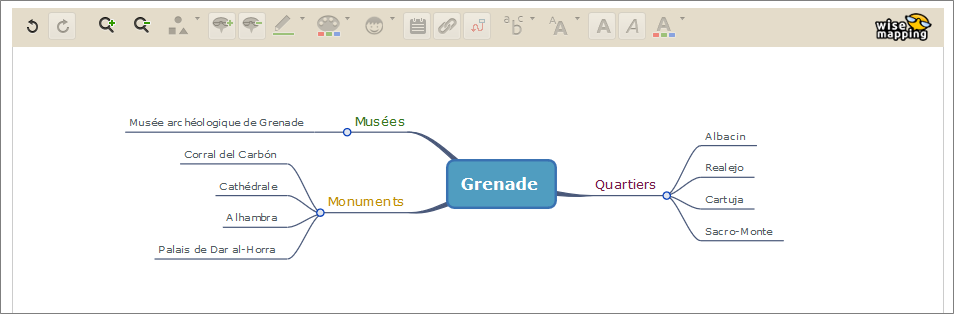
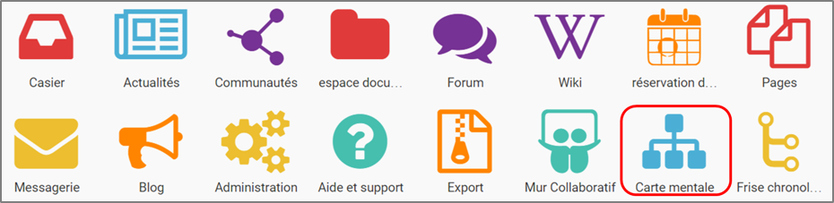
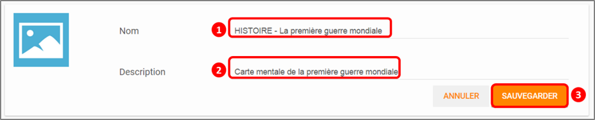
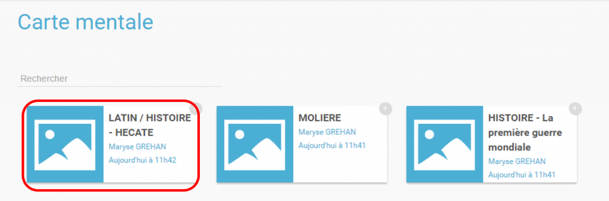
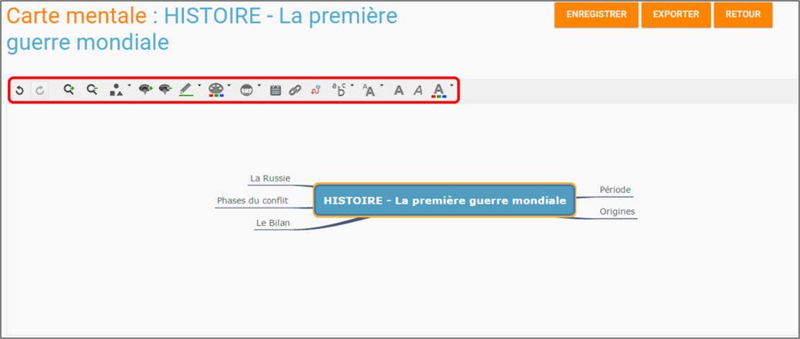
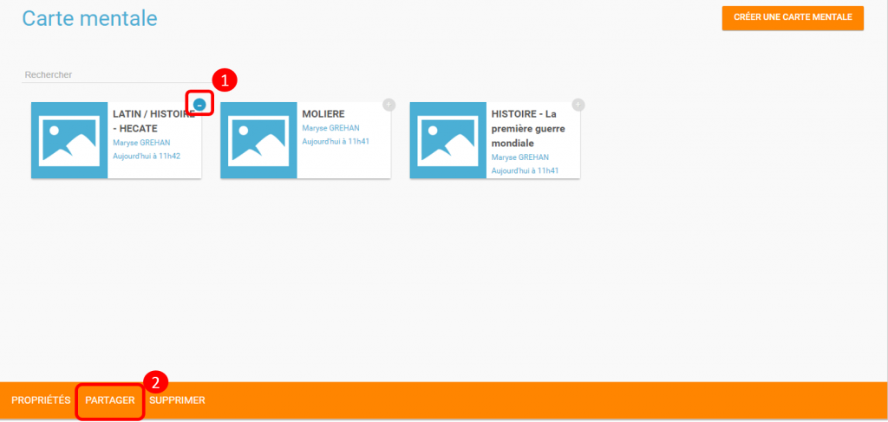

= Carte Mentale

L’appli *Carte Mentale*permet *d’organiser des idées, des concepts, des
prises de notes sous forme d'un schéma* permettant de représenter le
fonctionnement de la pensée.

* link:index.html?iframe=true#presentation[Présentation]
* link:index.html?iframe=true#cas-d-usage-1[Créer une Carte Mentale]
* link:index.html?iframe=true#cas-d-usage-2[Partager une Carte Mentale]
* link:index.html?iframe=true#notes-de-versions[Note de version]

== Présentation

http://creativecommons.org/licenses/by-nc-sa/3.0/fr/[image:../../wp-content/uploads/2015/03/CC-BY-NC-SA-3.0-FR-300x105.png[CC
BY-NC-SA 3.0 FR]]
javascript:window.print()[image:../../wp-content/themes/ode/assets/img/print-blue.png[Imprimer]]

L'appli Carte Mentale permet de *représenter visuellement une
arborescence* en créant des liens entre différentes idées. Le schéma se
construit autour d'une idée principale, sous forme d’image ou de texte,
à partir de laquelle plusieurs chemins se créent.

La carte mentale peut être faite de manière collective ou personnelle,
selon les souhaits du créateur de la carte.

== Créer une Carte Mentale

http://creativecommons.org/licenses/by-nc-sa/3.0/fr/[image:../../wp-content/uploads/2015/03/CC-BY-NC-SA-3.0-FR-300x105.png[CC
BY-NC-SA 3.0 FR]]
javascript:window.print()[image:../../wp-content/themes/ode/assets/img/print-blue.png[Imprimer]]

Pour accéder à l’appli Carte mentale, cliquez sur l’icône correspondante
dans la page « Mes applis ».

Cliquez sur « Créer une carte mentale ».

image:../../wp-content/uploads/2015/07/c1.png[c1]

1.  Saisissez un nom de carte
2.  Renseignez une description
3.  Cliquez sur « Sauvegarder »

 +
 Cliquez sur le nom de votre carte pour la créer.

 +
 

L’éditeur de texte vous permet de créer facilement une carte mentale.

link:../../wp-content/uploads/2015/06/m22.png[ +
]image:../../wp-content/uploads/2015/06/m5.png[m5]

Lorsque la carte mentale est terminée, cliquez sur « Enregistrer ».

image:../../wp-content/uploads/2015/06/m6.png[m6]

Votre carte est maintenant créée !

 

== Partager une Carte Mentale

http://creativecommons.org/licenses/by-nc-sa/3.0/fr/[image:../../wp-content/uploads/2015/03/CC-BY-NC-SA-3.0-FR-300x105.png[CC
BY-NC-SA 3.0 FR]]
javascript:window.print()[image:../../wp-content/themes/ode/assets/img/print-blue.png[Imprimer]]

Pour partager une carte mentale avec d’autres utilisateurs, cliquez sur
le + (1) située à côté de la carte puis sur « Partager » (2).

Dans la fenêtre de partage, vous pouvez donner des droits de lecture, de
contribution et de gestion à d’autres personnes sur votre carte. Pour
cela, saisissez les premières lettres du nom de l’utilisateur ou du
groupe d’utilisateurs que vous recherchez (1), sélectionnez le résultat
(2) et cochez les cases correspondant aux droits que vous souhaitez leur
attribuer (3).

Les différents droits que vous pouvez attribuer sont les suivants :

* Lecture : l’utilisateur peut visualiser la carte
* Contribution : l’utilisateur peut apporter des modifications à la
carte
* Gestion : l’utilisateur peut modifier, supprimer et attribuer des
droits de partage sur la carte

image:../../wp-content/uploads/2015/06/m7.png[m7]

== Note de version

http://creativecommons.org/licenses/by-nc-sa/3.0/fr/[image:../../wp-content/uploads/2015/03/CC-BY-NC-SA-3.0-FR-300x105.png[CC
BY-NC-SA 3.0 FR]]
javascript:window.print()[image:../../wp-content/themes/ode/assets/img/print-blue.png[Imprimer]]

A chaque nouvelle version de l'application, les nouveautés seront
présentées dans cette section.
