= Pages

L'appli *Pages* est un outil de création et publication de contenus,
permettant de créer des mini sites web internes*.*

* link:index.html?iframe=true#presentation[Présentation]
* link:index.html?iframe=true#cas-d-usage-1[Créer un mini site]
* link:index.html?iframe=true#cas-d-usage-2[Partager un site web]
* link:index.html?iframe=true#cas-d-usage-3[Créer une nouvelle page]
* link:index.html?iframe=true#notes-de-versions[Note de version]

== Présentation

http://creativecommons.org/licenses/by-nc-sa/3.0/fr/[image:../../wp-content/uploads/2015/03/CC-BY-NC-SA-3.0-FR-300x105.png[CC
BY-NC-SA 3.0 FR]]
javascript:window.print()[]

L'appli Pages permet de créer des pages web qui sont organisées entre
elles grâce à un menu de navigation, et offrant une grande liberté de
mise en page du contenu.

Il est possible d'insérer dans ces pages*différents*types de contenus*
(*texte, image, son, vidéo...) et*des liens vers d’autres contenus*. En
particulier, si un lien est enregistré vers un blog existant, la page
sera automatiquement mise à jour avec les nouvelles publications
effectuées dans le blog.

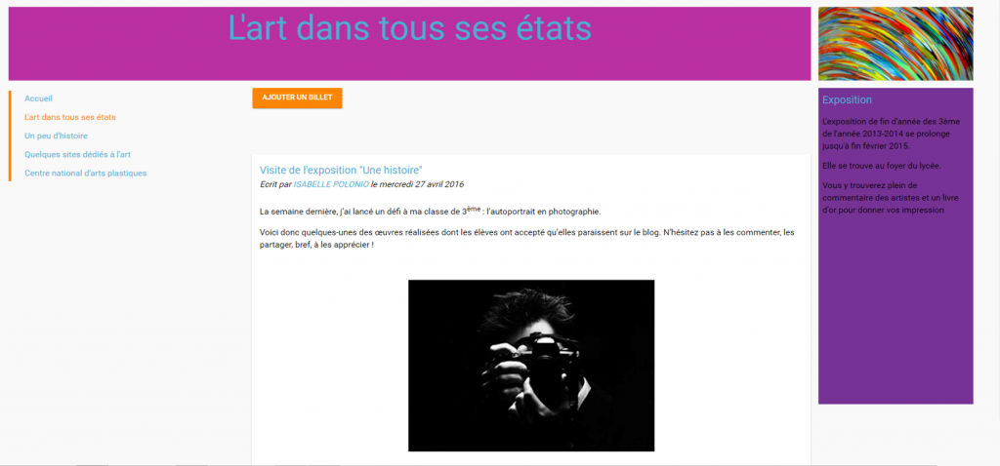

== Créer un mini site

http://creativecommons.org/licenses/by-nc-sa/3.0/fr/[image:../../wp-content/uploads/2015/03/CC-BY-NC-SA-3.0-FR-300x105.png[CC
BY-NC-SA 3.0 FR]]
javascript:window.print()[]

Depuis la page d’accueil, cliquez sur « Mes applis » en haut à droite de
l’écran puis cliquez sur « Pages ».

image:../../wp-content/uploads/2016/01/pages1.png[pages]

* Pour créer un site interne : Cliquez sur «  Créer un site» (1)
* Pour créer un site public: Cliquez sur le « + » (2), puis sélectionner
« site public » dans le menu d’actions qui s’affiche en bas de l’écran
(3).

Lorsque vous créez un site public celui-ci est visible de tous dans
l’ENT. De plus, toute personne extérieure à l’ENT peut accéder à ce site
si elle dispose du lien.

link:../../wp-content/uploads/2016/01/PAGES.png[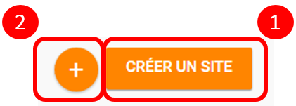 +
 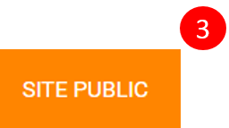]

 

Dans la nouvelle fenêtre, saisissez le titre de votre site (4) puis
cliquez sur le bouton « Créer » (5)

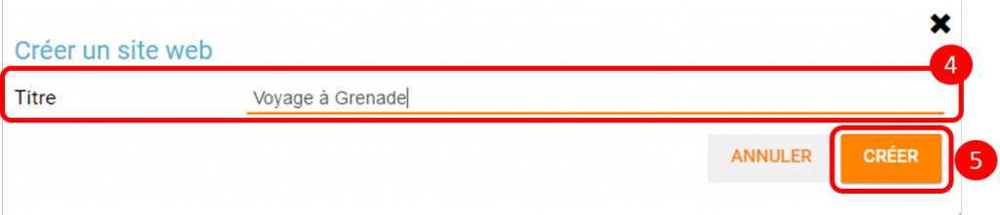

Votre site web est maintenant créé, vous pouvez le compléter en y
intégrant des contenus.

== Partager un site web

http://creativecommons.org/licenses/by-nc-sa/3.0/fr/[image:../../wp-content/uploads/2015/03/CC-BY-NC-SA-3.0-FR-300x105.png[CC
BY-NC-SA 3.0 FR]]
javascript:window.print()[]

Pour partager votre page, avec d'autres utilisateurs, suivez les étapes
suivantes :

1.  Sélectionnez la case à cochez de la page (1)
2.  Cliquez sur le bouton "Propriétés" (2)
3.  Puis cliquez sur « Partager dans l’ENT » (3).

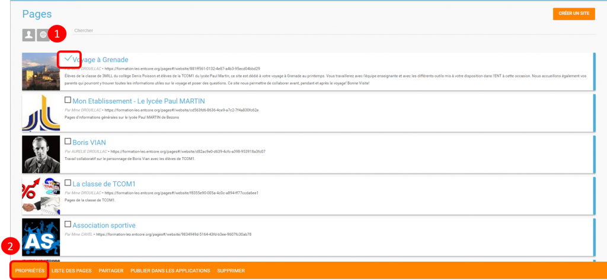

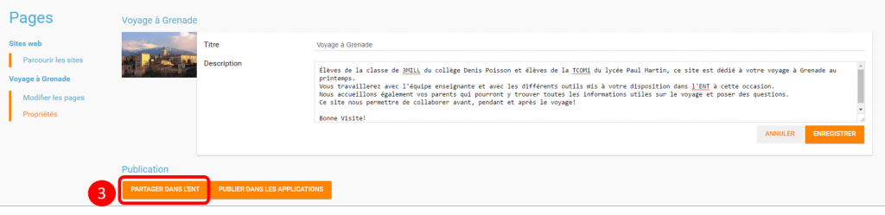

La fenêtre de partage apparaît. Pour attribuer des droits à d’autres
utilisateurs, suivez les étapes suivantes :

1.  Saisissez les premières lettres du nom de l’utilisateur ou du groupe
d’utilisateurs que vous recherchez (1).
2.  Sélectionnez le nom de l’utilisateur ou du groupe (2).
3.  Cochez les cases correspondant aux droits que vous souhaitez leur
attribuer (3).

image:../../wp-content/uploads/2016/04/Pages-Part_4-1024x665.png[Pages-Part_4]

Vous pouvez attribuer différents droits aux autres utilisateurs de
l’ENT :

* Consulter : l’utilisateur peut consulter la page
* Contribuer : l’utilisateur peut créer des pages qui vous seront
soumises avant publication
* Gérer : l’utilisateur peut modifier, partager ou supprimer la page

 

== Créer une nouvelle page

http://creativecommons.org/licenses/by-nc-sa/3.0/fr/[image:../../wp-content/uploads/2015/03/CC-BY-NC-SA-3.0-FR-300x105.png[CC
BY-NC-SA 3.0 FR]]
javascript:window.print()[]

Pour créer une nouvelle page, suivez les étapes suivantes :

1.  Sélectionnez la case à cochez de la page (1)
2.  Cliquez sur le bouton "Liste des pages" (2)
3.  Puis cliquez sur "Nouvelle page" (3).

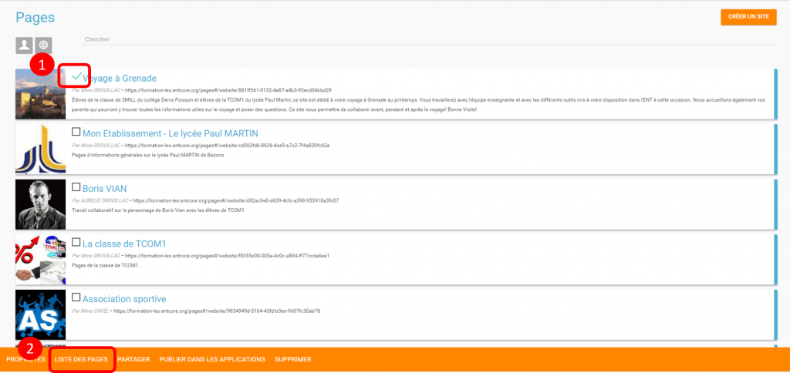

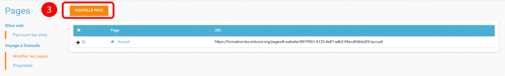

Une nouvelle page apparait.

1.  Choisissez un titre à votre page.
2.  Choisissez entre quatre modèles pour votre page : « Articles et
navigation », « Texte et navigation », "Une colonne" ou "Deux colonnes".

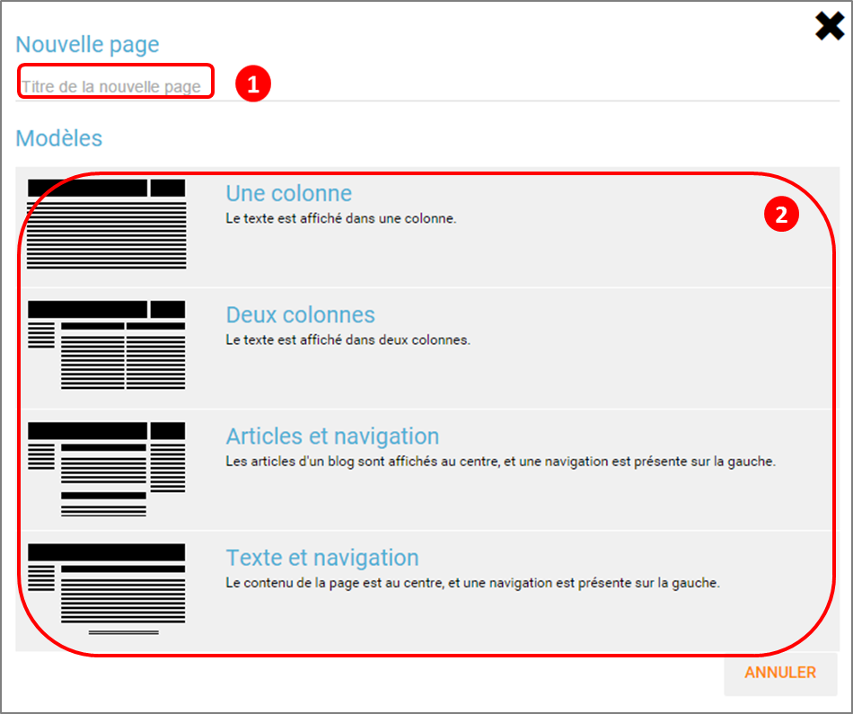

Votre nouvelle page apparaît. Pour la mettre en forme et y ajouter du
contenu, cliquez sur « Modifier » en bas à droite de l’écran.

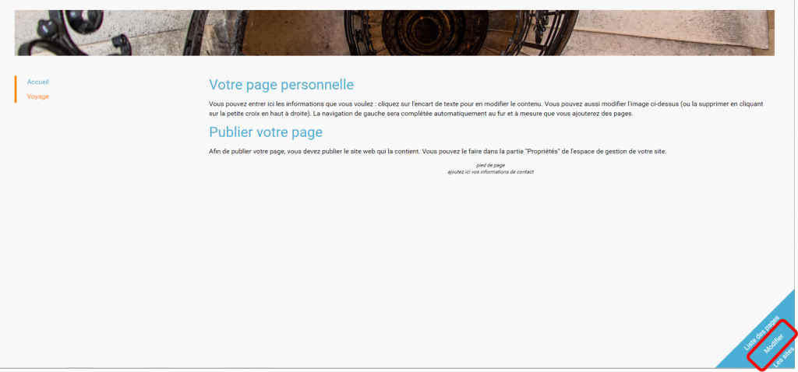

La page s’affiche avec différentes zones dans lesquelles vous pouvez
ajouter, modifier ou supprimer du contenu et que vous pouvez déplacer
sur la page.

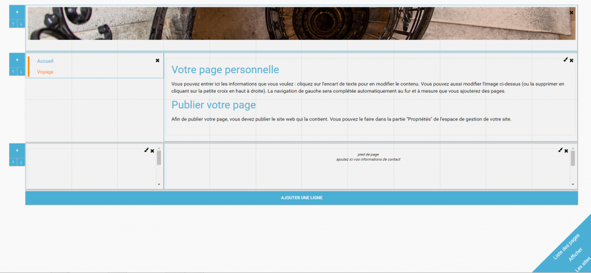

Pour visualiser un aperçu de la page, cliquez sur « Afficher », en bas à
droite de votre écran.

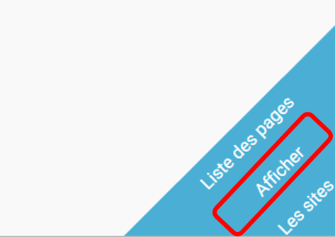 +
 link:../../wp-content/uploads/2015/05/P102.png[ +
]

== Note de version

http://creativecommons.org/licenses/by-nc-sa/3.0/fr/[image:../../wp-content/uploads/2015/03/CC-BY-NC-SA-3.0-FR-300x105.png[CC
BY-NC-SA 3.0 FR]]
javascript:window.print()[]

Nouveautés de la version 0.5

*Edition des billets de blog*

Les billets d’un blog affichés dans une page sur le service Pages sont
dorénavant modifiables directement depuis la page elle-même sans être
redirigé vers le service blog.

*Possibilité de dupliquer une page existante*

Un bouton permettant de dupliquer les pages a été ajouté. +
 

*Possibilité de renommer une page*

Un autre bouton permet de renommer les pages des sites.

*Modification de l’ordre des pages*

Il est possible de modifier l’ordre d’affichage des pages. Cliquez sur
le bouton suivant pour modifier la position de la page dans la
liste:link:../../wp-content/uploads/2015/07/icone.png[ +
] +
 

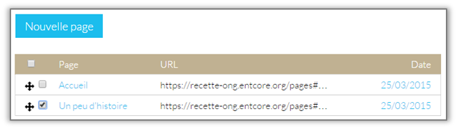 +

*Nouveaux sniplets*

Plusieurs sniplets* ont été ajoutés dans le service Pages. Les contenus
ci-contre peuvent maintenant être ajoutés aux pages.

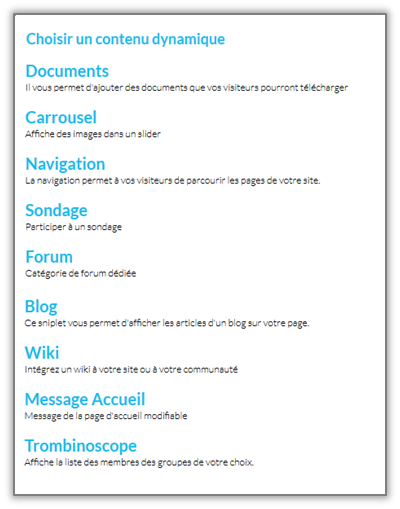

_*Un sniplet est un module qui permet d’intégrer des contenus issus des
applications._

*Pages publiques *

Le service Pages permet désormais de publier des sites publics
accessibles en ligne sans être connecté à l’ENT. Sur la page d’accueil
du service Pages, une icône permet de voir quels sont les sites publics.

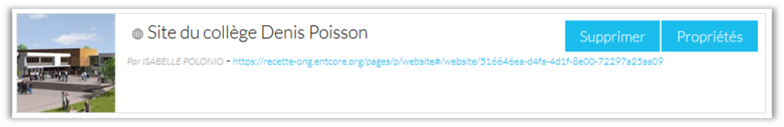

A la différence d’un site interne à l’ENT, il n’est pas possible
d’ajouter de sniplet dans un site public.

'''''

 

Nouveauté de la version 0.4

*Ajout d'un droit de gestion +
*

Il est désormais possible d’attribuer un droit de gestion aux sites du
service Pages. Ce droit permet d’avoir les mêmes permissions que le
propriétaire du site web (partage, suppression, édition, …).
