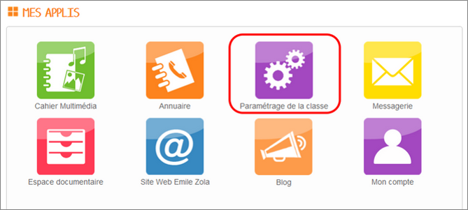
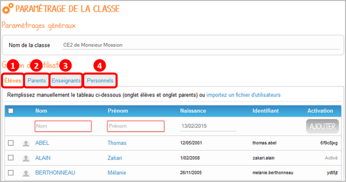
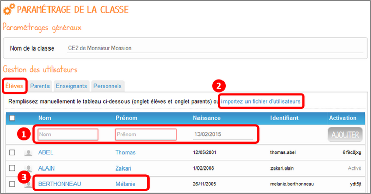
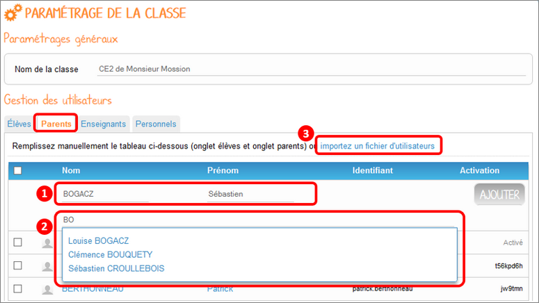
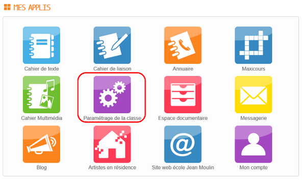
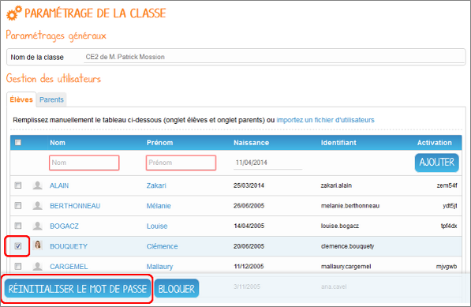
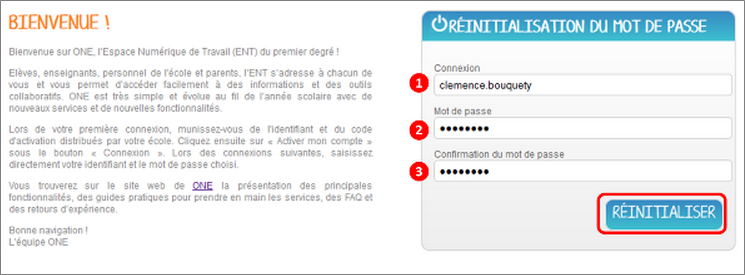
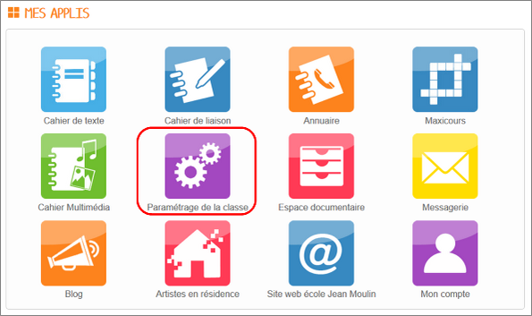
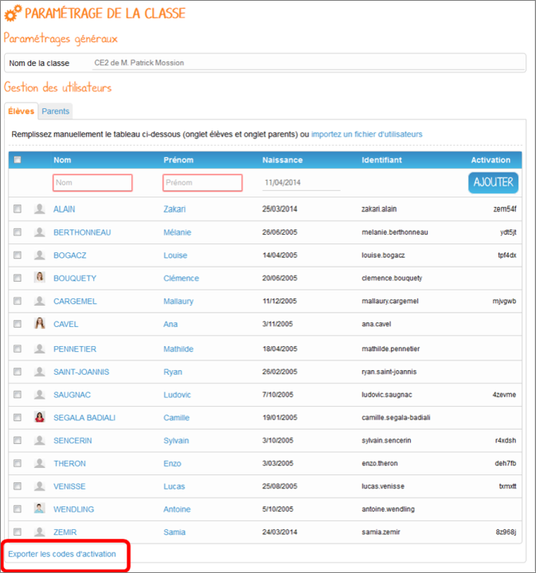
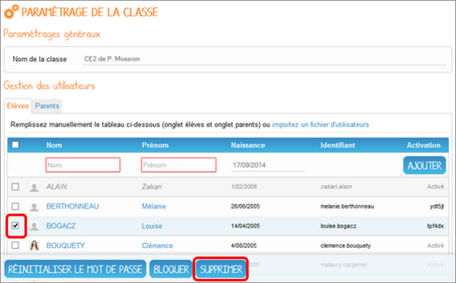

[[parametrage-de-la-classe-1d]]
= Paramétrage de la classe 1D

L’appli Paramétrage permet aux enseignants de gérer un ensemble de
paramètres pour leur classe en toute autonomie.

* link:index.html?iframe=true#presentation[Présentation]
* link:index.html?iframe=true#cas-d-usage-1[Créer des utilisateurs dans
la classe]
* link:index.html?iframe=true#cas-d-usage-2[Renouveler un mot de passe]
* link:index.html?iframe=true#cas-d-usage-3[Exporter les identifiants et
codes d'activation]
* link:index.html?iframe=true#cas-d-usage-4[Supprimer un utilisateur]
* link:index.html?iframe=true#notes-de-versions[Note de version]

http://creativecommons.org/licenses/by-nc-sa/3.0/fr/[image:../../wp-content/uploads/2015/03/CC-BY-NC-SA-3.0-FR-300x105.png[CC
BY-NC-SA 3.0 FR,width=100,height=35]]

[[presentation]]
== Présentation

Cette appli permet notamment de créer de nouveaux comptes (élèves,
parents, personnels, enseignants), d’exporter les identifiants et code
d’activation, de renouveler le mot de passe des utilisateurs de la
classe, d’activer de nouveaux services pour la classe, modifier le nom
de la classe, etc.

[[cas-d-usage-1]]
== Créer des utilisateurs dans la classe

Pour accéder à l’appli Paramétrage de la classe, cliquez sur l’icône
correspondante dans la page « Mes
applis ».

image:../../wp-content/uploads/2015/06/p1.png[p1,width=274,height=50] +

Vous accédez à la page de gestion de votre classe, qui vous permet de
modifier le nom de votre classe et d’administrer les utilisateurs
(élèves et parents).

Il est alors possible d’ajouter des élèves (1), des parents (2), des
enseignants (3) et des personnels
(4).

Pour ajouter des élèves, vous pouvez soit :

* Saisir manuellement les élèves (1),
* Importer un fichier CSV sur le modèle suivant (2) : http://one1d.fr/wp-content/uploads/2014/04/Import_ELEVES.csv[Import_ELEVES
(cliquez ici pour télécharger le fichier)]. +
Pour modifier les informations déjà saisies pour un utilisateur de votre
classe, cliquez sur le nom de l’utilisateur (3).

La création de compte parent s’effectue de la même manière. Dans
l’onglet « Parents », il est possible :

* De saisir manuellement les informations (1). Il faudra alors rattacher
l’élève correspondant en saisissant quelques lettres de son nom ou
prénom (2);

* D’importer un fichier « responsables » CSV sur le modèle suivant (3): : http://one1d.fr/wp-content/uploads/2014/08/Import_RESPONSABLES_2014.csv[Import_RESPONSABLES
(cliquez ici pour télécharger le fichier).]

.

Pour que les élèves soient bien rattachés aux parents, vérifiez que le
nom et prénom de l’élève soient correctement saisis dans le fichier des
parents.

Attention : pour le bon fonctionnement de ces manipulations, les élèves
doivent être créés avant les parents.

Pour créer un compte enseignant ou un compte personnel, il suffit de
renseigner le nom et le prénom de l’utilisateur dans l’onglet
correspondant.

[[cas-d-usage-2]]
== Renouveler un mot de passe

Pour accéder à l’appli Paramétrage de la classe, cliquez sur l’icône
correspondante dans la page « Mes
applis ».

image:../../wp-content/uploads/2015/06/p11.png[p1,width=268,height=49] +

Vous accédez à la page de gestion de votre classe, qui vous permet de
modifier le nom de votre classe et d’administrer les utilisateurs
(élèves et parents).

Dans l’onglet correspondant, sélectionnez l’utilisateur dont vous
souhaitez renouveler le mot de passe et cliquez sur « Réinitialiser le
mot de passe ».

Un email est alors envoyé sur l’adresse email que vous avez renseignée
dans la rubrique « Mon compte ».

Cet email contient le message suivant :

_Bonjour,_

_Vous avez demandé la réinitialisation d’un mot de passe. +
Pour procéder à cette réinitialisation, veuillez cliquer sur le lien
ci-dessous. +
[lien] +
Votre identifiant : [identifiant]_

_Si vous n’êtes pas à l’origine de cette demande, vous pouvez ignorer
cet email._

_Cordialement, +
L’équipe ENT_ +
Vous avez la possibilité de transmettre ce message à l’utilisateur
concerné pour qu’il renouvelle lui-même son mot de passe (par exemple
s’il s’agit d’un parent).

Vous pouvez également effectuer vous-même la manipulation. Pour cela,
cliquez sur le lien contenu dans le corps du message. Vous accédez à
l’interface de réinitialisation du mot de passe. +

Renseignez l’identifiant de l’utilisateur dans le premier champ (1).
Saisissez ensuite le nouveau mot de passe (2), puis confirmez-le dans le
dernier champ (3) et cliquez sur « Réinitialiser » (4).

La réinitialisation du mot de passe est effective. L’utilisateur peut
alors se connecter avec son nouveau mot de passe.

[[cas-d-usage-3]]
== Exporter les identifiants et codes d'activation

Pour accéder à l’appli Paramétrage de la classe, cliquez sur l’icône
correspondante dans la page « Mes applis ».

image:../../wp-content/uploads/2015/06/p12.png[p1,width=290,height=53]

Vous accédez à la page de gestion de votre classe, qui vous permet de
modifier le nom de votre classe et d’administrer les utilisateurs
(élèves et parents).

Placez-vous sur l’onglet « Elèves » ou « Parents » en fonction du profil
des utilisateurs pour lesquels vous souhaitez récupérer les informations
de connexion.

En bas de la liste d’utilisateurs, cliquez sur « Exporter les codes
d’activation ».

Un fichier CSV est généré, contenant les identifiants et codes
d’activation des utilisateurs sélectionnés, que vous pouvez ouvrir ou
enregistrer sur votre ordinateur. Ce fichier vous permettra de
distribuer les informations de connexion aux utilisateurs de votre
classe.

[[cas-d-usage-4]]
== Supprimer un utilisateur

Pour accéder à l’appli Paramétrage de la classe, cliquez sur l’icône
correspondante dans la page « Mes applis ». +
image:../../wp-content/uploads/2015/06/p13.png[p1,width=312,height=57]
 +
Vous accédez à la page de gestion de votre classe, qui vous permet de
modifier le nom de votre classe et d’administrer les utilisateurs
(élèves et parents).

Dans l’onglet correspondant, sélectionnez l’utilisateur que vous
souhaitez supprimer et cliquez sur « Supprimer ».

Une personne dont le compte est supprimé pourra encore se connecter et
récupérer un export de ses documents (appli Export). En revanche, elle
ne pourra plus accéder aux autres applis (espace documentaire, blog,
cahier multimédia, etc.).

Au bout de trois mois, un compte supprimé est complètement effacé et
l’utilisateur n’a plus accès à l’ENT. Aucune information le concernant
n’est conservée.

[[notes-de-versions]]
== Note de version

A chaque nouvelle version de l'application, les nouveautés seront
présentées dans cette section.
