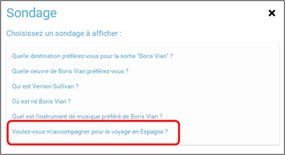

# Sondage

Une question vous démange ? Grâce à l’appli **Sondage**, créez des enquêtes personnalisées et collectez les réponses !

## Présentation

L’appli Sondage permet de créer des **sondages qui pourront être intégrés dans des pages web** \(en utilisant l’appli Pages\). L’utilisateur qui crée le sondage peut attribuer **différents droits** aux utilisateurs qu’il choisit : droit de **lecture** \(accès au sondage en consultation\), droit de **vote** \(possibilité de répondre au sondage\) et droit de **gestion** \(possibilité de modifier et supprimer le sondage\).

## Créer un sondage

Pour accéder à l’appli Sondage, cliquez sur l’icône correspondante dans la page « Mes applis ».

Cliquez sur "Créer un sondage".

1. Saisissez une question
2. Choisissez une date de fin de validité
3. Chargez une image d’illustration si vous le souhaitez
4. Saisissez les réponses possibles à la question. Pour ajouter d’autres réponses, cliquez sur "Ajouter"
5. Cliquez sur « Sauvegarder »

Le sondage est maintenant créé.

## Partager un sondage

Pour partager le sondage, cliquez sur le + \(1\), puis sur « Partager » \(2\).

Dans la fenêtre de partage, vous pouvez donner des droits de lecture, de vote et de gestion à d’autres personnes sur votre sondage. Pour cela, saisissez les premières lettres du nom de l’utilisateur ou du groupe d’utilisateurs que vous recherchez \(1\), sélectionnez le résultat \(2\) et cochez les cases correspondant aux droits que vous souhaitez leur attribuer \(3\).

Les différents droits que vous pouvez attribuer sont les suivants :

* Lecture : l’utilisateur peut visualiser le sondage
* Vote : l’utilisateur peut répondre au sondage
* Gestion : l’utilisateur peut partager, modifie et supprimer le sondage

Pour valider, cliquez sur le bouton "Partager".

Votre sondage est bien créé et partagé.

## Insérer un sondage dans un page

Une fois le sondage créé et partagé, il est possible de l’insérer dans une page. Pour cela, cliquez sur l’appli « Pages ».

Cliquez sur le site dans lequel vous souhaitez insérer le sondage.

Pour insérer le sondage, cliquez sur l’icône suivante:  

Cliquez sur « Ajouter un sniplet ».

Puis choisissez l’appli Sondage.

La liste des sondages dont vous êtes gestionnaire apparaît. Choisissez celui que vous souhaitez faire apparaître.

Le sondage apparaît bien sur la page.

