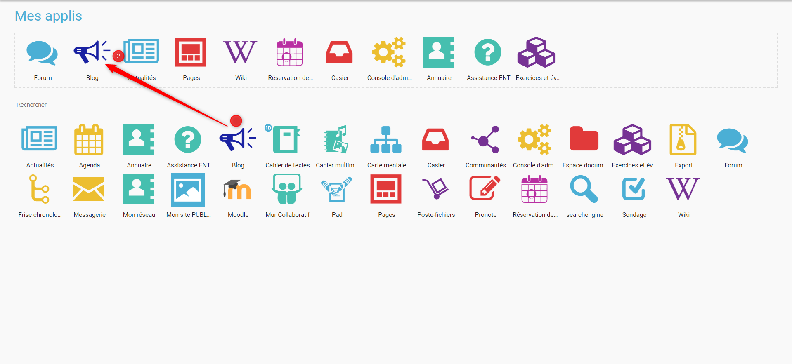

# Mes applis

## Accéder à mes applis

Pour accéder à vos applis, cliquez sur l’icône correspondante dans le bandeau de navigation.

Vous accédez aux services pour lesquels vous avez des droits d’accès : applications, connecteurs aux outils de vie scolaire, sites web internes au réseau ou publics …

Pour accéder à une appli, cliquez sur l’icône correspondante.

La page d’accueil de l’appli apparaît.

## Gestion des favoris

La gestion des favoris vous permet d’accéder rapidement à vos applications préférées. Le menu des favoris est accessible directement depuis l’icône du bandeau de navigation \(1\).

Pour ajouter une application dans les favoris, il faut effectuer un glisser-déposer. Pour cela, sélectionnez l’application à déplacer \(1\) et glissez-la vers l’emplacement dédié à cet effet\(2\).

