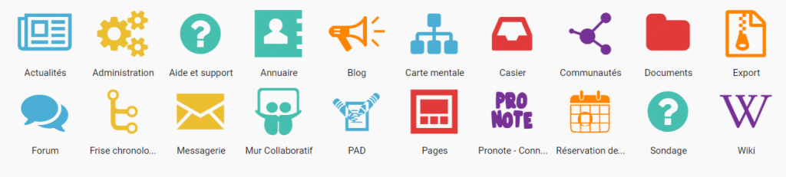
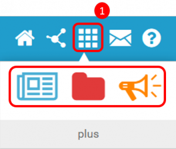

[[mes-applis]]
= Mes applis

* link:index.html?iframe=true#presentation[Accéder à mes applis]
* link:index.html?iframe=true#cas-d-usage-1[Gestion des favoris]
* link:index.html?iframe=true#notes-de-versions[Note de version]

http://creativecommons.org/licenses/by-nc-sa/3.0/fr/[image:../../wp-content/uploads/2015/03/CC-BY-NC-SA-3.0-FR-300x105.png[CC
BY-NC-SA 3.0 FR,width=100,height=35]]

[[presentation]]
== Accéder à mes applis

Pour accéder à vos applis, cliquez sur l’icône correspondante dans le
bandeau de navigation.

image:../../wp-content/uploads/2015/06/a16.png[a1,width=309,height=58]

Vous accédez aux services pour lesquels vous avez des droits d’accès :
applis de l’ENT, connecteurs aux outils de vie scolaire, sites web
internes à l’ENT ou publics …

Pour accéder à une appli, cliquez sur l'icône correspondante.

image:../../wp-content/uploads/2016/04/Mes_Applis_2-1024x231.png[Mes_Applis_2,width=600,height=135]

La page d'accueil de l'appli apparaît.

[[cas-d-usage-1]]
== Gestion des favoris

La gestion des favoris vous permet d’accéder rapidement à vos
applications préférées. Le menu des favoris est accessible directement
depuis l’icône du bandeau de navigation (1).

link:../../wp-content/uploads/2016/01/GESTION_FAVORIS.png[ +
]Pour ajouter une application dans les favoris, il faut effectuer un
glisser-déposer. Pour cela, sélectionnez l’application à déplacer (1) et
glissez-la vers l’emplacement dédié à cet effet(2).

[[notes-de-versions]]
== Note de version

A chaque nouvelle version de l'application, les nouveautés seront
présentées dans cette section.
