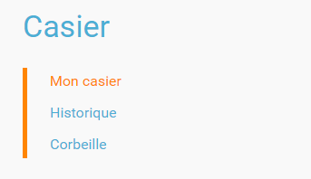

[[casier]]
= Casier

L’appli *Casier* permet de déposer des documents dans le casier d’autres
utilisateurs. Les documents ainsi échangés sont horodatés et peuvent
être déplacés vers d'autres dossiers de l'appli Documents.

* link:index.html?iframe=true#presentation[Présentation]
* link:index.html?iframe=true#cas-d-usage-1[Déposer un document dans un
casier]
* link:index.html?iframe=true#cas-d-usage-2[Sélection et action sur les
documents]
* link:index.html?iframe=true#cas-d-usage-3[Copier un document du casier
vers l'appli Documents]
* link:index.html?iframe=true#notes-de-versions[Note de version]

http://creativecommons.org/licenses/by-nc-sa/3.0/fr/[image:../../wp-content/uploads/2015/03/CC-BY-NC-SA-3.0-FR-300x105.png[CC
BY-NC-SA 3.0 FR,width=100,height=35]]

[[presentation]]
== Présentation

Le casier est composé de 3 dossiers :

Le dossier « *Mon casier* » contient les documents envoyés dans mon
casier. +
Le dossier « *Historique* » contient les documents déposés par
l'utilisateur dans le casier d'autres utilisateurs. Pour chaque document
reçu, le titre du document, l'identifiant du destinataire ainsi que la
date et l'heure d'envoi sont précisés. +
Les documents supprimés sont disponibles dans le dossier « *Corbeille* »
avant suppression définitive.

Lorsqu'un document a été déposé dans un casier, il n’est **pas possible
de le modifier, ni de le supprimer a posteriori**. Il est néanmoins
possible de faire un second envoi avec une nouvelle version du document.

[[cas-d-usage-1]]
== Déposer un document dans un casier

Pour déposer un document dans le casier d'un autre utilisateur, accédez
à l'appli Casier puis cliquez sur le bouton « Déposer dans un casier ».

link:../../wp-content/uploads/2016/08/rack-déposer-casier.png[image:../../wp-content/uploads/2016/08/rack-déposer-casier-1024x279.png[rack
- déposer casier,width=628,height=171]]

Dans la nouvelle fenêtre, cliquez sur « Parcourir » (1) pour
sélectionner sur votre ordinateur le document à envoyer puis
sélectionnez le(s) destinataire(s) (2). Comme dans les autres applis de
l'ENT, vous pouvez choisir un utilisateur ou un groupe d'utilisateurs.
En cas d'erreur dans la sélection des destinataires, le bouton «
Réinitialiser les destinataires » vous permet de supprimer la sélection
faite.

Cliquez ensuite sur « Envoyer » (3) pour envoyer le document. Un message
de confirmation vous informe que le document a bien été envoyé.

image:../../wp-content/uploads/2016/04/Casier3.png[Casier3,width=300]

 

[[cas-d-usage-2]]
== Sélection et action sur les documents

Pour sélectionner un fichier, vous devez cliquer une fois dessus. Le
fichier est alors surligné en bleu (1) et le menu d'option s'affiche en
bas de page (2). +
Vous pouvez également sélectionner plusieurs documents en même temps
pour effectuer une action sur tous ces documents.

image:../../wp-content/uploads/2016/08/rack-tous-sélectionnés2-1024x512.png[rack
- tous sélectionnés2,width=628,height=314]

Vous disposez également d'un bouton "télécharger" (1) sur chaque fichier
si vous souhaitez télécharger directement le fichier sur votre
ordinateur. +
link:../../wp-content/uploads/2016/08/rack-bouton-télécharger2.png[image:../../wp-content/uploads/2016/08/rack-bouton-télécharger2.png[rack
- bouton télécharger2,width=110,height=102]]

[[cas-d-usage-3]]
== Copier un document du casier vers l'appli Documents

Lorsque vous recevez un document dans votre casier, vous avez la
possibilité de le copier vers un dossier de votre espace documentaire. +
Connectez-vous à l'appli Casier et consultez le dossier « Mon casier ».
Sélectionnez le document et cliquez sur le bouton « Copier dans mes
documents » en bas de page.

image:../../wp-content/uploads/2016/04/Casier4.png[Casier4,width=250]

La nouvelle fenêtre vous présente l'arborescence du dossier « Mes
documents » (1), vous pouvez ainsi copier le document dans le dossier
que vous souhaitez (2).

image:../../wp-content/uploads/2016/04/Casier5.png[Casier5,width=400]

[[notes-de-versions]]
== Note de version

Nouveauté de la version 0.6

*Évolution ergonomique*

Les cases à cocher ont été supprimées. La sélection d’un ou plusieurs
documents se fait désormais en cochant la ou les vignettes.
