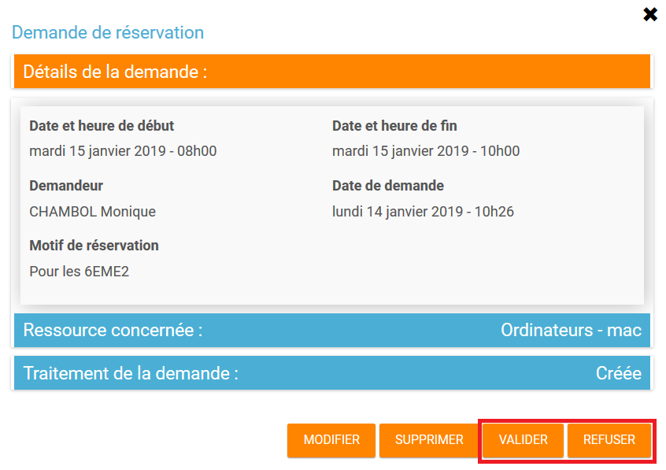
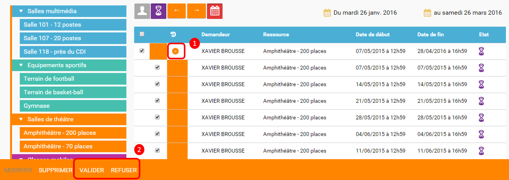
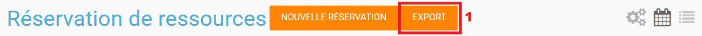
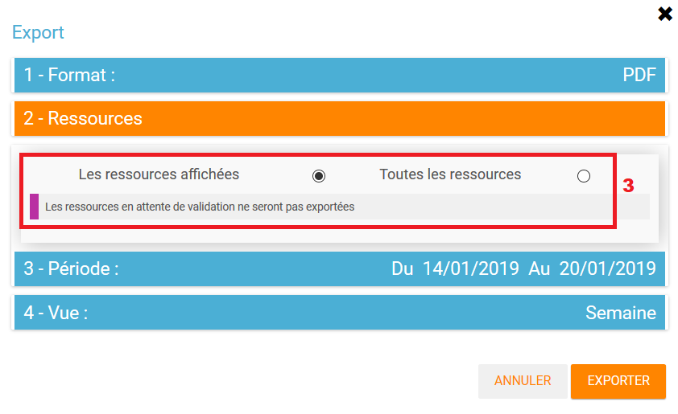
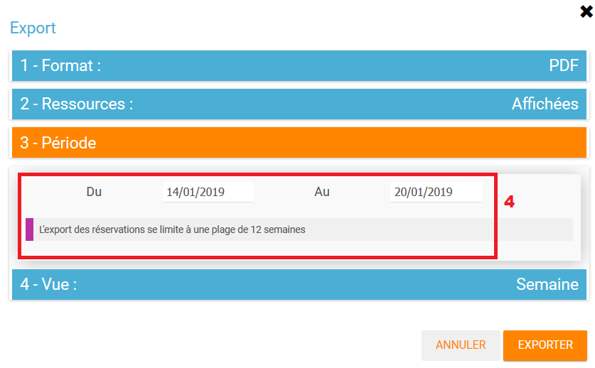
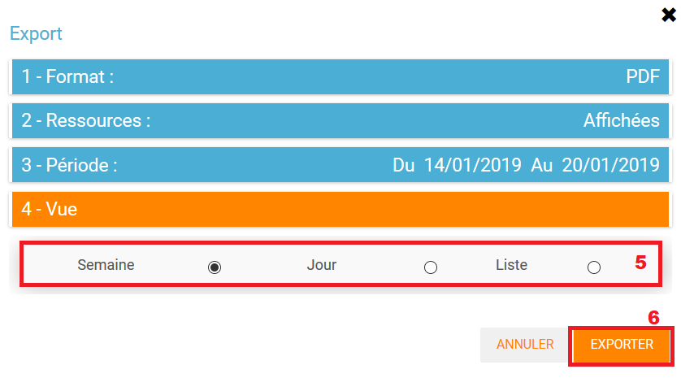

# Réservation de ressources

Organisez la gestion des salles et du matériel en ligne ! À l’aide de l’application **Réservation de ressources**, visualisez et réservez les salles et le matériel disponibles dans votre établissement.

## Présentation

L’outil de réservation de ressources vous permet de faire des **demandes de réservation**, **ponctuelles ou périodiques**, de ressources \(salle informatique, tablette, vidéo projecteur…\). Pour chaque ressource à laquelle vous accédez, vous pouvez visualiser les créneaux horaires déjà réservés et les disponibilités via le **calendrier**.

Les ressources sont créées par des **gestionnaires** qui peuvent mettre en place un **principe de validation des réservations** pour certaines ressources et définir plusieurs paramètres \(comme par exemple la définition de **plages horaires** de réservations, la date à partir de laquelle une réservation peut être effectuée, etc.\).

## Consulter les ressources disponibles

Le **gestionnaire** de chaque **type de ressource**, choisit les utilisateurs autorisés à réserver les ressources qu’il a sous sa responsabilité.

Pour consulter les réservations enregistrées, l’utilisateur dispose de deux approches : une vue par le **calendrier**, et une vue sous la forme de **liste**.

**La vue calendrier**

La vue calendrier est accessible en cliquant sur l'icône calendrier \(1\). L’utilisateur peut changer la semaine affichée en cliquant sur les flèches au dessus du calendrier \(2\). L'utilisateur peut également naviguer en modifiant l'affichage du calendrier en **vue mois, semaine ou jour** \(3\). L’utilisateur dispose d’un certain nombre de **filtres** :

* Filtre sur les **types de ressources** et les **ressources** par établissement \(4\)
* Filtre pour afficher uniquement **ses propres réservations**\(5\) :
* Filtre pour afficher uniquement les réservations **en attente de validation** \(6\)

Chaque réservation est matérialisée sur le calendrier par un pavé de la même couleur que la ressource concernée.

* La réservation est validée. \(1\)
* La réservation est en attente de validation. \(2\)
* La réservation a été refusée. \(3\)
* Il s’agit d’une réservation périodique. \(4\)

Pour visualiser le détail d’une réservation, il suffit de cliquer sur la réservation en question, pour afficher une fenêtre \(pop-up\) qui présente plusieurs sections. Chaque section se déplie en cliquant sur le titre.

Pour intervenir sur une réservation \(modification, validation, suppression\) il suffit de cocher la case correspondant à cette réservation \(5\) et les boutons d’action apparaissent au bas de la page.

Si la réservation ne propose pas de case à cocher, c’est que l’utilisateur connecté n’est pas autorisé à agir sur cette réservation.

**La vue liste**  
La vue Liste est accessible en cliquant sur \(1\). L’utilisateur peut afficher toute la liste des réservations effectuées entre deux dates qu’il aura choisies : \(2\) pour activer le filtre, \(3\) pour choisir les dates.

Il bénéficie par ailleurs des mêmes filtres que sur la vue Calendrier. Le tri peut être fait sur toutes les colonnes du tableau : demandeur, ressource, date de début, date de fin et état.

Pour visualiser le détail d’une réservation, il suffit de cliquer sur la réservation en question dans la liste, pour afficher une fenêtre \(pop-up\) qui donne toutes les informations.

## Créer une demande de réservation

Il est possible de réserver une ressource :

* Soit en cliquant sur « Nouvelle réservation » en haut de l’écran

* Soit en cliquant sur un créneau dans le calendrier.

Les deux méthodes conduisent à la même procédure de réservation.

Il est possible de créer une demande de réservation ponctuelle ou périodique. L’utilisateur choisit de créer une demande ponctuelle ou périodique en cliquant sur "Nouvelle réservation".

La première section permet de choisir l'établissement \(1\), le type de ressource \(2\) et la ressource à réserver \(3\). La description de la ressource est indiquée \(4\). L’utilisateur peut également voir les noms des valideurs \(5\) si les réservations pour cette ressource sont soumises à validation.

**Réservation ponctuelle**

Dans le cas d’une réservation ponctuelle, l’utilisateur choisit le créneau de sa demande. L’utilisateur choisit le créneau de réservation \(ce créneau peut être en horaire libre ou sur des plages définies par l'établissement\) \(1\), indique le motif de la réservation \(2\) et d’enregistrer sa demande. \(3\)

Si l’utilisateur souhaite modifier sa demande ponctuelle en demande périodique, il lui suffit de cliquer sur la case à cocher "réservation périodique" \(4\).

**Réservation périodique**  
Pour une réservation périodique, l’utilisateur renseigne les mêmes informations que pour une réservation ponctuelle mais configure également une périodicité.

Pour cela, il faut choisir la récurrence \(1\), les jours de la semaine concernés \(2\), le nombre d’occurrences ou une date de fin de période \(3\). Pour enregistrer la demande, cliquez sur "Enregistrer".

Dans tous les cas, tous les créneaux réservés doivent satisfaire les contraintes éventuellement mises en place par le gestionnaire de la ressource concernant les intervalles minimum et maximum de réservation.

## Valider une réservation

Le gestionnaire et/ou le valideur du type de ressource peuvent valider ou refuser les demandes de réservation.

Tant qu’une demande n’a pas été validée, le créneau horaire y correspondant reste libre d’accès aux autres utilisateurs.

Pour valider une réservation, le valideur peut se rendre soit sur la vue Calendrier, soit sur la vue Liste, effectuer un filtre sur le type de ressource \(1\), et afficher uniquement les réservations en attente de validation \(2\). L’icône signifie que la réservation est en attente de validation. \(3\).

Le valideur peut aussi valider les demandes de réservations directement dans le calendrier en cochant la demande et en cliquant sur valider, ou également en cliquant sur la demande. Une pop up s'ouvre et permet la validation ou le refus.

**Valider une réservation ponctuelle**

Pour accepter ou refuser une réservation ponctuelle, le valideur doit sélectionner la réservation \(1\) et cliquer sur le bouton Valider ou Refuser \(2\).

Le valideur qui refuse une réservation peut indiquer le motif de son refus \(1\) \(champ non obligatoire\), puis confirmer son refus. \(2\)

**Valider une réservation périodique**

Pour valider une réservation périodique \(qui comporte plusieurs créneaux\), il est possible :

* De valider/refuser d’un seul coup la totalité des créneaux, en cochant la case correspondant à la réservation \(1\) puis en cliquant sur le bouton d’action en bas de l’écran : supprimer, valider et refuser \(2\) :

* De déplier la réservation \(1\) pour visualiser les différents créneaux qui la composent en cliquant sur l’icône suivant:

Puis en sélectionnant les seuls créneaux que l’on veut valider/refuser \(2\) :

## Définir les types de ressources

Pour accéder à l’interface de gestion des ressources, les utilisateurs habilités \(gestionnaires\) doivent cliquer sur l’icône de la molette. \(1\)

Pour ajouter des nouveaux types de ressources, cliquez sur « Créer un type de ressources » \(1\) et renseignez les champs suivants :

* Indiquez le nom de la ressource et ajoutez d’un circuit de validation le cas échéant \(2\)
* Choisissez une couleur et indiquez si les ressources doivent avoir la même couleur que le type de ressources \(3\)
* Choisissez des réservations libres \(24/24\) ou définies sur des plages horaires définies par l'établissement \(4\). Pour créer les plages horaires, les administrateurs doivent se référer à la documentation de la console d'administration \(Menu Calendrier\)
* Cliquez sur Enregistrer \(5\)

L’étape suivante consiste à définir les droits d’accès et de gestion

* Sélectionnez le type de ressources nouvellement créé \(1\)
* Cliquez sur Modifier \(2\)

* Recherchez successivement les utilisateurs et/ou groupes \(1\) auxquels vous souhaitez donner accès à cette ressource
* Sélectionnez les utilisateurs en question \(2\)
* Attribuez les droits en cochant les cases correspondantes \(3\).

Pour valider, cliquez sur "Enregistrer".

Les différents droits que vous pouvez attribuer aux autres utilisateurs sont les suivants :

* Voir : l’utilisateur peut visualiser les réservations de la ressource
* Réserver : l’utilisateur peut créer des demandes de réservation
* Valider : l’utilisateur peut accepter ou refuser les demandes de réservation
* Gérer : l’utilisateur peut créer et supprimer des types de ressources

## Définir les ressources

Une fois les types de ressources définis, il faut créer les ressources. Pour cela, cliquez sur le bouton d’action « Créer une ressource »

La ressource doit ensuite être caractérisée par:

1. Le type de ressource à laquelle elle est rattachée
2. Le nom de la ressource
3. Le circuit de validation
4. Sa disponibilité, la possibilité de réserver cette ressource de manière périodique, un intervalle de réservation minimum et un intervalle maximum de réservation.
5. Sa couleur \(par défaut la couleur du type de ressource si défini\)
6. Une description éditée par un éditeur de texte HTML permettant d’intégrer différents contenus: texte, images, liens, son…

Après enregistrement, la nouvelle ressource s’affiche dans la liste. En cochant la case correspondante \(1\), des boutons d’action apparaissent en bas de page pour supprimer ou éditer la ressource. Vous pouvez cliquer sur "Editer la ressource" pour la modifier ou la supprimer \(2\)

## Exporter les ressources

Il est possible d'exporter les réservations au format iCal ou PDF. Seules les réservations validées pourront être exportées.

Pour exporter les réservations :

* Cliquez sur le bouton d'Export \(1\)

* Choisissez le type d'export \(iCal ou PDF\) \(2\)

* Filtrez sur les ressources sélectionnées ou toutes les ressources accessibles par l'utilisateur \(3\)

* Choisissez la période \(4\). L'export des réservations se limite à une plage de 12 semaines

* Choisissez le type de vue \(Mois, semaine ou jour\) pour l'export PDF uniquement \(5\)

* Cliquez sur Exporter \(6\). L'export se télécharge ensuite.

