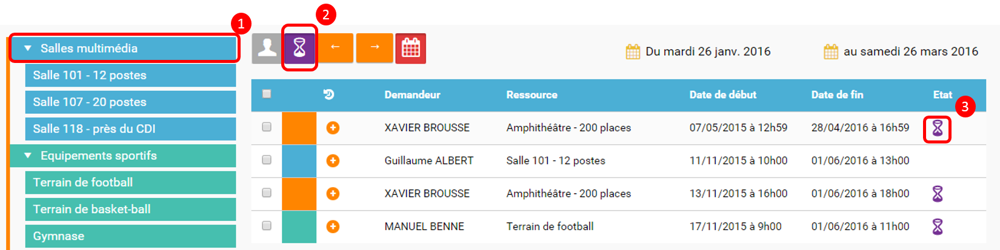
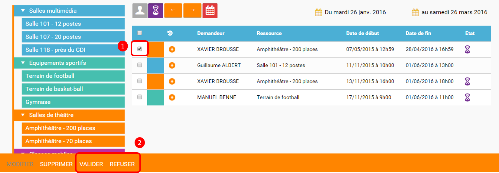

Organisez la gestion des salles et du matériel en ligne ! À l’aide de l’application *Réservation de ressources*, visualisez et réservez les salles et le matériel disponibles dans votre établissement. 

image:../../wp-content/uploads/2015/03/CC-BY-NC-SA-3.0-FR-300x105.png[width=100,height=35]

[[presentation]]
== Présentation

L’outil de réservation de ressources vous permet de faire des **demandes
de réservation**, **ponctuelles ou périodiques**, de ressources (salle
informatique, tablette, vidéo projecteur…). Pour chaque ressource à
laquelle vous accédez, vous pouvez visualiser les créneaux horaires déjà
réservés et les disponibilités via le **calendrier**.

Les ressources sont créées par des *gestionnaires* qui peuvent mettre en
place un *principe de validation des réservations* pour certaines
ressources et définir plusieurs paramètres (comme par exemple la date à
partir de laquelle une réservation peut être effectuée).

image:../../wp-content/uploads/2016/01/RBS_PRESENTATION.png[width=602,height=237]

[[cas-d-usage-1]]
== Consulter les ressources disponibles

Le** gestionnaire** de chaque **type de ressource**, choisit les
utilisateurs autorisés à réserver les ressources qu’il a sous sa
responsabilité.

Pour consulter les réservations enregistrées, l’utilisateur dispose de
deux approches : une vue par le **calendrier**, et une vue sous la forme
de **liste**.

*La vue calendrier*

La vue calendrier est accessible en cliquant sur (1)

L’utilisateur peut changer la semaine affichée en cliquant sur les
flèches au dessus du calendrier (2).

L’utilisateur dispose d’un certain nombre de *filtres* :

* Filtre sur les *types de ressources* et les *ressources* (3)
* Filtre pour afficher uniquement **ses propres réservations**(4) :
* Filtre pour afficher uniquement les réservations **en attente de
validation**(5)

image:../../wp-content/uploads/2016/01/RBS-Vue-Calendrier.png[width=602,height=240]

Chaque réservation est matérialisée sur le calendrier par un pavé de la
même couleur que le type de ressource concerné.

* La réservation est validée. (1)
* La réservation est en attente de validation. (2)
* La réservation a été refusée. (3)
* Il s’agit d’une réservation périodique. (4)

image:../../wp-content/uploads/2016/01/RBS-Vue-Calendrier-2.png[width=602,height=275] +
Pour visualiser le détail d’une réservation, il suffit de cliquer sur la
réservation en question, pour afficher une fenêtre (pop-up) qui présente
plusieurs sections. Chaque section se déplie en cliquant sur le titre.

image:../../wp-content/uploads/2015/06/r3.png[width=345,height=278]

Pour intervenir sur une réservation (modification, validation,
suppression) il suffit de cocher la case correspondant à cette
réservation (5) et les boutons d’action apparaissent au bas de la page.

Si la réservation ne propose pas de case à cocher, c’est que
l’utilisateur connecté n’est pas autorisé à agir sur cette réservation.

*La vue liste* +
La vue Liste est accessible en cliquant sur (1).

L’utilisateur peut afficher toute la liste des réservations effectuées
entre deux dates qu’il aura choisies : (2) pour activer le filtre, (3)
et (4) pour choisir les dates.

Il bénéficie par ailleurs des mêmes filtres que sur la vue Calendrier.

Le tri peut être fait sur toutes les colonnes du tableau : demandeur,
ressource, date de début, date de fin et état.

image:../../wp-content/uploads/2016/01/RBS-VUE-LISTE.png[width=603,height=235]

Pour visualiser le détail d’une réservation, il suffit de cliquer sur
la réservation en question dans la liste, pour afficher une fenêtre
(pop-up) qui donne toutes les informations.

image:../../wp-content/uploads/2015/06/r3.png[width=322,height=259] +

[[cas-d-usage-2]]
== Créer une demande de réservation

Il est possible de réserver une ressource :

* Soit en cliquant sur « Nouvelle réservation » en haut de l’écran

image:../../wp-content/uploads/2016/01/RBS_CREATION.png[width=602,height=240]

* Soit en cliquant sur un créneau dans le calendrier.

Les deux méthodes conduisent à la même procédure de réservation.

Il est possible de créer une demande de réservation ponctuelle ou
périodique. L'utilisateur choisit de créer une demande ponctuelle ou
périodique en cliquant sur "Nouvelle réservation".

image:../../wp-content/uploads/2015/06/r7.png[width=185,height=97]

La première section permet de choisir le type de ressource (1) et la
ressource à réserver (2).

La description de la ressource est indiquée (3). L’utilisateur peut
également voir les noms des valideurs (4) si les réservations pour cette
ressource sont soumises à validation.

image:../../wp-content/uploads/2015/06/r8.png[width=442,height=325]

*Réservation ponctuelle*

Dans le cas d'une réservation ponctuelle, l'utilisateur choisit le
créneau de sa demande. L'utilisateur choisit le créneau de réservation
(1), indique le motif de la réservation (2) et d’enregistrer sa demande.
(3)

image:../../wp-content/uploads/2015/06/r12.png[width=521,height=372]

Si l'utilisateur souhaite modifier sa demande ponctuelle en demande
périodique, il lui suffit de cliquer sur la case à cocher "réservation
périodique" (4).

**Réservation périodique +
**Pour une réservation périodique, l’utilisateur renseigne les mêmes
informations que pour une réservation ponctuelle mais configure
également une périodicité.

Pour cela, il faut choisir la récurrence (1), les jours de la semaine
concernés (2), le nombre d'occurrences ou une date de fin de période
(3). Pour enregistrer la demande, cliquez sur "Enregistrer".

image:../../wp-content/uploads/2015/06/r21.png[width=467,height=367] +
Dans tous les cas, tous les créneaux réservés doivent satisfaire les
contraintes éventuellement mises en place par le gestionnaire de la
ressource concernant les intervalles minimum et maximum de réservation.

[[cas-d-usage-3]]
== Valider une réservation

Le gestionnaire et/ou le valideur du type de ressource  peuvent valider
ou refuser les demandes de réservation.

Tant qu'une demande n'a pas été validée, le créneau horaire y
correspondant reste libre d'accès aux autres utilisateurs.

Pour valider une réservation, le valideur peut se rendre sur la vue
Liste, effectuer un filtre sur le type de ressource (1), et afficher
uniquement les réservations en attente de validation (2). L’icône
signifie que la réservation est en attente de validation. (3).

*Valider une réservation ponctuelle*

Pour accepter ou refuser une réservation ponctuelle, le valideur doit
sélectionner la réservation (1) et cliquer sur le bouton Valider ou
Refuser (2). +
image:../../wp-content/uploads/2016/01/RBS-VALIDATION-PONCTUELLE.png[width=602,height=212]

Le valideur qui refuse une réservation peut indiquer le motif de son
refus (1) (champ non obligatoire), puis confirmer son refus. (2)

image:../../wp-content/uploads/2015/06/r31.png[width=490,height=280]

*Valider une réservation périodique*

Pour valider une réservation périodique (qui comporte plusieurs
créneaux), il est possible :

* De valider/refuser d’un seul coup la totalité des créneaux, en cochant
la case correspondant à la réservation (1) puis en cliquant sur le
bouton d’action en bas de l’écran : supprimer, valider et refuser (2) :

* De déplier la réservation (1) pour visualiser les différents créneaux
qui la composent en cliquant sur l'icône suivant:

image:../../wp-content/uploads/2015/06/r51.png[width=34,height=32]

Puis en sélectionnant les seuls créneaux que l’on veut
valider/refuser(2) :

image:../../wp-content/uploads/2016/01/RBS-VALIDATION-PERIODIQUE-2.png[width=602,height=214]

[[cas-d-usage-4]]
== Définir les types de ressources

Pour accéder à l’interface de gestion des ressources, les utilisateurs
habilités (gestionnaires) doivent cliquer sur l’icône de la molette. (1)

image:../../wp-content/uploads/2015/06/r71.png[width=594,height=53]

Pour ajouter des nouveaux types de ressources, cliquez sur « Créer un type de ressources » (1) et renseignez les champs suivants :

* Indiquez le nom de la ressource et ajoutez d’un circuit de validation le cas échéant (2)
* Cliquez sur Enregistrer (3)

image:/assets/RDR création type de ressource .png[]

L’étape suivante consiste à  définir les droits d’accès et de gestion

* Sélectionnez le type de ressources nouvellement créé (1)
* Cliquez sur Modifier (2)

image:/assets/RDR Edition type de ressources_1.png[]

* Recherchez successivement les utilisateurs et/ou groupes (1) auxquels
vous souhaitez donner accès à cette ressource
* Sélectionnez les utilisateurs en question (2)
* Attribuez les droits en cochant les cases correspondantes (3).

Pour valider, cliquez sur "Enregistrer".

image:/assets/RDR Edition type de ressources 2.png[]

Les différents droits que vous pouvez attribuer aux autres utilisateurs
sont les suivants :

* Voir : l’utilisateur peut visualiser les réservations de la ressource
* Réserver : l’utilisateur peut créer des demandes de réservation
* Valider : l’utilisateur peut accepter ou refuser les demandes de
réservation
* Gérer : l’utilisateur peut créer et supprimer des types de ressources

[[cas-d-usage-5]]
== Définir les ressources

Une fois les types de ressources définis, il faut créer les ressources.

Pour cela, cliquez sur le bouton d’action « Créer une ressource » 

image:/assets/RDR Création ressource 1.png[]

La ressource doit ensuite être caractérisée par:

1. Le type de ressource à laquelle elle est rattachée 
2. Le nom de la ressource
3. Sa disponibilité, la possibilité de réserver cette ressource de
manière périodique, un intervalle de réservation minimum et un
intervalle maximum de réservation.
4.  Une description éditée par un éditeur de texte HTML permettant
d'intégrer différents contenus: texte, images, liens, son...

image:/assets/RDR Création ressource 2.png[]

Après enregistrement, la nouvelle ressource s'affiche dans la liste. En cochant la case correspondante (1), des boutons d'action apparaissent en bas de page pour supprimer ou éditer la ressource. Vous pouvez cliquer sur "Editer la ressource" pour la modifier (2)

image:/assets/RDR Edition ressource.png[]