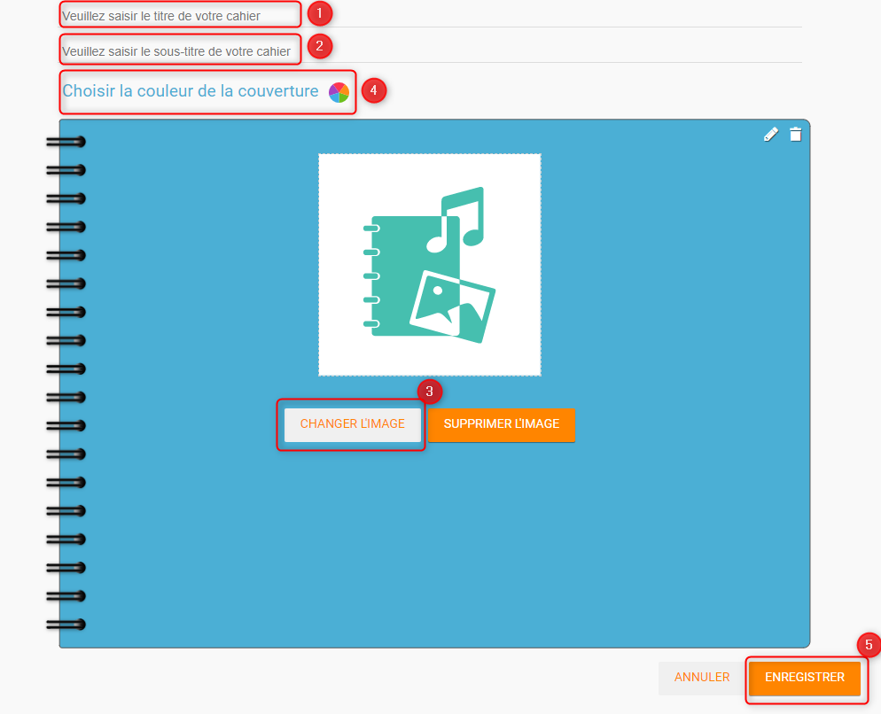
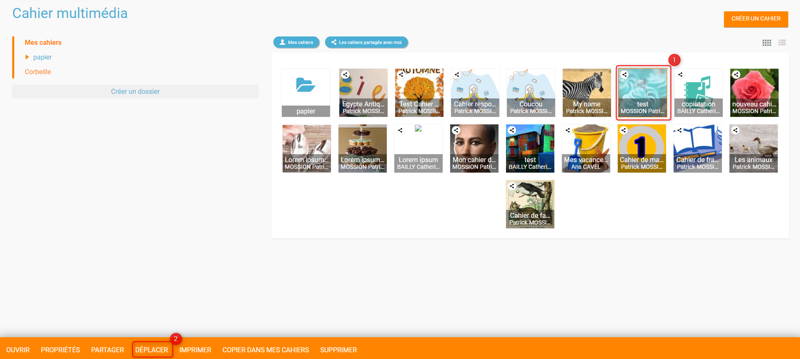
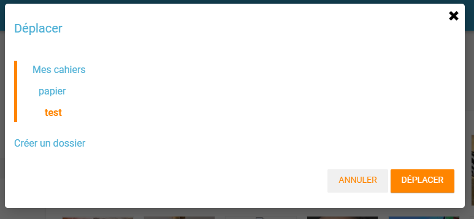
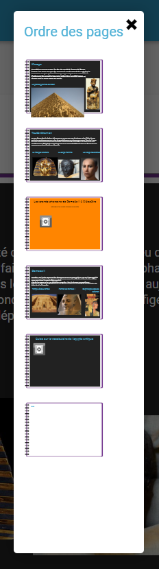
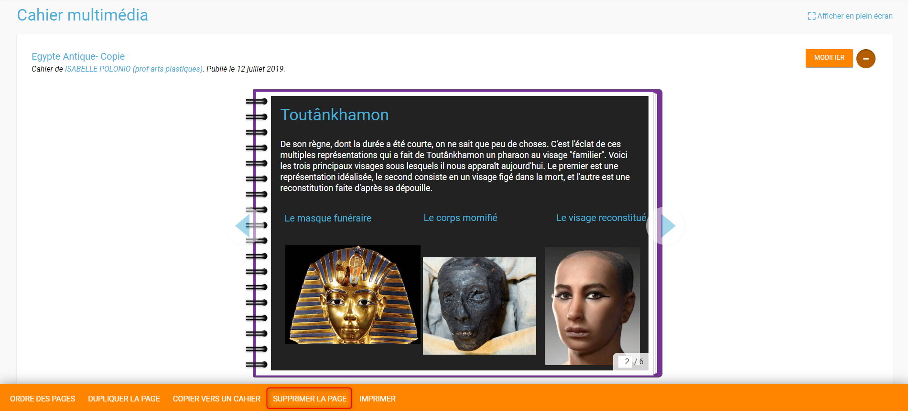
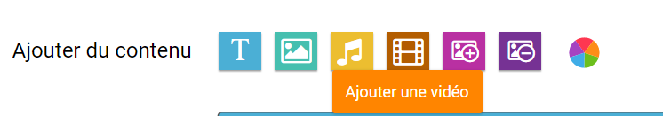
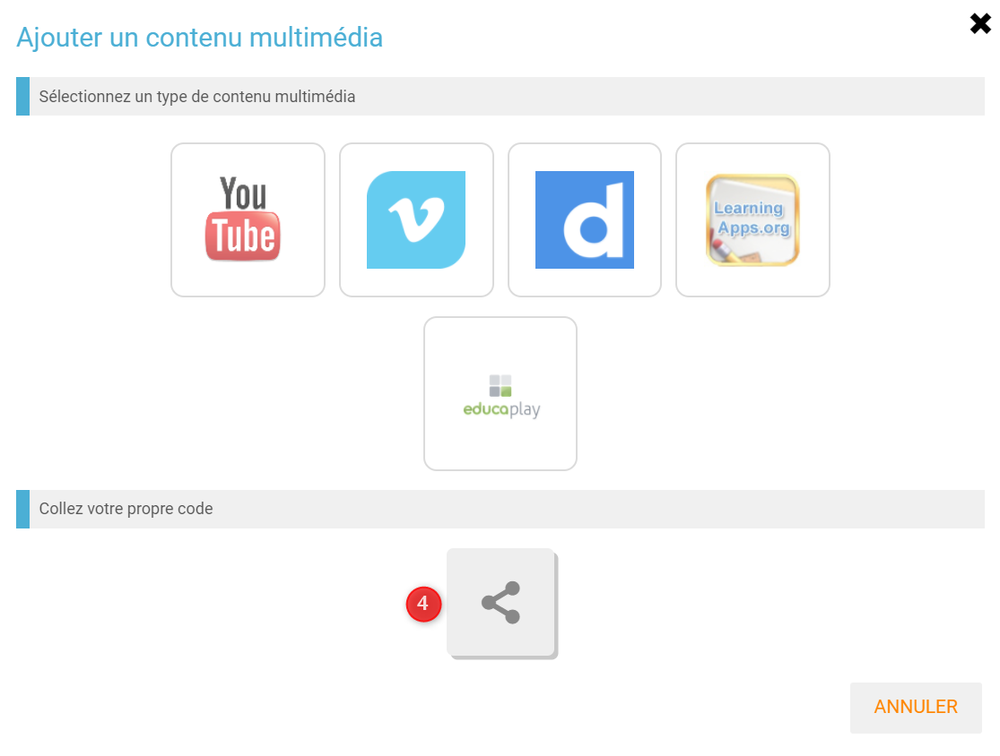
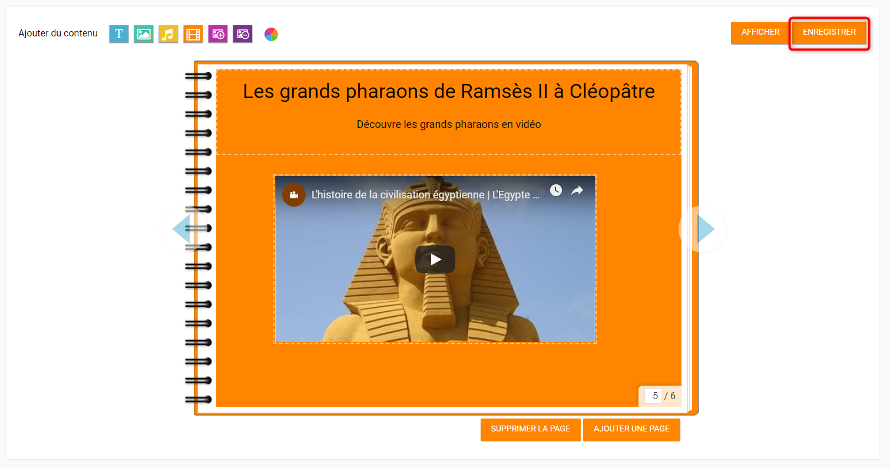
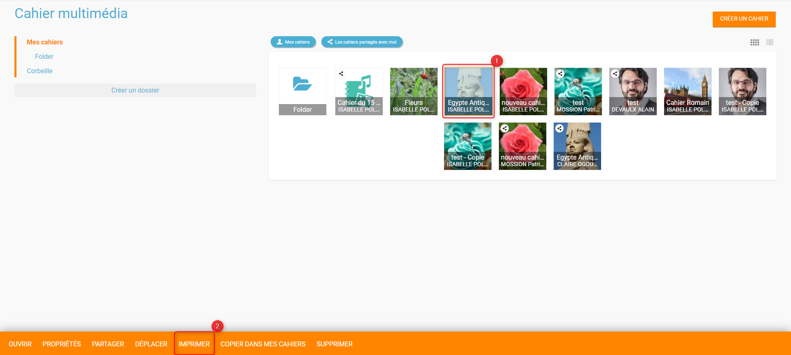

# Cahier multimédia

Avec le **Cahier multimédia**, votre banal exposé sur la faune amazonienne devient tout de suite plus passionnant ! Mise en pages personnalisée, illustrations, vidéos, sons, votre cahier prend vie sous les clics de vos lecteurs.

## Présentation

Les cahiers créés peuvent être utilisés comme des **supports de restitution** de travaux ou encore comme **outil de communication** avec d’autres utilisateurs puisque chaque cahier peut être partagé avec un utilisateur ou un groupe d’utilisateurs.

Les utilisateurs ayant des droits de contribution dans le cahier choisissent le nombre de pages du cahier et la mise en forme qu’ils souhaitent appliquer à chaque page.

## Créer et partager un cahier multimédia

Pour accéder à l’appli Cahier multimédia, cliquez sur l’icône correspondante dans la page « Mes applis ».

Dans le service Cahier multimédia, cliquez sur le bouton « Créer » en haut de la page.

Vous accédez à l’interface de création du cahier.

1. Indiquez le « titre » de votre cahier dans le champ correspondant
2. Vous pouvez renseigner un sous-titre pour votre cahier
3. Ajoutez une vignette d’illustration du cahier \(qui apparaît en miniature sur la page d’accueil et comme couverture du cahier\) en cliquant sur « Changer l’image ». Si vous ne modifiez pas l’image, c’est la vignette par défaut qui s’affichera.
4. Choisissez une couleur de couverture
5. Cliquez sur « Enregistrer »

Votre cahier est désormais créé mais n’est pas encore visible. Pour le partager avec d’autres utilisateurs, cliquez sur la case à cocher \(1\) située à côté du cahier puis sur « Partager » \(2\).

Dans la fenêtre, vous pouvez donner des droits de consultation, de contribution et de gestion sur votre cahier. Pour cela, saisissez les premières lettres du nom de l’utilisateur ou du groupe d’utilisateurs que vous recherchez \(1\), sélectionnez le résultat \(2\) et cochez les cases correspondant aux droits que vous souhaitez leur attribuer \(3\).

Pour valider, cliquez sur le bouton "Partager".

Les différents droits que vous pouvez attribuer sont les suivants :

* Lecture : l’utilisateur peut visualiser le cahier
* Contribution : l’utilisateur peut modifier le cahier
* Gestion : l’utilisateur peut partager, modifier et supprimer le cahier

Pour les cahiers vous appartenant, vous pourrez voir quels sont les cahiers que vous aurez déjà partagé car ils auront cette icône : 

## Organiser ses cahiers multimédias  

‌Vous avez à votre disposition différents outils pour trier les cahiers multimédias auxquels vous avez accès :‌

1. Deux filtres vous permettent d'afficher :
   * **Mes cahiers,** pour afficher/masquer les cahiers multimédia dont vous êtes le propriétaire
   * **Les cahiers partagés avec moi,** pour afficher/masquer les cahiers multimédia qui vous ont été partagés
2. Vous pouvez organiser vos cahiers grâce à l'arborescence suivante :
   * **Mes cahiers**, qui est le dossier principal, dans lequel vous pourrez créer tous vos sous-dossiers \(grâce au bouton "Créer un dossier"\)
   * **Corbeille** où vous retrouverez les cahiers multimédia que vous aurez supprimé, pour éviter toute suppression définitive involontaire.

Après avoir créé vos différents dossiers, sélectionnez \(1\) le ou les cahiers que vous voulez mettre dans vos dossiers, puis cliquez sur le bouton "Déplacer" \(2\).‌

Une fenêtre s'ouvrira, vous permettant de déplacer le cahier sélectionné dans un dossier existant ou d'en créer un nouveau. Vous pouvez également déplacer et organiser vos dossiers de la même manière.

## Editer les pages du cahier multimédia

Une fois votre cahier multimédia créé, vous pouvez publier des pages. Lorsque le cahier est affiché à l’écran, cliquez sur « Modifier ».

Pour modifier plus facilement le cahier multimédia, vous disposez de l'option "Afficher en plein écran".

Pour ajouter de nouvelles pages, cliquez sur « Ajouter une page » \(1\) ou sur la flèche à droite du cahier \(2\).

Vous pouvez ajouter les contenus suivants dans vos cahiers :

1. Texte
2. Image
3. Son / enregistrement audio
4. Vidéo / contenu multimédia
5. Ajouter une image de fond
6. Supprimer une image de fond
7. Modifier la couleur de fond

Il est possible de modifier une zone de texte. Pour cela, cliquez sur la zone puis cliquer sur le bouton "Editer" :

L'éditeur de texte riche s'affiche.

Pour tous les types de contenus, il est aussi possible de modifier la position et la taille de la zone. Pour déplacer un contenu : cliquez dessus, maintenez le clic enfoncé et déplacez le contenu.

Pour modifier la taille du contenu, cliquez sur le contenu puis cliquez sur l'icône "flèches" situé en bas à droite du contenu.

Pour visualiser votre cahier, cliquez sur « Afficher ». N’oubliez pas d’enregistrer vos travaux avant de quitter la page en cliquant sur « Enregistrer ».

## Organiser les pages du cahier multimédia  

‌Différentes options sont à votre disposition pour organiser les pages de votre cahier multimédia. Dans le mode édition du cahier multimédia, cliquez sur le bouton "+"‌

* Vous pouvez modifier l'ordre des pages en cliquant sur le bouton "Ordre des pages".

Une fenêtre s'ouvrira pour accéder à toutes les pages de votre cahier multimédia. Par un simple glisser-déposer, vous pourrez ordonner vos pages comme vous le souhaitez.

‌

* Vous pouvez dupliquer la page en cours, en cliquant sur "Dupliquer la page". La page dupliquée se retrouvera avant la page sélectionnée.

* Vous pouvez dupliquer la page en cours dans un autre cahier multimédia en cliquant sur le bouton "Copier vers un cahier".

Vous pourrez choisir le ou les cahiers multimédias de destination puis cliquer sur "Copier".

* Vous pouvez également supprimer la page en cours, en cliquant sur le bouton "Supprimer la page".

## Publier une vidéo dans un cahier multimédia

Il est possible d’ajouter dans vos cahiers multimédia des vidéos stockées sur des plateformes d’hébergement comme Youtube, Dailymotion, Libcast, Vimeo, Wat.tv, …

Ouvrez le cahier multimédia dans lequel vous souhaitez ajouter cette vidéo et cliquez sur l’icône d’ajout de vidéo.

Dans la fenêtre qui s’ouvre, sélectionnez un type de contenu de média \(vidéos hébergées sur Youtube, Viméo, Dailymotion, Learningaps.org et educaplay\) \(1\)

Collez l’URL de la vidéo \(2\) et cliquez sur « Appliquer » \(3\).

Pour une vidéo hébergée ailleurs , appuyez sur la vignette "Collez votre propre code" \(4\),

Collez le lien Iframe \(5\) et cliquez sur "Appliquer" \(6\).

Positionnez ensuite la vidéo dans la page et sauvegardez votre travail.

Votre cahier est complété et la vidéo prête à être regardée !

## Imprimer le cahier multimédia  

‌Il vous est possible d'imprimer votre cahier multimédia. Vous pouvez le faire depuis la page d'accueil de l'application Cahier multimédia en sélectionnant le cahier que vous voulez imprimer \(1\) puis cliquer sur "Imprimer" \(2\).

Vous pouvez également ouvrir le cahier multimédia souhaité, cliquer sur le "+" \(1\) puis cliquer sur "Imprimer" \(2\).

## Exporter un cahier multimédia en PDF  

‌Si vous souhaitez exporter votre cahier multimédia sous la forme d'un fichier PDF, il vous faut suivre les mêmes démarches que pour imprimer. Ensuite selon le navigateur utilisé :‌

* Pour Chrome :

Dans le champ "Destination", choisissez l'option Enregistrer au format PDF‌

* Pour Internet Explorer, Microsoft Edge et Mozilla Firefox :

Dans le champ "Nom", choisissez l'option "Microsoft Print to PDF"‌

* Pour Safari :

Cliquez sur la flèche vers le bas situé à coté du PDF puis choisissez l'option "Enregistrer au format PDF"

