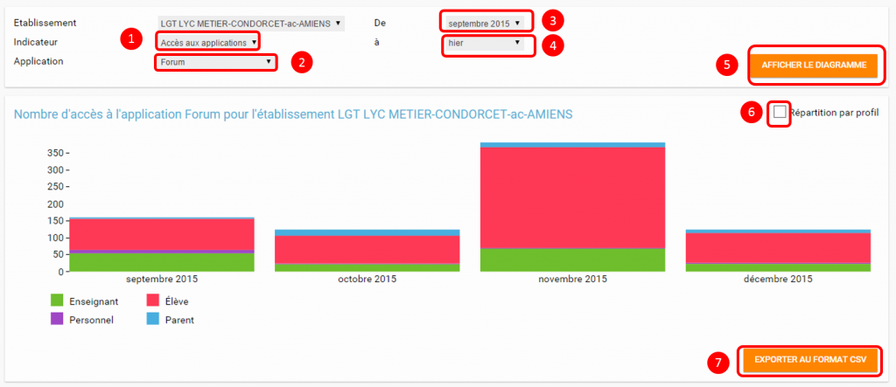
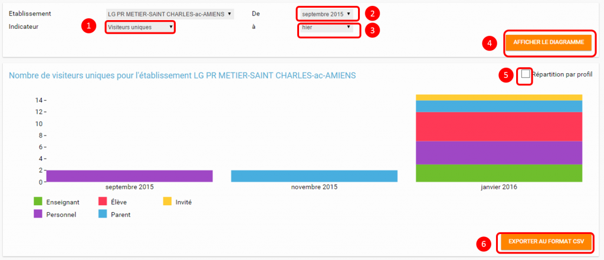

# Statistiques

Devenez un analyste en herbe ! Grâce à l’appli **Statistique** suivez, sur une période donnée, la fréquentation par application ou encore le nombre de visiteurs de votre plateforme.

## Présentation

L’appli Statistiques vous propose de suivre **cinq indicateurs** calculés sur **une période donnée** **\(vous pouvez choisir la période à afficher\):**

* **Connexions**: indique le nombre de connexions mensuelles par profil ;
* **Visiteurs uniques** : calcule le nombre d’utilisateurs différents \(par profil\) qui se sont connectés mensuellement ;
* **Accès aux applications** : indique le nombre de visites par appli sur la période choisie ;
* **Activation de comptes** : calcule le nombre de comptes activés mensuellement sur la période sélectionnée ;
* **Comptes activés** : indique la proportion d’activations de comptes par rapport à l’effectif total par profil.

## Statistiques de connexion

Pour accéder à l’appli Statistiques, cliquez sur l’icône correspondante dans la page « Mes applis ».

A l’arrivée sur l’application, les statistiques de connexion s’affichent par défaut \(1\). Vous pouvez choisir la période pour laquelle vous souhaitez voir apparaître les statistiques en cliquant sur le début de la période \(2\) et la fin de la période \(3\) puis cliquez sur « Afficher le diagramme » \(4\) pour afficher les résultats.

Vous pouvez organiser les résultats par profil \(5\) et les exporter dans un fichier au format CSV \(6\).

## Statistiques d’accès aux applications

Vous pouvez organiser les résultats par profil \(6\) et les exporter dans un fichier au format CSV \(7\).

## Statistiques d’activations de comptes

Cliquez sur l’indicateur «Activations de comptes » puis choisissez la période pour laquelle vous souhaitez voir apparaître les statistiques en cliquant sur le début de la période \(2\) et la fin de la période \(3\). Cliquez sur « Afficher le diagramme » \(4\) pour afficher les résultats.

Vous pouvez organiser les résultats par profil \(5\) et les exporter dans un fichier au format CSV \(6\).

## Statistiques de visiteurs uniques

Vous pouvez organiser les résultats par profil \(5\) et les exporter dans un fichier au format CSV \(6\).

## Statistiques des comptes activés

