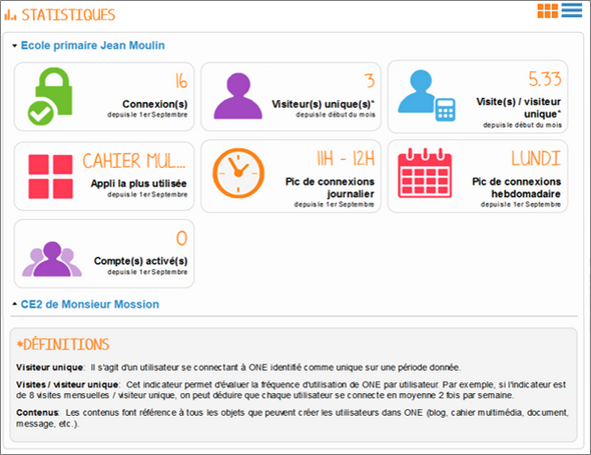
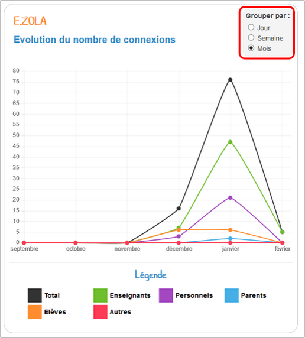
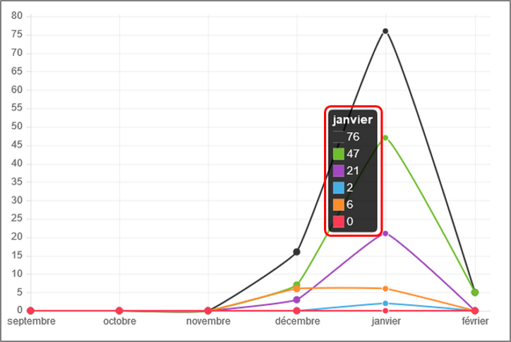

[[statistiques-1d]]
= Statistiques 1D

L’appli *Statistiques* permet de suivre un ensemble d’indicateurs sur la
fréquentation de l'ENT sur une période donnée (nombre de visiteurs ou
répartition des visites dans la journée par exemple).

* link:index.html?iframe=true#presentation[Présentation]
* link:index.html?iframe=true#cas-d-usage-1[Comprendre les données
disponibles]
* link:index.html?iframe=true#notes-de-versions[Note de version]

link:../../wp-content/uploads/2015/03/copyright.jpg[image:../../wp-content/uploads/2015/03/copyright.jpg[copyright,width=86,height=37]]

[[presentation]]
== Présentation

L’appli Statistiques vous propose de suivre *sept indicateurs* calculés
sur *une période donnée* (soit sur le mois écoulé, soit depuis le 1er
septembre):

• *Connexions* : calcule le nombre de visites depuis le 1er septembre +
• *Visiteurs uniques* : calcule le nombre d’utilisateurs identifiés
comme uniques depuis le début du mois en cours +
• *Visites par visiteur unique* : calcule une fréquence de visite par
utilisateur identifié depuis le début du mois en cours +
• *Appli la plus utilisée* : indique l’appli recueillant le plus de
visites depuis le 1er septembre +
• *Pic de connexion journalier* : indique le créneau horaire auquel
l'ENT est le plus consulté depuis le 1er septembre +
• *Pic de connexion hebdomadaire* : indique le jour de la semaine
recueillant le plus de visites depuis le 1er septembre +
• *Comptes activés* : calcule le nombre de comptes activés depuis le 1er
septembre.

image:../../wp-content/uploads/2015/04/Stats-1.jpg[Stats
1,width=329,height=365]

[[cas-d-usage-1]]
== Comprendre les données disponibles

Pour accéder à l’appli Statistiques, cliquez sur l’icône correspondante
dans la page « Mes applis ».

image:../../wp-content/uploads/2015/06/p14.png[p1,width=200]

Un récapitulatif des statistiques de fréquentation de l’ENT s’affiche.

Pour plus de détails, cliquez sur la vignette de l’indicateur. Un graphe
s’affiche.

L’encart situé en haut à droite permet de choisir la période d’affichage
des résultats.

En positionnant le curseur de la souris sur le graphe, vous pouvez
consulter le détail de l’indicateur par profil. Par exemple dans l’écran
ci-dessous, on constate pour le mois de janvier 76 visites tout profil
confondu dont 47 visites pour le profil Enseignant.

[[notes-de-versions]]
== Note de version

A chaque nouvelle version de l'application, les nouveautés seront
présentées dans cette section.
