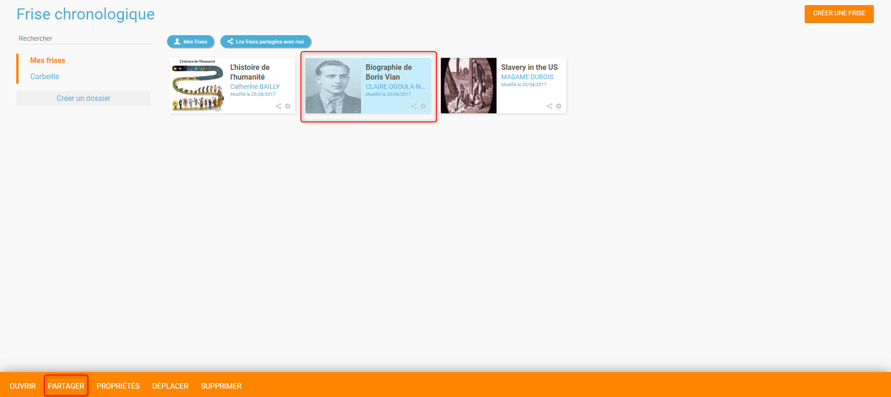
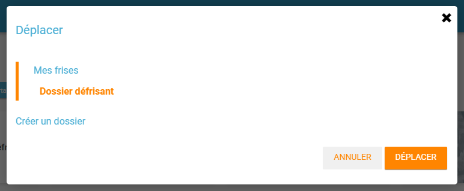

# Frise chronologique

Devenez un maître du temps avec l’appli **Frise chronologique** ! Sur une ligne représentant la flèche du temps, positionnez les étapes marquantes liées à votre thématique. Intégrez du texte, des images ou même des vidéos pour rendre votre frise plus attractive et ajoutez des contributeurs pour vous prêter main forte!

## Présentation

L’appli Frise chronologique permet **d’associer des événements à leur position dans le temps** et de les représenter sous la forme d’une frise temporelle. Chaque événement est accompagné d’un encart permettant de **publier du contenu additionnel** \(texte, image, son …\). Chaque frise peut être partagée avec un utilisateur ou un groupe d’utilisateurs.

## Créer et partager une frise chronologique

Pour accéder à l’appli Frise chronologique, cliquez sur l’icône correspondante dans la page « Mes applis ».

Cliquez sur le bouton « Créer une frise ».

Suivez les étapes suivantes :

* Saisissez un titre
* Choisissez une image pour la vignette
* Renseignez le descriptif de la frise
* Cliquez sur « Enregistrer »

## Partager une frise chronologique

Votre frise chronologique est désormais créée mais n’est pas encore visible. Pour le partager avec d’autres utilisateurs, cliquez sur votre frise puis cliquez sur le bouton « Partager ».

Dans la fenêtre de partage, vous pouvez donner des droits de consultation, de contribution ou de gestion sur votre frise chronologique. Pour cela, saisissez les premières lettres du nom de l’utilisateur ou du groupe d’utilisateurs que vous recherchez \(1\), sélectionnez le résultat \(2\) et cochez les cases correspondant aux droits que vous souhaitez leur attribuer \(3\).

Pour valider, cliquez sur le bouton "Partager".

Les différents droits que vous pouvez attribuer sont les suivants :

* Lecture : l’utilisateur peut visualiser la frise
* Contribution : l’utilisateur peut créer des événements sur la frise
* Gestion : l’utilisateur peut partager, modifier et supprimer la frise

En bas de chaque frise, vous pourrez voir quel droit vous disposez sur la frise en question grâce aux icônes suivantes:

*  : Consulter
*  : Contribuer
*  : Gérer

De plus, pour les frises vous appartenant, vous pourrez voir quels sont les frises que vous aurez déjà partagé car elles auront cette icône : 

## Organiser ses frises chronologiques

Vous avez à votre disposition différents outils pour trier les frises auxquelles vous avez accès :

1. Faites apparaître vos frises à l'aide des filtres suivants : 
   * **Mes frises**, pour afficher/masquer les frises dont vous êtes le propriétaire
   * **Les frises partagées avec moi**, pour afficher/masquer les frises qui vous ont été partagées
2. Une barre de recherche vous permet de trouver très facilement une frise en saisissant son nom
3. Vous trouverez une arborescence affichant :
   * **Mes frises**, qui est le dossier principal, dans lequel vous pourrez créer tous vos sous-dossiers \(grâce au bouton **Créer un dossier\)**
   * **Corbeille** où vous retrouverez les frises que vous aurez supprimées, pour éviter toute suppression définitive involontaire

Après avoir créé vos différents dossiers, sélectionnez \(1\) la ou les frises que vous voulez mettre dans vos dossiers, puis cliquez sur le bouton "Déplacer" \(2\).

Une fenêtre s'ouvrira, vous permettant de déplacer la frise sélectionnée dans un dossier existant ou d'en créer un nouveau. Vous pouvez également déplacer les dossiers eux-mêmes.

## Créer un événement dans la frise chronologique

Pour créer du contenu dans la frise, cliquez sur « Ajouter un événement ».

Vous devez renseigner plusieurs informations pour créer un évènement :

* Le titre de évènement
* La date de début de l’évènement
* Une image d’illustration
* Une description

* Une fois l’événement créé, il apparaît dans la frise chronologique. Le tour est joué !

