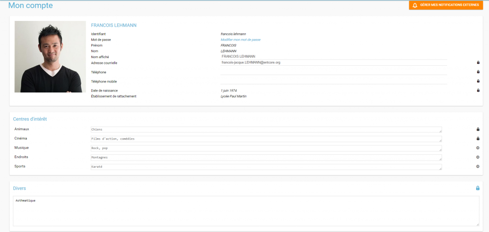

Accéder à mon compte
====================

Pour mettre à jour votre humeur, votre devise, votre photo et vos autres informations personnelles, vous disposez d’un espace dédié. Vous pouvez choisir de rendre visibles vos informations aux autres utilisateurs de l’ENT ou de les laisser invisibles.

Pour accéder à votre compte, connectez-vous à l’ENT en saisissant votre identifiant et votre mot de passe dans la fenêtre de connexion.

Cliquez sur « Connexion ».

Cliquez sur l’avatar en haut à gauche de l'écran.

Vous accédez à votre espace personnel où vous pouvez modifier vos informations : photo, coordonnées, devise, humeur, centres d’intérêt, en cliquant simplement sur le champ à modifier.

Les enseignants ont la possibilité de choisir un nom d’affichage personnalisé, visible par les autres utilisateurs de l’ENT. Par défaut, ce nom d’affichage est le prénom et le nom de l’utilisateur.

 

Changer ma photo de profil
==========================

Pour changer votre photo, cliquez directement sur la photo ou sur l’avatar par défaut.

Vous pouvez choisir une photo à partir de votre espace personnel de l’ENT en la sélectionnant dans :

-   « Mes documents » : documents personnels stockés dans l’ENT,

-   « Documents partagés avec moi » : documents partagés par d’autres utilisateurs,

-   « Documents ajoutés dans les applis » : documents insérés dans une appli.

Vous pouvez aussi choisir d’importer une photo à partir de votre poste de travail.

-   Cliquez sur « Charger un document ».

-   Cliquez sur « Parcourir ».

Sélectionnez un fichier dans votre poste de travail et cliquez sur ouvrir. Cliquez en suite sur « Importer » pour lancer le téléchargement. image:/assets/mon compte.png\[\] Votre photo est maintenant visible dans votre compte et par tous les utilisateurs ! image:/assets/Mon compte 2.png\[\]  
Votre photo est visible dans le fil de nouveautés des autres utilisateurs lorsque vous leur partagez un contenu mais également lorsque vous postez un message dans un forum.

Changer de mot de passe
=======================

Pour changer votre mot de passe, cliquez sur « Modifier mon mot de passe ».

Puis suivez les étapes suivantes :

-   Saisissez votre « Ancien mot de passe »

-   Saisissez votre « Nouveau mot de passe »

-   Saisissez la « Confirmation du mot de passe »

-   Cliquez sur « Réinitialiser »

Votre mot de passe est maintenant modifié !

Ajouter ou modifier mon adresse mail
====================================

Vous pouvez ajouter ou modifier votre adresse mail dans l’espace « Mon compte ».

Pour ajouter ou modifier votre adresse mail, saisissez votre nouvelle adresse dans le champ prévu, en face de « Adresse courrielle ».

En cas d’oubli de votre mot de passe, un lien de récupération vous sera envoyé sur l’adresse mail renseignée dans votre compte.

Ajouter une devise à mon compte
===============================

Vous pouvez ajouter une devise à votre compte. Pour cela, remplissez le champ « Devise » sous vos coordonnées.

Votre devise sera visible sur votre profil et apparaitra dans le fil de nouveautés des autres utilisateurs de l’ENT lorsque vous la modifierez.

Changer mon humeur
==================

Pour changer votre humeur, cliquez sur l’icône en dessous de votre photo.

Une liste d’humeurs apparaît. Choisissez celle que vous souhaitez.

 

Votre nouvelle humeur apparaît sur votre compte et est maintenant visible dans le fil de nouveautés des autres utilisateurs de l’ENT avec lesquels vous avez le droit de communiquer.

Modifier mes centres d’intérêt
==============================

Vous pouvez modifier vos centres d’intérêt : animaux, cinéma, musique, endroits et sports.

Saisissez les informations souhaitées dans les champs correspondants.

Mais aussi d’autres commentaires dans « Divers ».

Définir la visibilité de mes informations personnelles
======================================================

Vous avez la possibilité de définir la visibilité de vos informations personnelles grâce à l’icône située au bout de chaque ligne.

En un seul clic, vous choisissez l’icône correspondant au niveau de visibilité que vous souhaitez :

-   L’icône “Cadenas” signifie que l’information est privée, vous êtes le (la) seul(e) à la voir.

-   L’icône “Globe” signifie que l’information est visible des autres utilisateurs de l’ENT, en fonction des droits de communication dont ils disposent.

  
Lorsque vous ajoutez ou modifiez le texte ou les paramètres de visibilité dans votre espace personnel, l’enregistrement est automatique.

Notifications externes
======================

L’ENT est désormais doté d’un système de notification par mail qui permet aux utilisateurs de recevoir sur leur adresse personnelle des mails contenant les nouveautés de l’ENT qui les concernent.  
Chaque utilisateur peut modifier les notifications qu’il souhaite recevoir et la fréquence de chacune d’elles (immédiate, quotidienne, hebdomadaire).  
Pour accéder à ce paramétrage, aller dans mon compte (1) et cliquer sur le bouton "Gérer mes notifications externes" (2)

[image:../../wp-content/uploads/2016/12/notif-ext2.png\[width=599,height=241](../../wp-content/uploads/2016/12/notif-ext2.png)\]

La page de paramétrage des notifications externes permet de modifier l’adresse de réception des mails (3) et de choisir la fréquence d’envoi de chaque notification (immédiat, quotidien, hebdomadaire, jamais) (4).  
Le détail des notifications disponibles par service est accessible en cliquant sur le nom du service dans la ligne correspondante (5).

Lorsque les modifications sont terminées, cliquer sur "Enregistrer" en bas du tableau (6).

Une fois la notification reçue dans sa boîte mail personnelle, l’utilisateur peut cliquer sur le lien correspondant afin d’accéder au contenu. S’il n’est pas connecté à l’ENT, il devra saisir son identifiant et son mot de passe pour accéder à l’objet de la notification.

[image:../../wp-content/uploads/2016/12/notif-externe-réception.png\[width=200](../../wp-content/uploads/2016/12/notif-externe-réception.png)\]

Historique des notifications émises
===================================

Vous avez la possibilité de ne pas diffuser une notification aux utilisateurs avec lesquels vous avez des droits de communication ou vous avez partagé du contenu.  
Depuis votre espace "Mon compte", vous retrouverez toutes les notifications que vous avez émis en cliquant sur l’onglet "Historique".  
[image:../../wp-content/uploads/2016/12/Fil-historique.png\[width=599,height=219](../../wp-content/uploads/2016/12/Fil-historique.png)\]En survolant la notification avec la souris, vous verrez apparaître une flèche sur la droite de la notification. En cliquant sur cette flèche, une action apparaît vous permettant de supprimer définitivement la notification de l’ENT.  
[image:../../wp-content/uploads/2016/12/Fil-historique-suppression.png\[width=550,height=95](../../wp-content/uploads/2016/12/Fil-historique-suppression.png)\]
