# Vie scolaire

Paramétrer les modules de vie scolaire pour votre établissement : personnaliser l’affichage des niveaux de maitrise, adapter le référentiel de compétences …

## Présentation

Le module permet :
-	la configuration **des périodes d’évaluation** (choix trimestres ou semestres, dates de début et de fin de saisie …)
-	la personnalisation **des niveaux de maitrise affichés** : modification des couleurs, ajout de lettres
-	le choix **d’afficher** ou non certaines informations sur **le bilan de fin de cycle**
-	**la modification du référentiel de compétences** (ajout d’items, modification de libellés, masquer certains … )
-	**le rattachement des cycles** aux classes et groupes de votre établissement (cycles 3 et 4 ici)
-	**le paramétrage des projets éducatifs** pour le bilan périodique (création d’EPI, d’AP et de Parcours)

## Configurer les périodes d’évaluation

Pour configurer les périodes par classe, suivez les étapes suivantes :

Depuis l’onglet ETABLISSMENT, cliquez sur le menu « Paramétrage des périodes » (1)

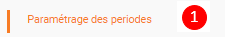

Rechercher une **classe ou un ensemble de classe (2)**, sélectionner les **classes souhaitées (3)** puis cliquer sur le bouton **Modifier (4)**.

  

Il est possiblde de choisir le type de période : **semestre** ou **trimestre** puis saisie des dates attendues :

  

## Personnaliser le niveau de maitrise

Pour personnaliser le niveau de maitrise par cycle, suivez les étapes suivantes :

Depuis l’onglet COMPETENCES , cliquez sur le menu **"Niveau de maitrise" (1)**

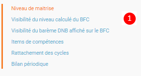

Choisir un **cycle (2)** – possibilité d’ajouter **une lettre ou un chiffre (3)** – **modification des couleurs** par défaut en cliquant sur la case **(4)**.

Le bouton **Réinitialiser** permet de revenir à l’état défini par défaut.

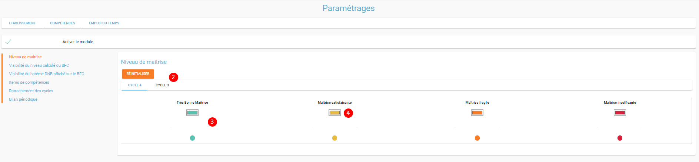

Par exemple, modifiez l’affichage des niveaux pour le cycle 3 :

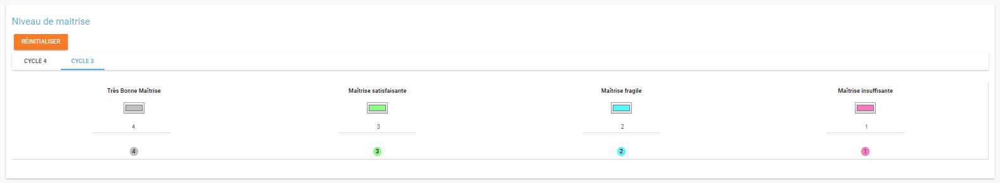

Chaque utilisateur pourra utiliser l’affichage personnalisé ici depuis **l’application Compétences (5)**, depuis **le suivi élève** par exemple (ou depuis l’écran d’évaluation d’un devoir) :

**AVANT** modification :

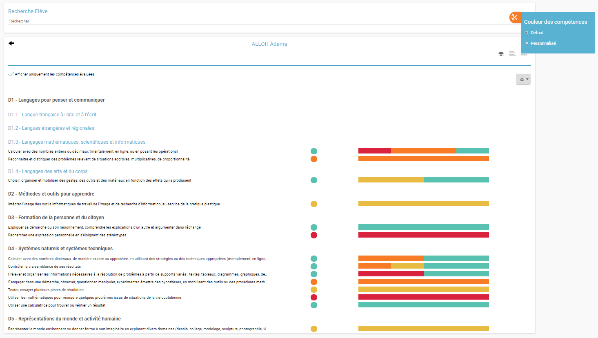

**APRES** modification :

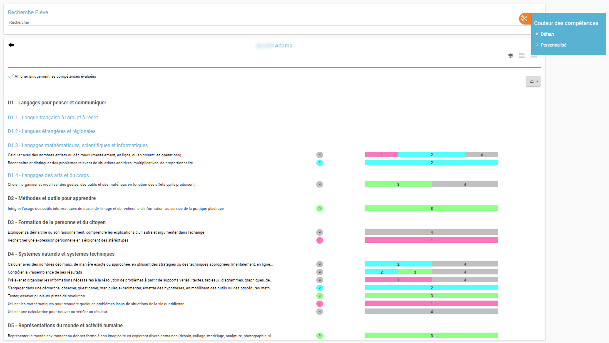

## Rendre visible certaines informations sur le BFC

Pour accéder à ces fonctionnalités, suivez les étapes suivantes :

Depuis **l’onglet COMPETENCES**, cliquez sur le menu **« Visibilité du niveau calculé du BFC »** ou **« Visibilité du barème DNB affiché sur le BFC » (1)**.

Possibilité de masquer ou d’afficher sur le Bilan de fin de cycle :
-	le **niveau** calculé **(2)**
-	le **barème** calculé **(3)**

#### Visibilité du niveau calculé :
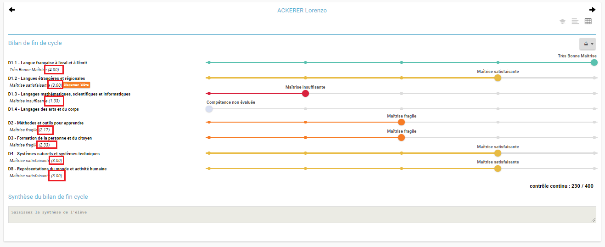

#### Visibilité du barème calculé :
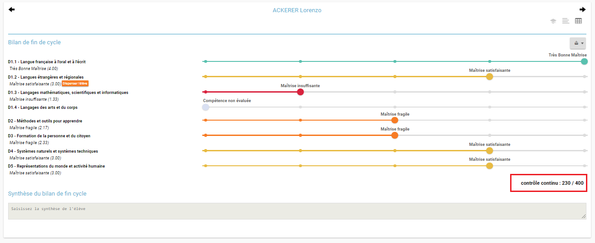

## Mettre à jour le référentiel de compétences

Pour mettre à jour le référentiel de compétences, suivez les étapes suivantes :

Depuis **l’onglet COMPETENCES**, cliquez sur le menu **« Items de compétences » (1)**

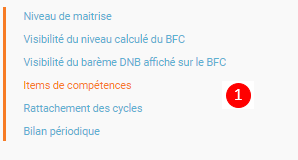

Les items de compétences sont affichés **par cycle et par enseignement ou domaine (2)**– possibilité d’effectuer une recherche d’un item en particulier.

Affichage des éléments signifiants et des items de compétences du socle rattachés (3).

Pour chaque item, vous pouvez (4) :
-	**le masquer** : il n’apparaitra plus sur les écrans d’évaluation de compétences (les devoirs déjà créés ne sont pas impactés)
-	**le modifier** : modification du libellé uniquement
-	**afficher les domaines rattachés (5)**

Enfin, il est tout à fait possible de **créer un nouvel item** de compétence dans un élément signifiant **(6)** :
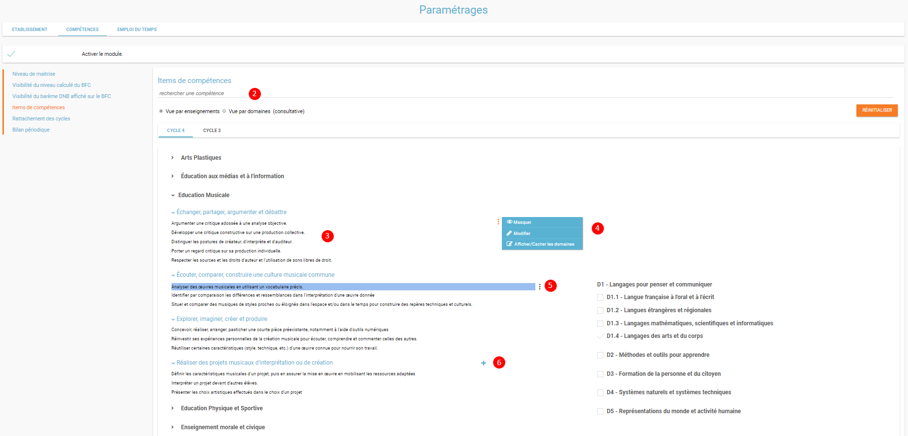

**Saisir un libellé et choisir un ou plusieurs domaines rattachés (7)** – ce nouvel item apparaitra dans le module Compétences.

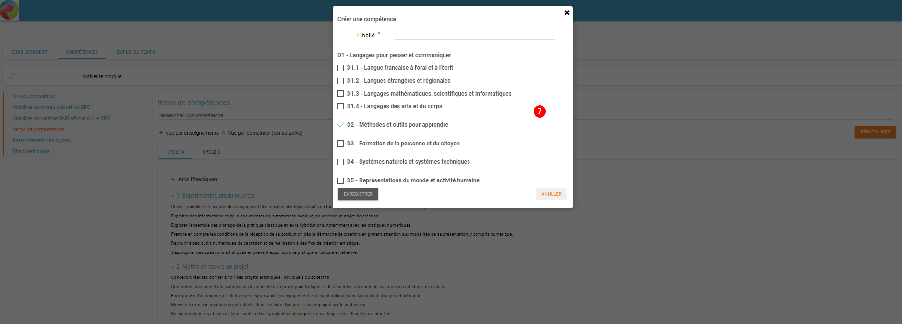

NB : Le bouton **Réinitialiser** permet de revenir à l’état initial du référentiel de compétences du socle.

## Rattacher les cycles

Pour rattacher une classe ou un groupe à un cycle, suivez les étapes suivantes :

Depuis **l’onglet COMPETENCES**, cliquez sur le menu **« Rattachement des cycles »**

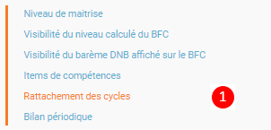

Rechercher une ou plusieurs classes ou groupes (2) – filtre possible par classe, groupes d’enseignement ou groupes manuels (3) – sélectionner les classes ou groupes à paramétrer puis cliquer sur Modifier (4) afin de les rattacher soit au cycle 3 soit au cycle 4 :

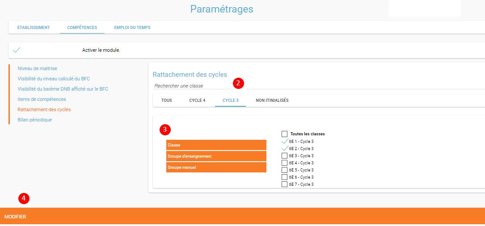

## Bilan périodique (projets éducatifs)

Pour paramétrer les projets éducatifs, suivez les étapes suivantes :

Depuis **l’onglet COMPETENCES**, cliquer sur le menu **« Bilan périodique »** :

Les différents **projets éducatifs** sont affichés par onglet (EPI, AP ou Parcours) (2).
La liste présente les EPI déjà paramétrés sur l’établissement (3), la sélection d’une ligne permet de modifier ou supprimer un projet.

Cliquez sur **« Créer EPI » (4)** :

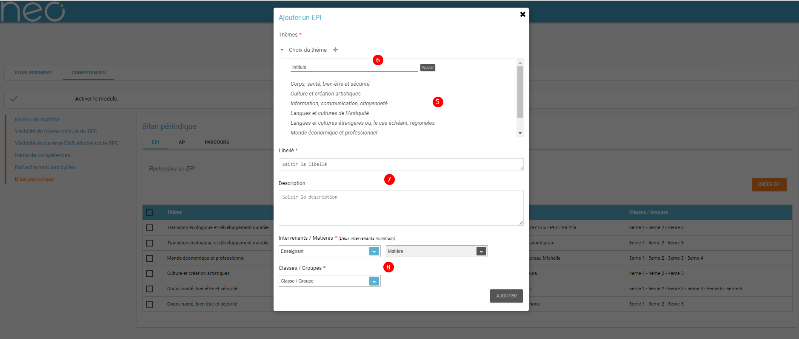

Choisissez un thème prédéfini (5) ou créer un nouveau pour votre établissement (6).

Saisissez un **libellé et une description (7)** et enfin choisissez au moins **2 intervenants** (avec leur matière) et au moins **une classe ou groupe**.

Cliquer sur **Ajouter** pour créer l’EPI. Celui-ci apparaitra dans la liste des EPI ajoutés.
Même principe sur les onglet AP et Parcours.
