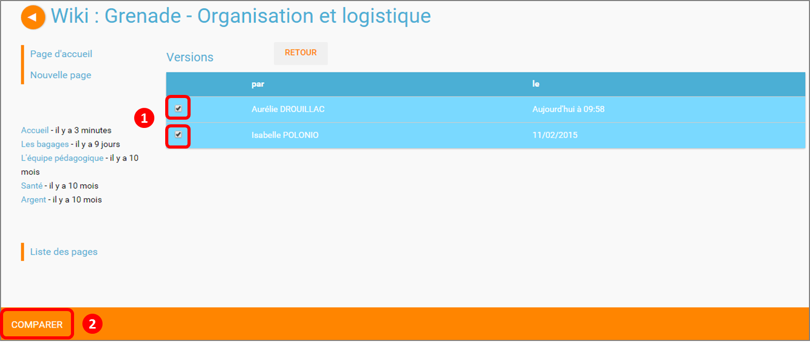

# Wiki

Montez une encyclopédie sur la notion vue en cours ! Grâce à l’appli **Wiki**, donnez une autre dimension à vos projets collaboratifs. En un clic, découvrez les contributions de vos élèves et collègues sur votre document, et gardez la main en revenant, si besoin, aux versions antérieures.

## Présentation

Un wiki permet de **créer et publier des contenus \(texte, images…\) dans différentes pages liées entre elles**. La page d’accueil du wiki est souvent utilisée comme un index référençant l’ensemble des pages créées dans le wiki.

## Créer un Wiki

Pour créer un wiki, cliquez sur le bouton « Créer un wiki » dans la page d’accueil de l’appli.

Saisissez un titre \(1\) et enregistrez si vous le souhaitez une image d’illustration du wiki \(sinon c’est l’icône par défaut qui est affichée\) \(2\).

Cliquez enfin sur « Enregistrer » \(3\)

## Partager un Wiki

Pour partager un Wiki avec d’autres utilisateurs, cliquez sur le correspondant au Wiki \(1\) puis sur le bouton « Partager » \(2\).

Dans la fenêtre, vous pouvez donner aux utilisateurs de l’ENT différents droits d’accès à votre wiki. Pour cela, suivez les étapes suivantes :

1. Saisissez les premières lettres du nom de l’utilisateur ou du groupe d’utilisateurs que vous recherchez.
2. Sélectionnez le résultat.
3. Cochez les cases correspondant aux droits que vous souhaitez leur attribuer.

Pour valider, cliquez sur le bouton "Partager".

Les droits de partage que vous pouvez attribuer aux autres utilisateurs sont les suivants :

* **Lire** : l’utilisateur peut lire le contenu du Wiki
* **Contribuer** : l’utilisateur peut modifier le Wiki
* **Gérer** : l’utilisateur peut modifier, supprimer ou partager le Wiki
* **Commenter** : l’utilisateur peut commenter le Wiki

## Créer et éditer une page

Pour créer et éditer une page dans le Wiki, suivez les étapes suivantes :

1. Cliquez sur le bouton « Nouvelle Page »
2. Saisissez un titre
3. Saisissez du contenu
4. Cliquez sur « Enregistrer »

Une page peut être définie comme page d’accueil du wiki, en cliquant dans la case prévue à cet effet. Elle devient ainsi la 1ère page sur laquelle sont dirigés les utilisateurs lorsqu’ils accèdent au wiki. Des liens peuvent être faits entre les différentes pages du wiki grâce à l’outil de création de liens.

Lorsqu’une page n’est pas définie comme page d’accueil du wiki, il est nécessaire de la référencer dans d’autres pages \(grâce à l’outil de création de liens\) afin de la rendre visible.

## Modifier une page

Vous pouvez modifier une page. Pour cela, suivez les étapes suivantes :

1. Cliquez sur le bouton « Modifier », en haut à droite de la page.
2. Effectuez les modifications nécessaires et cliquez sur le bouton « Enregistrer ».

## Comparer deux versions de pages

Lorsque vous modifiez une page de Wiki, une nouvelle version de celle-ci se crée automatiquement. Vous pouvez comparer deux versions de page pour visualiser les ajouts et suppressions de contenu.

Pour comparer deux versions de page, suivez les étapes suivantes :

1. Cliquez sur le bouton « Plus » en haut à droite de la page.
2. Cliquez sur le bouton « Versions »

La liste des versions de la page s’affiche, avec pour chacune les informations suivantes :

* L’identifiant de la personne qui a effectué les modifications
* La date de la modification

Pour comparer deux versions de page, sélectionnez les cases à cocher des versions correspondantes \(1\) et cliquez sur « Comparer » en bas à gauche de la page \(2\).

Les deux versions de page apparaissent l’une à côté de l’autre avec :

* En vert : les ajouts
* En rouge : les suppressions

Il est également possible de restaurer une version précédente en cliquant sur « Restaurer » en haut de la page correspondante.

