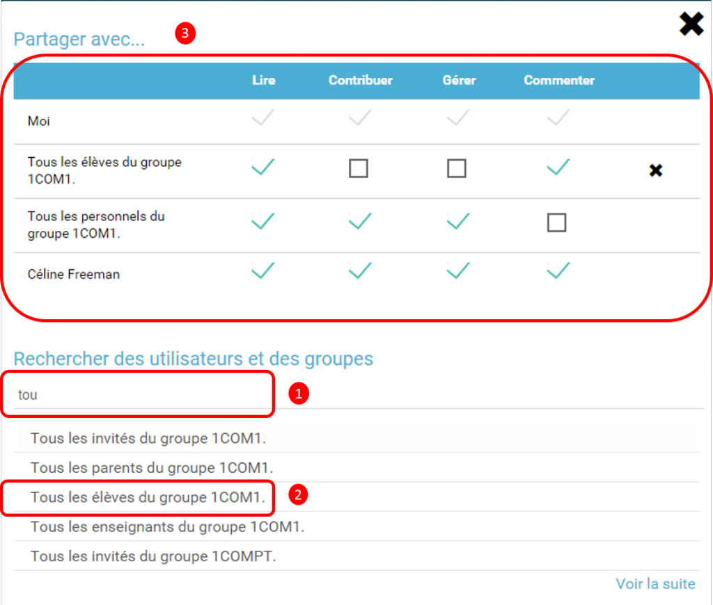
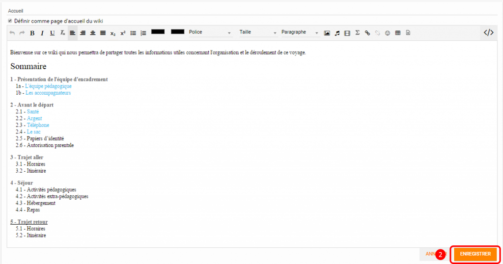
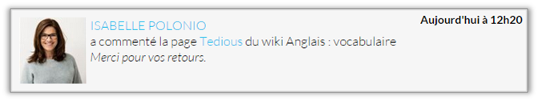
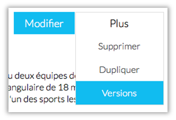
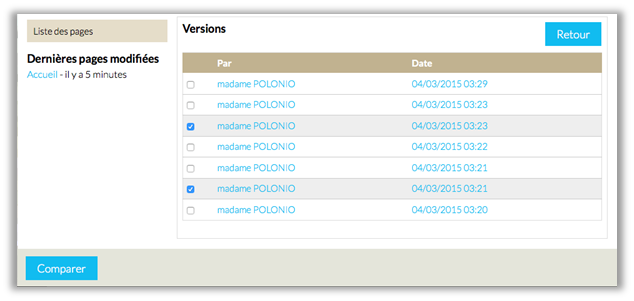
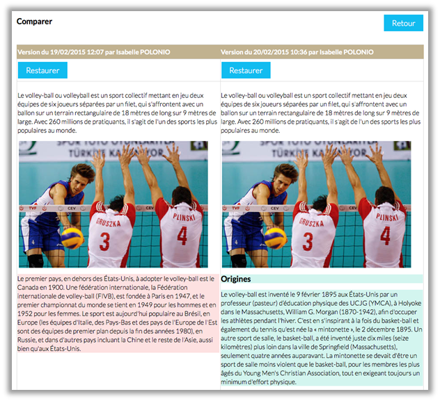

= Wiki

Un *Wiki* est un ensemble de pages modifiables par les utilisateurs
habilités afin de permettre l'écriture et l'illustration collaboratives
des documents numériques qu'il contient.

* link:index.html?iframe=true#presentation[Présentation]
* link:index.html?iframe=true#cas-d-usage-1[Créer un Wiki]
* link:index.html?iframe=true#cas-d-usage-2[Partager un Wiki]
* link:index.html?iframe=true#cas-d-usage-3[Créer et éditer une page]
* link:index.html?iframe=true#cas-d-usage-4[Modifier une page]
* link:index.html?iframe=true#cas-d-usage-5[Comparer deux versions de
pages]
* link:index.html?iframe=true#notes-de-versions[Note de version]

== Présentation

Un wiki permet de *créer et publier des contenus (texte, images...) dans
différentes pages liées entre elles*. La page d'accueil du wiki est
souvent utilisée comme un index référençant l'ensemble des pages créées
dans le wiki.

image:../../wp-content/uploads/2016/01/WIKI_PRESENTATION1.png[image]

== Créer un Wiki

Pour créer un wiki, cliquez sur le bouton « Créer un wiki » dans la page
d'accueil de l'appli.

image:../../wp-content/uploads/2015/07/w1.png[w1]

Saisissez un titre (1) et enregistrez si vous le souhaitez une image
d’illustration du wiki (sinon c’est l’icône par défaut qui est affichée)
(2).

Cliquez enfin sur « Enregistrer » (3)

image:../../wp-content/uploads/2015/07/w2.png[w2]

 

 

== Partager un Wiki

Pour partager un Wiki avec d’autres utilisateurs, cliquez sur le +
correspondant au Wiki (1) puis sur le bouton « Partager » (2).

image:../../wp-content/uploads/2016/08/Wiki_1-1024x490.png[image]

Dans la fenêtre, vous pouvez donner aux utilisateurs de l’ENT différents
droits d'accès à votre wiki. Pour cela, suivez les étapes suivantes :

1.  Saisissez les premières lettres du nom de l’utilisateur ou du groupe
d’utilisateurs que vous recherchez.
2.  Sélectionnez le résultat.
3.  Cochez les cases correspondant aux droits que vous souhaitez leur
attribuer.

link:../../wp-content/uploads/2016/01/WIKI-PARTAGE.png[]

Les droits de partage que vous pouvez attribuer aux autres utilisateurs
sont les suivants :

* *Lire*: l’utilisateur peut lire le contenu du Wiki
* *Contribuer*: l’utilisateur peut modifier le Wiki
* *Gérer*: l’utilisateur peut modifier, supprimer ou partager le Wiki
* *Commenter*: l’utilisateur peut commenter le Wiki

== Créer et éditer une page

Pour créer et éditer une page dans le Wiki, suivez les étapes
suivantes :

1.  Cliquez sur le bouton « Nouvelle Page »
2.  Saisissez un titre
3.  Saisissez du contenu
4.  Cliquez sur « Enregistrer »

image:../../wp-content/uploads/2015/07/w4.png[w4]

image:../../wp-content/uploads/2016/01/WIKI-EDITER-1024x539.png[image]

'''''

*Une page peut être définie comme page d’accueil du wiki, en cliquant
dans la case prévue à cet effet. Elle devient ainsi la 1ère page sur
laquelle sont dirigés les utilisateurs lorsqu'ils accèdent au wiki. +
*

'''''

Des liens peuvent être faits entre les différentes pages du wiki grâce à
l'outil de création de liens.

Lorsqu’une page n’est pas définie comme page d’accueil du wiki, il est
nécessaire de la référencer dans d’autres pages (grâce à l'outil de
création de liens) afin de la rendre visible.

== Modifier une page

Vous pouvez modifier une page. Pour cela, suivez les étapes suivantes :

1.  Cliquez sur le bouton « Modifier », en haut à droite de la page.
2.  Effectuez les modifications nécessaires et cliquez sur le bouton
« Enregistrer ».

image:../../wp-content/uploads/2016/01/WIKI-MODIFIER-1-1024x410.png[image] +
 link:../../wp-content/uploads/2016/01/WIKI-MODIFIER-2.png[ +
] +
 La page s’affiche avec les modifications effectuées.

== Comparer deux versions de pages

Lorsque vous modifiez une page de Wiki, une nouvelle version de celle-ci
se crée automatiquement. Vous pouvez comparer deux versions de page pour
visualiser les ajouts et suppressions de contenu.

Pour comparer deux versions de page, suivez les étapes suivantes :

1.  Cliquez sur le bouton « Plus » en haut à droite de la page.
2.  Cliquez sur le bouton « Versions »

image:../../wp-content/uploads/2016/01/WIKI-VERSION-1-1024x451.png[image]

La liste des versions de la page s’affiche, avec pour chacune les
informations suivantes :

* L’identifiant de la personne qui a effectué les modifications
* La date de la modification

Pour comparer deux versions de page, sélectionnez les cases à cocher des
versions correspondantes (1) et cliquez sur « Comparer » en bas à gauche
de la page (2).

image:../../wp-content/uploads/2015/07/w21.png[w2]

Les deux versions de page apparaissent l’une à côté de l’autre avec :

* En vert : les ajouts
* En rouge : les suppressions

image:../../wp-content/uploads/2016/01/WIKI-VERSION-2-1024x467.png[image] +
 Il est également possible de restaurer une version précédente en
cliquant sur « Restaurer » en haut de la page correspondante.

== Note de version

Nouveauté de la version 0.5 +

*Notification lors de l’ajout de commentaires*

Lorsqu’une personne commente un wiki, une notification est maintenant
envoyée à toutes les personnes ayant accès au wiki.

'''''

Nouveauté de la version 0.4

*Gestion des versions de page** +
*

Le wiki permet maintenant de gérer les versions des pages.

Pour accéder à la fonctionnalité, allez sur une page et cliquez sur
« Plus » puis « Versions ».

**

Sélectionnez ensuite les versions à comparer.

Les différences entre les deux versions sont surlignées en vert (ajout)
ou en rouge (suppression).

Il est également possible de restaurer une précédente version en
cliquant sur Restaurer.

'''''

Nouveauté de la version 0.12

*Évolution ergonomique*

Les cases à cocher ont été remplacées par des composants de sélections
multiples plus ergonomiques et plus adaptés pour les supports mobiles.

 
