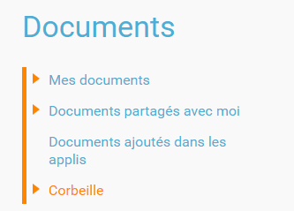

[[documents]]
= Documents

L’appli *Documents* permet de stocker et partager ses documents en
ligne. Chaque utilisateur accède ainsi à tous les fichiers dont il a
besoin.  

* link:index.html?iframe=true#presentation[Présentation]
* link:index.html?iframe=true#cas-d-usage-1[Naviguer dans mes Documents]
* link:index.html?iframe=true#cas-d-usage-2[Importer un document]
* link:index.html?iframe=true#cas-d-usage-3[Déplacer un document ou un
dossier]
* link:index.html?iframe=true#cas-d-usage-4[Connaître l'espace de
stockage disponible]
* link:index.html?iframe=true#cas-d-usage-5[Ajouter la nouvelle version
d'un document]
* link:index.html?iframe=true#cas-d-usage-6[Accéder aux anciennes
versions de son document]
* link:index.html?iframe=true#notes-de-versions[Note de version]

http://creativecommons.org/licenses/by-nc-sa/3.0/fr/[image:../../wp-content/uploads/2015/03/CC-BY-NC-SA-3.0-FR-300x105.png[CC
BY-NC-SA 3.0 FR,width=100,height=35]]

[[presentation]]
== Présentation

L’application Document d’un utilisateur est composé de 4 dossiers :

L’utilisateur peut importer depuis son poste de travail *tout type de
document* sans restriction de format, et les *organiser* en dossiers
créés dans « Mes documents ». Il peut *également partager ses documents*
personnels avec d’autres utilisateurs en leur attribuant différents
droits.

Lorsqu’un document est partagé par un autre utilisateur, celui-ci se
trouve dans le dossier « Documents partagés avec moi ».

Le dossier « Documents ajoutés dans les applis » contient les documents
que l’utilisateur aura ajoutés dans les autres applis (par exemple
l'image d'un billet de blog).

*En centralisant l'ensemble des documents accessibles par l'utilisateur,
l'appli Documents permet d'intégrer facilement un contenu dans n'importe
quelle appli de l'ENT.*

 

[[cas-d-usage-1]]
== Naviguer dans mes Documents

Un nouveau mode de navigation plus intuitif a été mis en place sur
l'application Document. +
Pour *accéder au menu d'option* d'un fichier ou d'un dossier, vous devez
*cliquer une fois* dessus. Le menu s'affiche ensuite en bas de la page
et vous pouvez choisir les actions à effectuer. +
Vous devez cliquer une nouvelle fois sur le fichier ou le dossier pour
le désélectionner.

image:../../wp-content/uploads/2016/08/Doc-ouverture-menu-fichier.png[Doc
- ouverture menu fichier,width=629,height=259]

'''''

Pour *visualiser un fichier* sur la visionneuse de l'ENT ou pour
**ouvrir un dossier**, vous devez **double-cliquer dessus**.

'''''

Vous pouvez également sélectionner plusieurs fichiers ou dossiers si
vous souhaitez effectuer une action sur tous ces documents
simultanément.

link:../../wp-content/uploads/2016/08/Doc-Sélection-multi-fichier.png[image:../../wp-content/uploads/2016/08/Doc-Sélection-multi-fichier-1024x491.png[Doc
- Sélection multi fichier,width=628,height=301]] +
*ATTENTION* +
Si vous effectuez une action de partage sur plusieurs fichiers ou
dossiers alors que l'un de ces fichiers ou dossiers possède déjà un
partage, vous supprimerez l'ancien partage effectué sur ce fichier ou
dossier.

[[cas-d-usage-2]]
== Importer un document

Pour importer un document dans votre espace de stockage personnel,
cliquez sur le bouton « Importer » situé en haut de l’interface.

image:/assets/Import bouton.png[alt=""]

Dans la nouvelle fenêtre, suivez les étapes suivantes :

1.  Cliquez sur « Parcourir » et sélectionnez sur votre ordinateur le(s)
document(s) que vous souhaitez enregistrer dans l’espace documentaire. Vous pouvez également effectuer un glisser-déposer multiple.

2.  Cliquez sur « Importer ».

image:/assets/Fenetre import vide.png[alt=""]

image:/assets/Fenetre import full.png[alt=""]

'''''

*Vous pouvez importer plusieurs fichiers en une seule fois, si vous en
sélectionnez plusieurs sur votre ordinateur.*

'''''

Vous pouvez aussi importer un document ou plusieurs documents en
effectuant un glisser-déposer. Pour cela, sélectionnez le ou les
documents à déplacer (1) depuis votre espace de travail et glissez-le
vers son nouvel emplacement (2).

link:../../wp-content/uploads/2016/08/Doc-glisser-déposer-pc2.png[image:../../wp-content/uploads/2016/08/Doc-glisser-déposer-pc2-1024x354.png[Doc
- glisser-déposer pc2,width=628,height=217]]

[[cas-d-usage-3]]
== Déplacer un document ou un dossier

Vous pouvez déplacer vos documents et vos dossiers facilement dans votre
espace documentaire. Pour cela, sélectionnez le document ou le dossier à
déplacer (1) et glissez-le vers son nouvel emplacement (2).

link:../../wp-content/uploads/2016/08/Doc-glisser-déposer-avec.png[image:../../wp-content/uploads/2016/08/Doc-glisser-déposer-avec-1024x263.png[Doc
- glisser-déposer avec,width=627,height=161]]

'''''

Vous ne pouvez pas déplacer un fichier du dossier « Mes documents » vers
les dossiers « Documents partagés avec moi » et « Documents ajoutés dans
les applis ».

'''''

Le dossier se trouve maintenant à l’emplacement choisi.

link:../../wp-content/uploads/2016/08/Doc-glisser-déposer-2.png[image:../../wp-content/uploads/2016/08/Doc-glisser-déposer-2-1024x273.png[Doc
- glisser-déposer 2,width=630,height=168]]

[[cas-d-usage-4]]
== Connaître l'espace de stockage disponible

La jauge affichée sous la liste des dossiers de l’espace documentaire
vous permet de connaître l’espace de stockage dont vous disposez.
L’espace utilisé est indiqué sur la gauche. Le chiffre situé sur la
droite indique l’espace total de l’utilisateur.

image:../../wp-content/uploads/2016/04/Document11.png[Document11,width=200]

[[cas-d-usage-5]]
== Ajouter la nouvelle version d'un document

Vous pouvez mettre à jour un document tout en gardant une trace de ses
précédentes versions et en conservant les droits de partage du document
initial.

Pour mettre à jour un document, cliquer une fois sur le document pour
qu'il soit surligner en bleu. La barre d'action s'affiche en bas de
page, cliquez sur le bouton « Versions ».

link:../../wp-content/uploads/2016/08/Doc-Sélection-fichier.png[image:../../wp-content/uploads/2016/08/Doc-Sélection-fichier.png[Doc
- Sélection fichier,width=100]]

Une nouvelle page s’affiche, cliquez sur le bouton « Nouvelle version ».

image:../../wp-content/uploads/2016/04/Document5-1024x328.png[Document5,width=300]

Choisissez le document depuis votre poste de travail et cliquez sur «
Ouvrir ».

image:../../wp-content/uploads/2016/04/Document6-1024x720.png[Document6,width=550,height=387]

Le document a été mis à jour.

image:../../wp-content/uploads/2016/04/Document7-1024x408.png[Document7,width=600,height=239]

Le document sera renommé avec le libellé du dernier document importé.

'''''

*Les utilisateurs qui ont un droit de contribution sur un document
peuvent mettre à jour de nouvelles versions. +
*

'''''

[[cas-d-usage-6]]
== Accéder aux anciennes versions de son document

Pour visualiser les anciennes versions d'un document, suivez les étapes
suivantes:

1.  Cliquez une fois sur le document pour qu'il soit surligné en bleu
2.  Cliquez sur le bouton "Versions" en bas de page

link:../../wp-content/uploads/2016/08/Doc-Sélection-fichier.png[image:../../wp-content/uploads/2016/08/Doc-Sélection-fichier.png[Doc
- Sélection fichier,width=100]]

Toutes les versions du document s’affichent. Chaque version permet
d’accéder aux informations suivantes :

* Titre du document
* Identifiant de la personne qui a ajouté le document
* Taille du document

Il est possible de supprimer toutes les versions du document sauf la
dernière mise à jour.

image:../../wp-content/uploads/2016/04/Document8-1024x399.png[Document8,width=550,height=214]

[[notes-de-versions]]
== Note de version

Nouveautés de la version 1.13.1

*Glisser-déposer dans la vue liste*

La fonctionnalité de glisser-déposer est maintenant disponible dans la
vue liste du service Documents.

image:../../wp-content/uploads/2015/05/NDV-4.png[NDV
4,width=582,height=207] +
*Suppression de commentaire* +

Les commentaires d’un document peuvent être supprimés par le créateur du
commentaire ou le gestionnaire du document.

*Compression des images lors du chargement*

Une nouvelle fonctionnalité permet de compresser les images lors de leur
chargement dans l’espace documentaire. Un curseur permet de choisir dans
quelle proportion compresser l’image.

Cette fonctionnalité est aussi disponible lors du téléchargement d’une
image à partir de la bibliothèque multimédia.

image:../../wp-content/uploads/2015/05/NDV-5.png[NDV
5,width=373,height=231]

*Visionneuse de documents*

Le service document permet maintenant de visualiser les documents pour
les formats suivants :

Documents :

* PDF

Images :

* JPEG
* PNG
* GIF

Sons :

* MP3
* MPEG-4
* WAVE

image:../../wp-content/uploads/2015/05/NDV-6.png[NDV
6,width=384,height=240] +
Lors du clic sur le document, si le format est reconnu, le document est
affiché à l’écran pour être visualisé ou écouté. Il est alors possible
de l’afficher en plein écran ou de le télécharger.

'''''

Nouveautés de la version 1.12.0** +
**

*Carrousel*

Une nouvelle vue fait son apparition dans l’espace documentaire : la vue
carrousel. Elle permet de faire défiler un aperçu de toutes les images
du dossier courant.

image:../../wp-content/uploads/2015/04/NDV-3.png[NDV
3,width=519,height=267] 

Le carrousel est également présent dans la liste des "sniplets"
disponible dans l'appli Pages.

*Gestion des versions d'un document*

Il est désormais possible de mettre à jour un document tout en
conservant une trace de l’historique des versions de ce dernier. Pour
cela, cliquez sur l’icône « Voir les versions archivées ». +
image:../../wp-content/uploads/2015/04/NDV-41.png[NDV
4,width=196,height=184]

La liste affichée permet de voir toutes les versions déposées et les
utilisateurs qui les ont déposées.

image:../../wp-content/uploads/2015/04/NDV-5.png[NDV
5,width=250]

Il est ensuite possible de supprimer les anciennes versions d’un
document en cliquant sur la croix blanche en face d’une version.

Les actions possibles sur les versions d’un document dépendent des
droits dont l’utilisateur dispose sur ce document :

* Les personnes ayant des droits de consultation peuvent visualiser
toutes les versions d’un document ;
* Les contributeurs peuvent ajouter une nouvelle version du document et
supprimer les anciennes versions dont ils sont propriétaires ;
* Les gestionnaires peuvent ajouter une nouvelle version du document et
supprimer toutes les anciennes versions du document.

*Glisser-déposer depuis le poste de l’utilisateur*

Un utilisateur peut maintenant glisser-déposer un ou plusieurs documents
depuis son poste de travail.

Cette fonctionnalité est également disponible dans les zones de textes
et pour les vignettes des contenus des services.

image:../../wp-content/uploads/2015/04/NDV-61.png[NDV
6,width=600,height=236]** +
**

*Espace documentaire : suppression des partages des documents mis à la
corbeille*

Quand un utilisateur met un document à la corbeille, les partages du
document sont automatiquement supprimés.

*Espace documentaire : caractères spéciaux sur les dossiers*

A l’exception du caractère "_", les caractères spéciaux sont désormais
correctement gérés dans les noms des dossiers. Pour le moment, le
caractère "_" ne peut pas être utilisé dans le nom des dossiers.

*Commentaires sur les dossiers*

Les commentaires sur les dossiers sont maintenant possibles. L’ajout de
commentaire s’effectue de la même manière que pour les documents :
sélectionnez la case à cocher correspondant au document et cliquez sur
le bouton « Commentaire ».

image:../../wp-content/uploads/2015/04/NDV-7.png[NDV
7,width=100]

'''''

Nouveauté de la version 1.21

*Évolution ergonomique*

Les cases à cocher ont été supprimées en mode vignette. La sélection
d’un ou plusieurs documents se fait désormais en cochant la ou les
vignettes.

