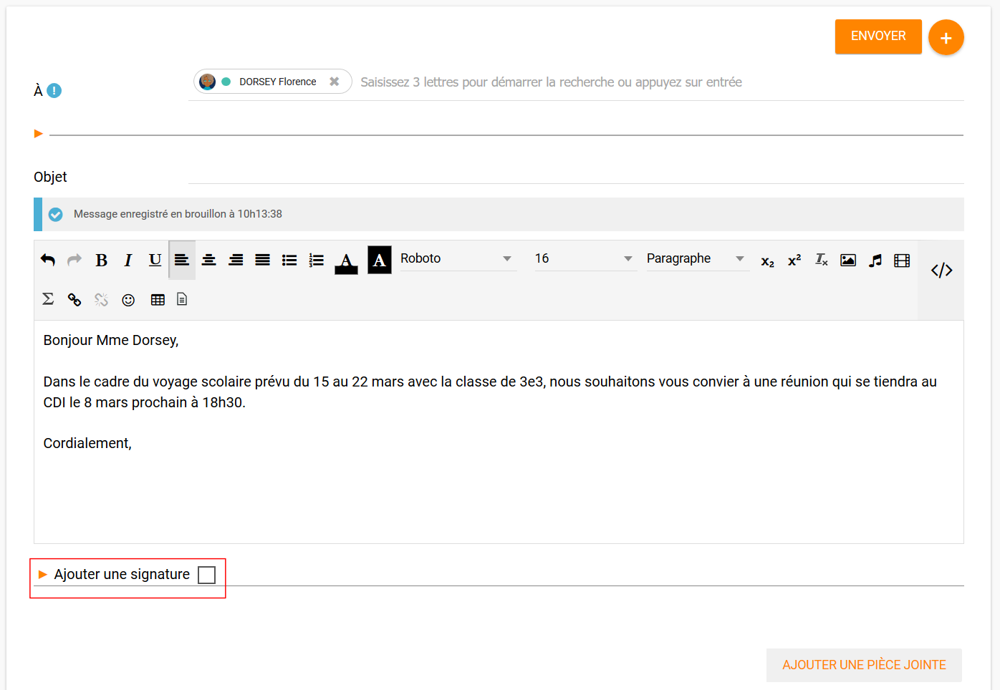

# Présentation
L’application **Messagerie** permet d’envoyer simplement un message à un utilisateur ou à un groupe d’utilisateurs (les élèves d’une classe, le personnel de l'établissement, etc.) ayant un accès à l’ENT et, selon l’établissement, à des personnes extérieures à l’ENT.

La **réception** d’un nouveau message est visible dès la **page d’accueil**. Elle est indiquée par une **notification** dans le bandeau de navigation et dans le fil de nouveautés. Le nombre de messages non lus est indiqué devant chaque dossier.

# Envoyer un message
Dans le service **Messagerie**, en mode simplifié, cliquez sur le bouton **« Nouveau message »** présent en haut de la page.

Vous accédez à la fenêtre de création d’un message.

(1) Indiquez le(s) destinataire(s) de votre message dans le champ **« À »** en saisissant au moins les trois premières lettres de son nom ou en appuyant sur entrée. Vous pouvez adresser un message à un utilisateur en particulier (par exemple un élève), ou à un groupe d’utilisateurs (par exemple les parents d’élèves de Terminale).
(2) En cliquant sur la flèche, vous avez accès à la saisie des destinataires en **copie** du message. 

(3) Ajoutez des personnes ou des groupes dans le champ **« Copie »** si vous souhaitez leur adresser une copie du message.
(4) Ajoutez des personnes ou des groupes dans le champ **« Copie cachée »** si vous souhaitez leur adresser une copie du message. Les autres destinataires ne verront pas la liste des utilisateurs mis en copie cachée du message lors de l’envoi. 
(5) Indiquez le sujet de votre message dans le champ **« Objet »**.

Pour sélectionner les **destinataires** de votre message,

(1) Effectuer votre recherche.
(2) Les résultats s’affichent dans la liste déroulante.
(3) Si la liste des résultats correspondant à votre recherche est longue, cliquez sur « Voir la suite » pour afficher plus de résultats. 

**Dans la fenêtre de saisie de contenu,**

(1) **rédigez** votre message.
(2) Cliquez sur **"Ajouter une pièce jointe"** pour joindre un document à votre message.
Choisissez le document depuis votre **poste de travail**.

En cochant **« Ajouter une signature »**, vous pouvez paramétrer l’ajout d’une signature pour ce message et pour les suivants.

L’option pourra être à tout moment cochée ou décochée et le texte modifié : en cliquant sur la flèche vous faites apparaître le bloc de texte dédié à la signature.

Lorsque vous commencez la rédaction de votre message, un **brouillon** est **automatiquement** créé dans la rubrique « brouillon » de votre messagerie.

Toutes les modifications effectuées sont **automatiquement enregistrées**. Vous pouvez donc interrompre à tout moment la création de votre message et la reprendre plus tard en vous rendant dans l’onglet « brouillons ».

Une fois que votre message est prêt, vous pouvez l’envoyer.

# Communiquer vers l’extérieur
### Savoir si vous êtes autorisés à communiquer avec l’extérieur
Rendez-vous dans l’application de messagerie et cliquez sur **« Nouveau message »**. Si une infobulle signalée par un point d’exclamation s’affiche au niveau de la saisie des destinataires, cela signifie que vous pouvez communiquer avec l’extérieur. 

Si l’icône signalant cette infobulle n’apparaît pas, cela signifie que vous n’avez pas les droits pour communiquer avec l’extérieur. 
### Envoyer un message lorsque la communication vers l’extérieur est autorisée
Pour envoyer un message vers des utilisateurs de l’ENT, saisissez les premières lettres du nom de l’utilisateur ou d’un groupe d’utilisateur et les suggestions correspondantes apparaissent. Cliquez sur les suggestions pour les sélectionner (reportez-vous à la section « Envoyer un message » pour plus de détail).
Pour envoyer un message à une adresse extérieure à l’ENT, saisissez l’adresse du destinataire et validez en tapant sur la touche entrée.
Pour écrire à plusieurs destinataires, séparez leurs adresses par un point-virgule.

Vous pouvez aussi saisie la seconde adresse après avoir validé la première. 

# Visualiser mes messages reçus
Lorsque vous recevez un nouveau message, la **notification** est indiquée dans le bandeau de navigation supérieur.

Une fois dans l’application de messagerie, le nombre de messages **non lus** est indiqué dans la bulle à droite de la mention « Boîte de réception ».

Sur l’écran central, les messages non lus apparaissent en bleu dans la liste et sont indiqués par une enveloppe fermée.

Pour chaque message,

(1) Une **enveloppe** indique que le message n’a pas encore été ouvert ou marqué comme lu.
(2) Le **trombone** indique que le message comporte une pièce jointe

(1) Le filtre **« messages non lus »** vous permet de ne faire apparaître que les messages qui n’ont pas encore été lus.
(2) La **barre de recherche** vous permet de rechercher un message dans le dossier en cours de consultation grâce au nom d’un utilisateur, un mot clé présent dans l’objet ou le contenu.
Le **mode d’affichage** par défaut des messages est en liste. Vous pouvez changer à tout moment.

Cliquez sur le titre d’un message pour en lire le contenu.

Les flèches présentes en haut à gauche du message permettent de passer d’un message à un autre au sein de la catégorie ou de la sélection.

Revenez sur la liste de vos messages.

(1) Sélectionner tous les messages ;
(2) Sélectionner plusieurs messages ;
(3) Les déplacer dans un dossier (pour cela vous pouvez également utiliser le "drag & drop") ;
(4) Les marquer comme lus ;
(5) Les marquer comme non lus.

Cliquez sur les icônes de changement de vue pour modifier le mode d’affichage de vos messages.

Cliquez pour passer en **affichage scindé** et voir simultanément la liste de vos messages et le contenu du message sélectionné. 

# Répondre, transférer, classer et supprimer un message
Lorsque vous avez cliqué sur le titre d’un message, vous accédez à son contenu. Le bouton **« Répondre »** en haut à droite vous permet de répondre à l’émetteur du message.

La fenêtre de création d’un message s’ouvre. L’émetteur du message reçu est automatiquement ajouté en tant que destinataire.
Si vous avez reçu un message groupé vous pouvez cliquer sur le bouton « + » (1) présent en haut à droite pour faire apparaître les options secondaires :

(2) **Répondre à tous** : tous les destinataires du messages reçus sont automatiquement ajoutés dans les champs « à » et « en copie » selon la répartition du message d’origine.
(3) **Transférer** : la fenêtre de création de contenus s’ouvre, le champ destinataire est vide et la pièce jointe est reprise si le message transféré en possédait une.
(4) **Imprimer**.
(5) **Supprimer** : Le message sera déplacé dans votre corbeille. Vous pourrez le supprimer définitivement ou le restaurer en le sélectionnant dans le dossier « Corbeille ».

# Mode expert
### Accéder au mode expert (hors parents)
Via la page d’accueil de l’ENT, cliquez sur votre avatar pour ouvrir votre profil.

Cochez la case « Accès direct au mode Expert de la messagerie ».

La case est cochée : le mode expert est en accès direct.

(1) Lorsque vous vous connectez à la messagerie via le lien de connexion directe, vous accédez automatiquement au mode expert de la messagerie.
(2) Si vous vous connectez via le menu des applications ou via les applications mises en raccourci, vous accédez au mode simple.
Pour accéder au mode expert directement depuis la messagerie. Cliquez sur le bouton pour accéder au mode expert.

Vous accédez alors au mode expert.

(1) Triez et gérez vos mails, dossiers et tags.
(2) Effectuez des actions sur vos messages.
(3) Affichez vos messages
(4) Changez le mode d’affichage de vos messages
Toutes les fonctionnalités d’une messagerie classique sont accessibles. 
